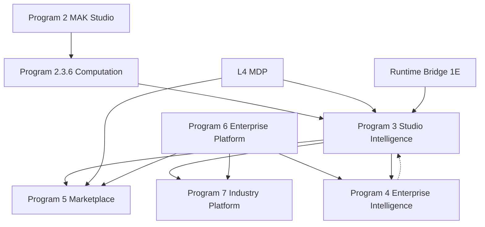

# MAK Platform Evolution — Long-Horizon Architecture Map

**Mission:** Program 3.0 — Platform Evolution Planning  
**Status:** Official — **Vision document only** (not approved for implementation)  
**Version:** 1.0.0  
**Effective date:** 2026-06-30  
**Horizon:** 2026–2035+ (next decade)  
**Authority:** Subordinate to [Constitution](../constitution/00-MAK-CONSTITUTION.md) and [MAK 2035 Master Architecture](./MAK-2035-MASTER-ARCHITECTURE.md)

---

## ⚠️ Official disclaimer

| Statement | Meaning |
|-----------|---------|
| **This document does NOT approve any program, phase, or delivery date** | All Programs 3–7 below are **organizational vision**, not commitments |
| **This document does NOT alter [ROADMAP.md](../engineering/ROADMAP.md)** | The authoritative implementation sequence remains the ROADMAP |
| **No code, API, or database change is implied** | Documentation-only mission (Program 3.0) |
| **Promotion requires governance** | D-028 impact gate · D-register · ROADMAP inclusion · architectural review |

**Immediate next work** remains **[Program 2.3.6](../engineering/IFM-PHASE-2.3.6-COMPUTED-DERIVED-FIELDS-BRIEF.md)** — Studio Computation Engine — as defined in the ROADMAP. This document situates that work inside a longer arc without replacing it.

---

## 1. Purpose

Organize the **official long-term evolution map** of MAK Gestão for the next decade:

1. Separate **near-term execution** (Program 2 — MAK Studio, in progress) from **future platform arcs** (Programs 3–7).
2. Align future arcs with the **L0–L7 layer model** defined in Master Architecture.
3. Preserve strategic clarity so architectural decisions today remain compatible with Marketplace, Intelligence, Enterprise scale, and Industry verticals tomorrow.
4. Provide a single reference for product, architecture, and AI agents when evaluating ideas — without prematurely committing delivery.

---

## 2. Document relationships

| Document | Role relative to this file |
|----------|----------------------------|
| [ROADMAP.md](../engineering/ROADMAP.md) | **What will be built next** — unchanged by Program 3.0 |
| [MAK-2035-MASTER-ARCHITECTURE.md](./MAK-2035-MASTER-ARCHITECTURE.md) | **Structural truth** — L0–L7 topology and flows |
| [MAK-STUDIO-ARCHITECTURE.md](./MAK-STUDIO-ARCHITECTURE.md) | **Studio implementation doctrine** — L5 |
| [MAK-2040-VISION-BACKLOG.md](../vision/MAK-2040-VISION-BACKLOG.md) | **Idea repository** — exploratory items (V-001+) |
| **This document** | **Program-level evolution map** — groups vision into seven future arcs |

### Mapping to Master Architecture §8 (historical program names)

Master Architecture used a shorter program index. This document **extends** (does not replace) that view:

| This document | Master Architecture §8 | Primary layers |
|---------------|------------------------|----------------|
| *(current)* Program 2 — MAK Studio | Program 2 Studio | L5 |
| Program 3 — Studio Intelligence | *(extends Program 2)* | L5 + L4 compile |
| Program 4 — Enterprise Intelligence | Program 4 Intelligence + parts of Program 5 Knowledge | L6 |
| Program 5 — Marketplace Platform | Program 3 Ecosystem | L6 |
| Program 6 — Enterprise Platform | Program 1F + L3 hardening | L3 + L0 |
| Program 7 — Industry Platform | *(vertical L1/L7 extension)* | L1 + L7 + edge |

---

## 3. Platform state at close of Program 2.3.X (2026-06-30)

Stabilization cycle **2.3.X is complete**. Production is operational. Foundation relevant to future evolution:

| Layer | Maturity (today) | Enables future programs |
|-------|------------------|-------------------------|
| **L4 MDP** | IFM 1C complete (MDP-1→5) | All Studio Intelligence + Marketplace packages |
| **L5 Studio** | Foundation frozen (D-052); Layout + Field operational | Computation → Formula → Workflow designers |
| **L2 Runtime** | Foundation frozen V10; config engines V13–V20 | Runtime execution of compiled definitions |
| **L6 Services** | Mostly vision | Intelligence, Marketplace, Knowledge |
| **L3 Core** | Auth, tenant, RBAC operational | Enterprise Platform hardening |
| **L1 Domain** | empresas + cadcps certified | Industry vertical modules |

**Next authorized mission:** Program **2.3.6** — Computation Engine (first slice of Studio Intelligence, still under Program 2).

---

## 4. Evolution horizon (conceptual)

```
2026          2027–2028              2029–2031              2032–2035+
───────────── ────────────────────── ────────────────────── ───────────────────
Program 2     Program 3              Program 4–5            Program 6–7
MAK Studio    Studio Intelligence    Enterprise Intel.      Enterprise +
(completing)  (designers + runtime)  + Marketplace          Industry verticals
     │                │                      │                      │
     ▼                ▼                      ▼                      ▼
  L5 + L4         L5 deepen            L6 platform           L3 scale + L1 verticals
  2.3.6 start     Formula·Workflow     AI·Knowledge          Multi-country·IoT·Agro
```

Timelines are **illustrative only** — not approved schedules.

---

## 5. Program 3 — Studio Intelligence

**Arc:** Complete the MAK Studio designer family and connect every designer to MDP compile → Runtime Bridge → Foundation execution.

**Architectural home:** Primarily **L5 (MAK Studio)** with compile/publish through **L4 (MDP-5)** and hydration via **Program 1E Runtime Bridge**.

**Status:** Vision organized — **not approved as a single program**. Near-term work continues under **Program 2** (e.g. 2.3.6).

### 5.1 Capability areas

| Area | Description | Layer / engine | Notes |
|------|-------------|----------------|-------|
| **Computation Engine** | Computed & derived fields; evaluation pipeline in authoring + runtime | L5 Field Studio · G302 | **→ Program 2.3.6 (authorized next)** |
| **Formula Builder** | Visual formula authoring beyond expression text; function catalog UX | L5 · V17 formula-config-engine | Builds on Expression + Evaluation engines |
| **Derived Fields** | Expression-bound read-only / write-time derived values | L5 + L4 MDP `source: computed\|derived` | Overlaps 2.3.6 scope |
| **Relationships** | Visual relationship designer; cardinality, bindings, cross-entity navigation | L5 designer · MDP-3 | Registry: relationship |
| **Workflow Studio** | Visual workflow / state machine authoring | L5 · V20 workflow-config-engine | Requires IFM 1B event bus maturity |
| **Dashboard Studio** | Dashboard layout, widgets, KPI bindings | L5 · new registry: dashboard | Master Architecture capability gap |
| **Automation Studio** | Triggers, schedules, action chains | L5 · V18–V19 event/action engines | Distinct from Workflow (orchestration vs. state) |

### 5.2 Architectural principles (binding when implemented)

1. **No parallel runtime** — all definitions compile to CRB → Foundation registries (Pillar: compile before run).
2. **Designers consume engines** — Expression, Type, Dependency, Evaluation remain SSOT for logic.
3. **MDP is SSOT** — no designer-specific persistence outside L4.
4. **Studio Intelligence extends Program 2** — does not fork a second UI stack.

### 5.3 Prerequisites

- Program 2.3.6–2.3.x completion (Computation → Formula maturity)
- Runtime Bridge Phase 2 (environment pin → reload) — [ROADMAP 1E-2](../engineering/ROADMAP.md)
- Event bus (IFM 1B A5) for Workflow/Automation

### 5.4 Out of scope (belongs to other programs)

- Enterprise AI agents → Program 4
- Marketplace package authoring UI → Program 5 (extends Studio publish)
- Multi-tenant admin at scale → Program 6

---

## 6. Program 4 — Enterprise Intelligence

**Arc:** Layer of **reasoning, memory, and decision support** over MDP graph and platform APIs — never bypassing RBAC or direct database access.

**Architectural home:** **L6 — Platform Services** (AI Platform, Knowledge Platform subsets).

**Status:** Vision only — aligns with [MAK-2040 V-001, V-002](../vision/MAK-2040-VISION-BACKLOG.md).

### 6.1 Capability areas

| Area | Description | Layer | Engineering principle |
|------|-------------|-------|---------------------|
| **Knowledge Engine** | Structured knowledge linked to entities/fields/workflows | L6 Knowledge | Content separate from MDP definitions |
| **Business Memory** | Tenant-scoped historical context for agents and suggestions | L6 AI adjunct | RBAC + audit on all reads |
| **Decision Engine** | Rule/suggestion layer for approvals, routing, anomalies | L6 | Outputs are recommendations or workflow triggers — not silent mutations |
| **Smart Algorithms** | Reusable analytics/ML hooks over compiled metadata | L6 | API-only; no training on raw tenant data without consent |
| **AI Assistant** | In-app assistant for Studio and runtime | L6 AI Platform | P16 — AI via APIs only |
| **Predictive Analysis** | Forecasting, trend detection on business data | L6 + L1 read models | Optional read replicas / warehouse (Program 6) |

### 6.2 Dependencies

| Dependency | Why |
|------------|-----|
| MDP introspect + compile API ✅ | Agent tool surface |
| Program 3 (Workflow/Automation) | Action execution targets |
| Program 6 (Observability, Security) | Production-grade AI ops |
| Platform Event Bus | Real-time triggers |

### 6.3 Non-negotiable constraints

- **No direct DB access** for AI (Constitution + P16).
- **Tenant isolation** on every retrieval and tool call.
- **Human-in-the-loop** for destructive or financial decisions until explicitly certified.

---

## 7. Program 5 — Marketplace Platform

**Arc:** **Ecosystem layer** — ISVs and partners publish versioned MDP packages (`.makpkg`), tenants install with sandbox and certification.

**Architectural home:** **L6.1 Marketplace** (Master Architecture).

**Status:** Vision only — MDP-5 publish engine ✅ is prerequisite infrastructure, not the full Marketplace.

### 7.1 Capability areas

| Area | Description | Notes |
|------|-------------|-------|
| **Marketplace** | Browse, install, upgrade, uninstall packages | Extends `ClienteModulo` → entitlements |
| **Revenue Sharing** | Commercial split for partner packages | Legal/fiscal; ties to Program 6 multi-country |
| **Package Certification** | Automated + manual quality gates for listings | Governance gates for third-party MDP |
| **Community Publishing** | Contributor workflow, ratings, compatibility matrix | P17 — definitions only, no code injection |
| **Quality Review** | Human review queue, security scan, semver policy | Before production listing |

### 7.2 Core flows (target)

```
Author (Studio + SDK) → package (.makpkg) → certification → listing
    → tenant install (sandbox) → MDP merge → compile → pin → deploy
```

### 7.3 Dependencies

- Program 3 (complete Studio publish UX)
- Program 6 (Security, Administrator Center)
- Public API + `@mak/sdk-core` (Master Architecture L6)

---

## 8. Program 6 — Enterprise Platform

**Arc:** Operate MAK Gestão as a **global, observable, recoverable enterprise SaaS** at 10K+ tenants — the operational substrate for all other programs.

**Architectural home:** **L3 Platform Core** + **L0 Infrastructure** + documented [Program 1F](../engineering/ROADMAP.md#program-1f--enterprise-readiness-documentation-only).

**Status:** Vision organized — **1F remains documentation-only until promoted via ROADMAP**.

### 8.1 Capability areas

| Area | Description | Layer |
|------|-------------|-------|
| **Administrator Center** | Cross-tenant ops, support tools, feature flags, billing hooks | L3 |
| **Multi Country** | Locale, currency, fiscal, regulatory templates | L3 + L1 |
| **Security** | SSO, MFA, secrets, audit, penetration posture, supply chain | L3 |
| **Observability** | Metrics, traces, logs, SLOs, deploy health (extends G401/G402) | L0 + L3 |
| **Disaster Recovery** | RPO/RTO, backup, restore runbooks, multi-region | L0 |
| **Scale Platform** | Sharding, read replicas, queue workers, edge cache | L0 |

### 8.2 Relationship to stabilization (2.3.X)

Programs 2.3.X delivered **deploy pipeline gates (G303, G304)** and platform hardening runbooks — early slices of Observability + Deploy discipline. Program 6 **generalizes** that operational maturity globally.

### 8.3 Dependencies

- None for starting documentation/spec missions
- Blocks **production Marketplace** and **Enterprise AI** at scale

---

## 9. Program 7 — Industry Platform

**Arc:** **Vertical and physical-world extensions** — industry-specific domain modules, logistics, fleet, IoT/PLC/machine integrations, and edge connectivity.

**Architectural home:** **L1 Domain Modules** (vertical) + **L7 Experience/Edge** (devices) + optional **L6 Sync**.

**Status:** Vision only — no vertical approved.

### 9.1 Capability areas

| Area | Description | Pattern |
|------|-------------|---------|
| **Agro Platform** | Farm, crop, harvest, rural fiscal entities | L1 module + MDP templates |
| **Industry Platform** | Manufacturing, BOM, production orders | L1 + Workflow/Automation (Program 3) |
| **Logistics Platform** | Warehousing, shipping, tracking | L1 + Relationships |
| **Fleet Platform** | Vehicles, routes, maintenance | L1 + IoT telemetry ingest |
| **IoT** | Device registry, telemetry schema, alerts | L6 ingest + L4 field types |
| **PLC** | Shop-floor protocol adapters | Edge gateway — never in Foundation |
| **Machines** | Asset hierarchy, OEE, downtime | L1 domain |
| **Drones** | Mission planning, geospatial overlays | L7 specialized client + L1 |

### 9.2 Architectural constraints

1. **Verticals are modules, not forks** — same MDP + Studio + Runtime stack.
2. **Edge adapters are isolated** — protocol drivers do not enter L2 Foundation.
3. **IoT data paths are explicit** — ingest API → domain module → business records (audit trail).
4. **Offline/Sync** (Master Architecture Program 6 Omnichannel) may intersect here for field devices.

### 9.3 Dependencies

| Dependency | Why |
|------------|-----|
| Program 3 (Workflow, Automation, Dashboard) | Operational vertical workflows |
| Program 6 (Scale, Observability) | High-volume telemetry |
| Program 5 (optional) | Vertical `.makpkg` distribution |

---

## 10. Cross-program dependency graph



Solid arrows: typical prerequisite direction. Dotted: feedback (AI suggests Studio improvements — not blocking).

---

## 11. Layer coverage matrix (2035 target)

| Layer | Program 2 (now) | P3 Studio Intel. | P4 Ent. Intel. | P5 Marketplace | P6 Enterprise | P7 Industry |
|-------|-----------------|------------------|----------------|--------------|---------------|-------------|
| L7 Experience | Web ✅ | + Studio designers | AI UI | Install UI | Admin portal | Vertical UIs · drones |
| L6 Platform Services | — | — | AI · Knowledge | Marketplace | — | IoT ingest |
| L5 MAK Studio | ✅ Foundation | Full designer suite | Assistant UX | Publisher UX | — | Vertical templates |
| L4 MDP | ✅ | Richer registries | Agent tools ✅ | Packages ✅ | — | Vertical schemas |
| L3 Platform Core | ✅ baseline | — | — | Entitlements | **Scale focus** | — |
| L2 Foundation | ✅ frozen | Consumes compile | — | — | — | — |
| L1 Domain | 2 modules | — | — | Partner modules | — | **Vertical modules** |
| L0 Infra | ✅ | — | ML infra | — | **DR · scale** | Edge |

---

## 12. Governance — from vision to roadmap

No item in Programs 3–7 enters implementation without:

| Step | Action |
|------|--------|
| 1 | **D-028** — 10-question long-term impact assessment |
| 2 | **Master Architecture** compatibility review (no layer violations) |
| 3 | **D-register** entry for architectural decisions |
| 4 | **ROADMAP.md** promotion with priority and prerequisites |
| 5 | **PIP + RHP** — standard implementation lifecycle |

Ideas may originate in [MAK-2040-VISION-BACKLOG.md](../vision/MAK-2040-VISION-BACKLOG.md) and be **classified** into Programs 3–7 here before roadmap promotion.

---

## 13. What is explicitly not approved

| Item | Status |
|------|--------|
| Programs 3–7 as delivery commitments | ❌ Not approved |
| Dates or team sizing | ❌ Not defined |
| Changes to Foundation (L2) for verticals | ❌ Not approved |
| AI direct database access | ❌ Forbidden (permanent) |
| Marketplace arbitrary code execution | ❌ Forbidden (P17) |
| Replacement of Program 2.3.6 | ❌ — 2.3.6 remains **next** |

---

## 14. Immediate next step (unchanged)

| Mission | Status |
|---------|--------|
| **[Program 2.3.6 — Studio Computation Engine](../engineering/IFM-PHASE-2.3.6-COMPUTED-DERIVED-FIELDS-BRIEF.md)** | **Authorized — begin after Program 3.0 documentation** |
| Program 3.0 (this document) | ✅ Complete when merged |

Program 2.3.6 is the **first concrete step** toward Program 3 (Studio Intelligence) but remains governed by **Program 2** in the ROADMAP until explicitly reclassified.

---

## 15. Document maintenance

| Event | Action |
|-------|--------|
| New strategic arc discussed | Add subsection under Programs 3–7 or item in 2040 backlog |
| Program promoted to ROADMAP | Link from here; do not duplicate delivery detail |
| Master Architecture amendment | Update §2 mapping table |
| Major platform milestone | Update §3 platform state |

**Owner:** Architecture + Product · **Review cadence:** At major program certifications (RC releases).

---

*Program 3.0 — Platform Evolution Planning — documentation only. Architecture prepared for the next decade; execution remains ROADMAP-driven.*
