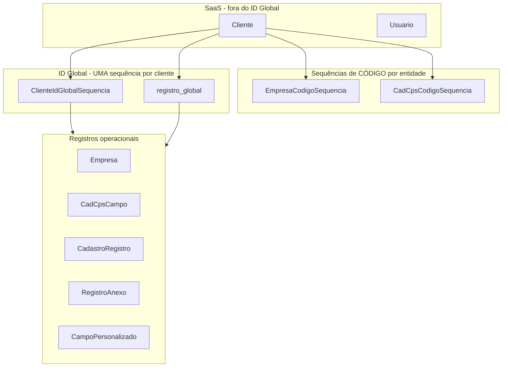

# Auditoria do Banco de Dados — ERP PROJETOMG

Documento de referência da estrutura esperada pelo código (Prisma) versus o que deve existir no PostgreSQL (Supabase).

## Como auditar o banco real

```bash
cd backend
# Confirme DATABASE_URL e DIRECT_URL no .env (credenciais reais do Supabase)
npm run audit:database
```

O script lista tabelas, colunas, migrations aplicadas, drift do ID Global e contagem de registros.

---

## Visão geral — camadas



---

## Tabelas — inventário completo (20 tabelas)

### SaaS (não recebe ID Global)

| Tabela | PK | Escopo | Função |
|--------|-----|--------|--------|
| `Cliente` | `id` (cuid) | Global SaaS | Tenant do ERP |
| `Usuario` | `id` (cuid) | Por cliente | Login e perfil |

### Operacionais (recebem ID Global)

| Tabela | PK | Código próprio | ID Global |
|--------|-----|----------------|-----------|
| `Empresa` | `id` | `codempresa` (Int) | `id_global` (Int) |
| `CadCpsCampo` | `id` | `codigo` (Int) | `id_global` (Int) |
| `CadastroRegistro` | `id` | — | `id_global` (Int) |
| `RegistroAnexo` | `id` | — | `id_global` (Int) |
| `CampoPersonalizado` | `id` | — | `id_global` (Int) |

### Sequências

| Tabela | Propósito | Escopo |
|--------|-----------|--------|
| `ClienteIdGlobalSequencia` | Próximo **ID Global** | 1 por cliente — **todos** os cadastros |
| `registro_global` | Índice `(cliente_id, id_global, entity_name, registro_id)` | 1 por cliente |
| `EmpresaCodigoSequencia` | Próximo **codempresa** | 1 por cliente — só empresas |
| `CadCpsCodigoSequencia` | Próximo **codigo** CADCPS | 1 por cliente — só campos |

> **Importante:** `EmpresaCodigoSequencia` e `CadCpsCodigoSequencia` são do sistema de **códigos de entidade** (1, 2, 3…). Não substituem o ID Global. O ID Global usa **apenas** `ClienteIdGlobalSequencia` + `registro_global`.

### Catálogo CADCPS

| Tabela | Função |
|--------|--------|
| `CadCpsTela` | Telas/módulos do ERP |
| `CadCpsCampoTela` | N:N campo ↔ tela |
| `CadCpsCampoEmpresa` | N:N campo ↔ empresa |
| `CadCpsCampoOpcao` | Opções de lista |
| `CadCpsHistorico` | Histórico de alterações CADCPS |

### Segurança, auditoria, preferências

| Tabela | Função |
|--------|--------|
| `PermissaoEmpresa` | Usuário ↔ empresas permitidas |
| `AuditLog` | Log corporativo (inclui `id_global` preparado) |
| `UsuarioPreferencia` | Layout/colunas por usuário |

---

## Colunas críticas — ID Global

### Tabelas novas (migration `20260604120000_id_global_corporativo`)

**`ClienteIdGlobalSequencia`**
- `id` TEXT PK
- `cliente_id` VARCHAR(64) UNIQUE FK → Cliente
- `next_id_global` INT DEFAULT 1
- `createdAt`, `updatedAt`

**`registro_global`**
- `id` TEXT PK
- `cliente_id` VARCHAR(64) FK → Cliente
- `id_global` INT
- `entity_name` VARCHAR(128)
- `registro_id` VARCHAR(128)
- `createdAt`
- UNIQUE `(cliente_id, id_global)`

### Colunas adicionadas em tabelas existentes

| Tabela | Coluna nova | Tipo |
|--------|-------------|------|
| Empresa | id_global | INTEGER NULL |
| CadCpsCampo | id_global | INTEGER NULL |
| CadastroRegistro | id_global | INTEGER NULL |
| RegistroAnexo | id_global | INTEGER NULL |
| CampoPersonalizado | id_global | INTEGER NULL |
| AuditLog | id_global | INTEGER NULL |

---

## Migrations no repositório

| Migration | Conteúdo |
|-----------|----------|
| `20260603010000_cadcps_module` | Tabelas CADCPS + CadCpsCodigoSequencia |
| `20260604120000_id_global_corporativo` | ClienteIdGlobalSequencia, registro_global, colunas id_global |

Scripts de garantia (boot produção):
- `ensureCadcpsTables.js`
- `ensureIdGlobalTables.js` (+ backfill automático)

---

## Causa do erro atual

```
Invalid prisma.clienteIdGlobalSequencia.upsert()
The table public.ClienteIdGlobalSequencia does not exist
```

**Diagnóstico:** o código já usa ID Global, mas o banco **não recebeu** a migration `20260604120000_id_global_corporativo`.

Isso ocorre quando:
1. O deploy do backend não rodou `ensureIdGlobalTables` / `prisma migrate deploy`
2. O Railway/Vercel subiu código novo sem executar o script de boot
3. A conexão `DATABASE_URL` aponta para outro banco (ex.: local vs produção)

---

## Correção

```bash
cd backend

# 1) Aplicar estrutura ID Global + backfill
npm run ensure:id-global

# 2) Confirmar
npm run audit:database

# 3) Reiniciar backend
npm run dev
```

No Supabase SQL Editor (alternativa manual):

```sql
-- Verificar se tabela existe
SELECT table_name FROM information_schema.tables
WHERE table_schema = 'public' AND table_name = 'ClienteIdGlobalSequencia';

-- Verificar coluna em Empresa
SELECT column_name FROM information_schema.columns
WHERE table_schema = 'public' AND table_name = 'Empresa' AND column_name = 'id_global';
```

Se ambos retornarem vazio → migration não aplicada.

---

## Relacionamentos principais

```
Cliente (1) ── (N) Empresa
Cliente (1) ── (1) ClienteIdGlobalSequencia
Cliente (1) ── (N) registro_global
Cliente (1) ── (1) EmpresaCodigoSequencia
Cliente (1) ── (1) CadCpsCodigoSequencia
Cliente (1) ── (N) CadCpsCampo
Empresa (1) ── (N) RegistroAnexo
Empresa (1) ── (N) CadastroRegistro
Usuario (N) ── (N) Empresa  via PermissaoEmpresa
```

---

## Multi-tenant

- Escopo principal: `cliente_id` em todas as tabelas operacionais
- Legado: `tenant_id` em Empresa, CampoPersonalizado, RegistroAnexo (compatibilidade)
- Sub-escopo: `empresa_id` onde aplicável
- ID Global: sequência **por cliente**, nunca compartilhada entre clientes
