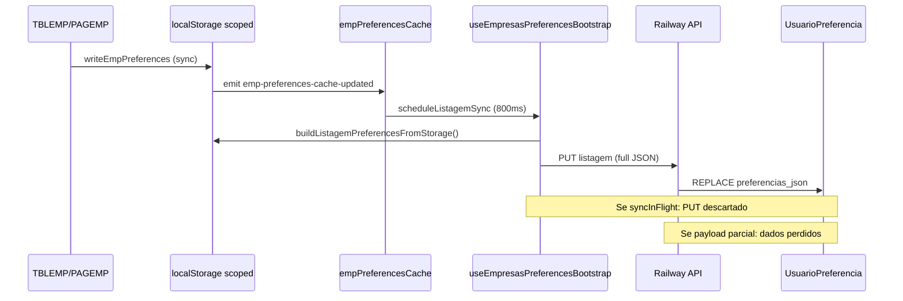

# Auditoria Forense — Preferências da Tela Empresas

**Data:** 2026-06-25  
**Ambiente de reprodução API:** `https://projetomg-production.up.railway.app`  
**Conta:** cliente `maike`, usuário `maike`  
**Escopo:** somente diagnóstico — nenhuma correção aplicada  
**Evidências brutas:** `docs/auditoria/evidence/forensic-api-results.json`

---

## 1. Resumo executivo

A arquitetura de preferências da tela Empresas usa **localStorage escopado** (`mg_pref_v2:{clienteId}:{userId}:empresas:listagem:{field}`) como fonte de verdade imediata para a UI, com **sincronização debounced (800 ms)** para um **único blob JSON** no backend (`UsuarioPreferencia.preferencias_json`, escopo `empresas.listagem`).

Os sintomas reportados em produção (**delays, salvamento seguido de reset, cards/filtros/tabela não permanecem**) são **consistentes com falhas reproduzíveis** identificadas nesta auditoria:

| Achado | Severidade | Evidência |
|--------|------------|-----------|
| Backend **substitui o JSON inteiro** em cada PUT (sem merge parcial) | **Crítica** | API: PUT parcial apagou `table`, `filters`, `viewMode` |
| `syncInFlightRef` **descarta PUT** se já houver sync em andamento | **Crítica** | Código: retorno antecipado sem fila |
| Corrida entre PUTs com snapshot stale → **last-write-wins** | **Crítica** | API: 2 PUTs concorrentes; backend aceita ambos |
| Tratamento de **409 não reidrata** storage/UI | **Alta** | Código: só atualiza `listagemUpdatedAtRef` |
| Debounce 800 ms + latência Railway ~1,2 s por PUT | **Alta** | API: PUT médio 1195–1776 ms |
| **Filtros temporários** persistidos no mesmo blob que config permanente | **Alta** | `FILTERS_KEY` / `columnFilters` |
| Gate `preferencesReady` bloqueia render da listagem | **Alta** | PAGEMP skeleton até bootstrap |
| Formulário: flash skeleton enquanto `isLayoutReady === false` | **Média** | FORMEMP.jsx |
| Chaves legadas `emp_*` / `erp_*` ainda lidas como fallback | **Média** | empresasPreferencesCache.js |
| Fullscreen de tabela **não persistido** | **Baixa** | TBLEMP: só `document.fullscreenElement` |

**Conclusão:** o isolamento por usuário **funciona no backend quando o registro é salvo corretamente**, mas o pipeline frontend→backend tem **pontos de perda de dados** (corrida, PUT descartado, replace total) que explicam resets intermitentes. **Não declarar preferências aprovadas.**

---

## 2. Bugs reproduzidos

### BUG-01 — PUT parcial apaga preferências existentes (Crítica)

**Reprodução (API produção, conta maike):**

```text
1. GET /api/user/preferences/empresas/listagem → JSON completo (~22 colunas visíveis)
2. PUT com payload { version: 1, cards: { cardsPerRow: 3 } } apenas
3. GET novamente → JSON contém só { version, cards }; table/filters/viewMode ausentes
```

**Evidência:** `forensic-api-results.json` → cenário "Backend — PUT parcial substitui JSON inteiro?" → `tableLost: true`, `tableVisibleCount: 0`.

**Impacto:** qualquer PUT com snapshot incompleto (corrida, bug de montagem) **destrói** colunas, filtros, cards e demais campos no banco.

---

### BUG-02 — PUT descartado durante sync in-flight (Crítica)

**Código:**

```196:198:src/modules/empresas/preferences/useEmpresasPreferencesBootstrap.js
  const persistListagemPreferences = useCallback(async () => {
    if (!userId || !clienteId || syncInFlightRef.current) return;
    syncInFlightRef.current = true;
```

Quando um PUT está em voo (~1,2 s em produção), chamadas subsequentes a `persistListagemPreferences` **retornam sem enfileirar retry**. O debounce de 800 ms pode disparar durante o PUT anterior; a alteração fica só no localStorage até outro evento de cache.

**Impacto:** alterações rápidas (Cenário 6) podem **nunca chegar ao backend**.

---

### BUG-03 — Corrida last-write-wins entre categorias (Crítica)

**Reprodução API:** dois PUTs paralelos com o **mesmo** `expectedUpdatedAt`:

- PUT1: ocultar coluna `email` — 1195 ms — OK  
- PUT2: cardsPerRow=1 (snapshot já incluía email oculto) — 1382 ms — OK  
- Estado final: ambos presentes **porque PUT2 carregou snapshot já mesclado localmente**

**Cenário de falha real:** se PUT1 e PUT2 montarem snapshots **independentes** a partir de localStorage em momentos diferentes (ex.: PUT1 antes de cards gravar no storage), o segundo PUT **sobrescreve** o primeiro no backend (replace total).

**Evidência:** backend `upsertByScope` faz `preferencias_json: validatedConfig` (replace), não merge.

---

### BUG-04 — HTTP 409 não reidrata UI (Alta)

```231:240:src/modules/empresas/preferences/useEmpresasPreferencesBootstrap.js
    } catch (error) {
      if (Number(error?.status) === 409) {
        const refreshed = await queryClient.fetchQuery({ ... });
        const mapped = mapBootstrapPreferences(refreshed);
        const remoteListagem = mapped[LISTAGEM_SCOPE_KEY];
        listagemUpdatedAtRef.current = remoteListagem?.updatedAt || null;
      }
```

Após conflito entre abas: timestamp remoto atualizado, mas **`applyListagemPreferencesToStorage` não é chamado**. UI/localStorage permanecem divergentes; próximo PUT pode falhar ou sobrescrever remoto.

---

### BUG-05 — Delay perceptível até persistência remota (Alta)

| Etapa | Tempo medido (produção) |
|-------|-------------------------|
| UI → localStorage | ~0 ms (síncrono) |
| Debounce antes do PUT | **800 ms** (fixo) |
| PUT listagem | **1195–1776 ms** |
| GET bootstrap | **~612 ms** |
| **Total clique → backend confirmado** | **~2,0–2,6 s** |

A UI atualiza imediatamente; o usuário percebe “salvou e resetou” quando reload ocorre **antes** do PUT completar ou quando PUT perdido (BUG-02/03).

---

### BUG-06 — Filtro temporário misturado com config permanente (Alta)

`FILTERS_KEY` (`emp_col_filters_v2`) armazena **valores aplicados** e operadores. Em `buildListagemPreferencesFromStorage`, vão para `table.columnFilters` **e** `filters.columnFilters`. No reload, PAGEMP reidrata `columnFilters` e reaplica filtros à listagem — comportamento de filtro temporário persistido como estado de sessão anterior.

**Separación A vs B:** operadores padrão (`filters.operatorsByField`) estão separados no JSON, mas **valores de filtro de coluna não**.

---

### BUG-07 — Bootstrap gate bloqueia tela inteira (Alta)

```1479:1489:src/modules/empresas/pages/PAGEMP.jsx
  if (!preferencesReady) {
    return ( /* skeleton animate-pulse */ );
  }
```

Até `useEmpresasPreferencesBootstrap` concluir GET bootstrap + `applyListagemPreferencesToStorage`, a listagem **não renderiza**. Latência inicial ≥ bootstrap (~612 ms) + processamento + possível migração local.

---

### BUG-08 — Cards: re-sync ao mudar catálogo de colunas (Média)

`useEmpCardsVisFields` recarrega `loadSearchVisFields` / `loadCardsLayoutConfig` quando `preferencesVersion` ou `catalog` muda. Troca tabela↔cards ou atualização de colunas em uso pode **re-merge** visibilidade e parecer reset.

---

### BUG-09 — Formulário: flash de layout padrão (Média)

`useCadastroForm`: `isLayoutReady` inicia `false` se não há layout local; FORMEMP renderiza skeleton até `readLocal` ou evento `cadastro-layout-hydrated:empresas`. Abrir/fechar repetido depende de cache local vs bootstrap remoto (debounce 800 ms separado em `LayoutPreferencesEngine`).

---

### BUG-10 — Troca de empresa selecionada reseta view local (Média)

```299:314:src/modules/empresas/pages/PAGEMP.jsx
  useEffect(() => {
    if (previousScopeEmpresaIdRef.current === selectedEmpresaId) return;
    ...
    setViewMode("table");
    ...
  }, [selectedEmpresaId]);
```

Não é perda no backend, mas **parece reset** de preferências de visualização.

---

## 3. Tabela de severidade

| ID | Bug | Severidade |
|----|-----|------------|
| BUG-01 | PUT replace total no backend | Crítica |
| BUG-02 | PUT descartado com sync in-flight | Crítica |
| BUG-03 | Corrida LWW entre categorias | Crítica |
| BUG-04 | 409 sem reidratação | Alta |
| BUG-05 | Delay debounce + Railway | Alta |
| BUG-06 | Filtro temp = permanente no blob | Alta |
| BUG-07 | Skeleton até preferencesReady | Alta |
| BUG-08 | Cards re-merge com catálogo | Média |
| BUG-09 | Form flash isLayoutReady | Média |
| BUG-10 | Reset view ao trocar empresa | Média |
| BUG-11 | Chaves legadas fallback leitura | Média |
| BUG-12 | Fullscreen não persistido | Baixa |
| BUG-13 | Produção aceita `usuario_id` no PUT body | Alta (segurança, PR #223 não deployada) |

---

## 4. Fluxo real de cada preferência

Legenda de etapas: **1** componente → **2** estado React → **3** hook → **4** memória → **5** localStorage → **6** evento abas → **7** debounce → **8** PUT → **9** endpoint → **10** repository → **11** DB → **12** GET bootstrap → **13** merge defaults → **14** sanitização → **15** hidratação → **16** render → **17** effects sobrescrevem

### 4.1 Tabela — colunas visíveis / ordem / congelamento

| Etapa | Detalhe |
|-------|---------|
| 1 | `TBLEMP.handleColumnLayoutChange`, popover colunas |
| 2 | `colunasVisiveis`, `colunasOrdem`, `frozenColumnCount` |
| 3 | — (direto no componente) |
| 4 | `empresasPreferencesCache.js` Map |
| 5 | `VISIBLE_KEY`, `ORDER_KEY`, `FROZEN_KEY` → scoped `mg_pref_v2:...:emp_col_*` |
| 6 | `emp-preferences-cache-updated` + `storage` listener |
| 7 | 800 ms via `scheduleListagemSync` (PAGEMP subscriber) |
| 8 | PUT body = `buildListagemPreferencesFromStorage()` (**objeto inteiro**) |
| 9 | `PUT /api/user/preferences/empresas/listagem` |
| 10 | `preferencesRepository.upsertByScope` — **replace** JSON |
| 11 | `UsuarioPreferencia.preferencias_json.table.*` |
| 12 | `GET /api/user/preferences/bootstrap` |
| 13 | `mergeEffectiveColumnLayout` + defaults catálogo COLUNAS_BASE |
| 14 | `sanitizeTablePreferences`, `FORBIDDEN_TABLE_KEYS` |
| 15 | `applyListagemPreferencesToStorage` reason `listagem:hydrate` → `applyTablePreferencesFromCache` |
| 16 | TBLEMP virtualized table |
| 17 | `useLayoutEffect` TBLEMP quando `preferencesVersion++`; bootstrap effect PAGEMP |

**Fonte vencedora em conflito:** último PUT bem-sucedido no backend; localStorage vence até reload se PUT falhar/atrasar.

---

### 4.2 Tabela — largura / auto-ajuste

| Etapa | Detalhe |
|-------|---------|
| 1 | Resize coluna TBLEMP |
| 2 | `columnWidths`, `autoFitActiveColumns` |
| 5 | `WIDTHS_KEY`, `SIZING_MODE_KEY` |
| 7 | widths: `emit: false` no effect — sync só via subscriber batch ou outros writes |
| 17 | `applyTablePreferencesFromCache` reaplica após hydrate |

---

### 4.3 Tabela — ordenação

| Etapa | Detalhe |
|-------|---------|
| 5 | `SORT_KEY` |
| 2 | `sortConfig` TBLEMP; PAGEMP `querySort` hidrata de SORT_KEY no mount |
| 8 | Incluso no blob listagem |

---

### 4.4 Tabela — filtros de coluna (temp + operador)

| Etapa | Detalhe |
|-------|---------|
| 5 | `FILTERS_KEY` |
| 2 | `filtrosColunas` TBLEMP; PAGEMP `columnFilters` |
| **A vs B** | **Não separado** — valores vão para JSON permanente |
| 8 | `scheduleListagemSync({ immediate: true })` em apply/clear filtros painel |

---

### 4.5 Filtros rápidos — config permanente (A)

| Etapa | Detalhe |
|-------|---------|
| 1 | Popover filtros, `useEmpFilterFieldsLayout.saveLayout` |
| 5 | `EMP_FILTER_FIELDS_LAYOUT_KEY`, `FILTER_MAX_VISIBLE_KEY` |
| 8 | `filters.filterFieldsLayout`, `filters.maxVisibleFields` no blob |
| 13 | `mergeSavedFilterFieldOrder`, defaults catálogo campos personalizados |

---

### 4.6 Filtros — valores temporários painel (B)

| Etapa | Detalhe |
|-------|---------|
| 2 | `filterValues`, `appliedFilterValues`, `appliedPanelFilters` |
| 5 | Indiretamente via `FILTERS_KEY` quando sincronizados com colunas |
| 8 | `handleFilterApply` → `scheduleListagemSync({ immediate: true })` |
| Reload | Reaplicados de `FILTERS_KEY` — **persistem como temp** |

---

### 4.7 Cards — campos visíveis, ordem, cards/linha

| Etapa | Detalhe |
|-------|---------|
| 1 | Config cards / `saveSearchVisFields`, `saveCardsLayoutConfig` |
| 2 | `useEmpCardsVisFields` |
| 5 | `erp_vis_config` (EMP_SEARCH_VIS_KEY), `erp_cards_layout_config` |
| 8 | `preferences.cards.*` no blob listagem |
| 17 | `preferencesVersion` listener recarrega state |

---

### 4.8 Modo visualização (tabela / cards / registro)

| Etapa | Detalhe |
|-------|---------|
| 5 | `emp_view_mode_v1` |
| 2 | PAGEMP `viewMode`; `handleMgViewModeChange` |
| 7 | effect `writeStoredEmpViewMode` quando `preferencesReady` |
| Nota | Modo "record" normalizado para "table" na hidratação |

---

### 4.9 Formulário — layout

| Etapa | Detalhe |
|-------|---------|
| 1 | `CadLayoutConfigurator`, `applyLayoutConfig` |
| 3 | `useCadastroForm`, `LayoutPreferencesEngine` |
| 5 | `cadastro:{clienteId}:{userId}:emp:form_layout_config` |
| 7 | **800 ms** debounce separado (`scheduleSync`) |
| 9 | `PUT /api/user/preferences/empresas/form_layout` |
| 12 | Bootstrap + `applyFormLayoutPreferencesToStorage` |
| 16 | FORMEMP gated by `isLayoutReady` |

**Escopo separado** do blob listagem — não apaga tabela, mas duplica padrão debounce/in-flight.

---

### 4.10 Lote / page size / agregação

| Chave | Campo JSON |
|-------|------------|
| `emp_infinite_batch_size` | `table.loadBatchSize` |
| `emp_table_page_size` | `table.pageSize` |
| `emp_table_aggregation_config` | `table.aggregationConfig` |

---

### 4.11 Fullscreen tabela

| Etapa | Só estado React + Fullscreen API — **não persistido** |

---

## 5. Inventário de chaves e fontes

| Preferência | Tela | Chave React Query | Chave memória | Chave localStorage | Evento | Endpoint | Campo JSON backend | Debounce (ms) | Classificação |
|-------------|------|-------------------|---------------|-------------------|--------|----------|-------------------|---------------|---------------|
| Bootstrap geral | Empresas | `["user-screen-preferences", clienteId, userId, "bootstrap"]` | RQ cache | — | — | GET `/api/user/preferences/bootstrap` | todos registros | 0 | **ATIVA** |
| Colunas visíveis | Listagem | ↑ | cache Map | `mg_pref_v2:*:emp_col_visiveis` / `emp_col_visiveis` | `emp-preferences-cache-updated` | PUT listagem | `table.visibleColumns` | 800 | **ATIVA** / LEGADA fallback |
| Ordem colunas | Listagem | ↑ | Map | `...emp_col_ordem` | ↑ | PUT listagem | `table.columnOrder` | 800 | **ATIVA** |
| Larguras | Listagem | ↑ | Map | `...emp_col_widths` | ↑ | PUT listagem | `table.columnWidths` | 800 | **ATIVA** |
| Sizing mode | Listagem | ↑ | Map | `...emp_col_sizing_mode_v1` | ↑ | PUT listagem | `table.columnSizingMode` | 800 | **ATIVA** |
| Congelamento | Listagem | ↑ | Map | `...emp_col_frozen` | ↑ | PUT listagem | `table.frozenLeftColumnCount` | 800 | **ATIVA** |
| Filtros coluna | Listagem | ↑ | Map | `...emp_col_filters_v2` | ↑ | PUT listagem | `table.columnFilters` + `filters.columnFilters` | 800 / imediato apply | **ATIVA** / **CONFLITANTE** (A+B) |
| Ordenação | Listagem | ↑ | Map | `...emp_sort_columns_v1` | ↑ | PUT listagem | `table.sort` | 800 | **ATIVA** |
| Page size | Listagem | ↑ | Map | `...emp_table_page_size` | ↑ | PUT listagem | `table.pageSize` | 800 | **ATIVA** |
| Lote infinito | Listagem | ↑ | Map | `...emp_infinite_batch_size` | ↑ | PUT listagem | `table.loadBatchSize` | 800 imediato | **ATIVA** |
| Agregação tabela | Listagem | ↑ | Map | `...emp_table_aggregation_config` | ↑ | PUT listagem | `table.aggregationConfig` | 800 | **ATIVA** |
| View mode | Listagem | ↑ | Map | `...emp_view_mode_v1` | `emp-view-mode-updated` | PUT listagem | `viewMode` | 800 | **ATIVA** |
| Launch panel style | Listagem | ↑ | Map | `...emp_launch_panel_style_v1` | custom | PUT listagem | `panels.launchPanelStyle` | 800 | **ATIVA** |
| Cards visíveis | Cards | ↑ | Map | `...erp_vis_config` / `emp_search_vis_config` | ↑ | PUT listagem | `cards.visibleFields` | 800 | **ATIVA** / LEGADA |
| Cards por linha | Cards | ↑ | Map | `...erp_cards_layout_config` | ↑ | PUT listagem | `cards.cardsPerRow` | 800 | **ATIVA** |
| Filtros rápidos layout | Filtros | ↑ | Map | `...emp_filter_fields_layout_v1` | `emp-filter-fields-layout-updated` | PUT listagem | `filters.filterFieldsLayout` | 800 | **ATIVA** |
| Max filtros visíveis | Filtros | ↑ | Map | `...emp_filter_max_visible_v1` | ↑ | PUT listagem | `filters.maxVisibleFields` | 800 | **DUPLICADA** (também em layout) |
| Operadores padrão | Filtros | ↑ | Map | derivado de FILTERS_KEY | ↑ | PUT listagem | `filters.operatorsByField` | 800 | **ATIVA** |
| Dropdown search fields | Search | ↑ | Map | `...erp_search_dropdown_vis_config` | ↑ | PUT listagem | `filters.dropdownVisibleFields` | 800 | **ATIVA** |
| Favoritos search | Search | ↑ | Map | `...emp_search_favorites` | `emp-favorites-updated` | PUT listagem | `filters.favorites` | 800 | **ATIVA** |
| Form layout | Form | — | Map | `cadastro:{c}:{u}:emp:form_layout_config` | `cadastro-layout-*:empresas` | PUT form_layout | `activeConfig` | 800 | **ATIVA** |
| Form updatedAt | Form | — | Map | `...__updatedAt`, `...__serverUpdatedAt` | — | — | — | — | **ATIVA** |
| Migração marker | Meta | — | Map | `...emp_user_preferences_migrated_v1:{userId}` | migration | — | — | — | **ATIVA** |
| Col vis initialized | Tabela | — | Map | `...emp_col_vis_initialized_v1` | — | — | — | — | **LEGADA** marker |
| `emp_col_pinned_right` | — | — | — | removido no mount | — | — | — | — | **ÓRFÃ** cleanup |
| `cps_*` | Cadastro CPS | — | — | módulo CPS, não Empresas | — | — | — | — | **NÃO UTILIZADA** em Empresas |

---

## 6. Medição de delays

Medições API produção (2026-06-25). UI localStorage é síncrona (~0 ms).

| Evento | UI responde | Até PUT | Resposta PUT | GET/hidratação | Total persistência |
|--------|------------:|--------:|-------------:|---------------:|-------------------:|
| Ocultar coluna (API direta) | n/a | 0 ms | **1198 ms** | 609 ms GET | **~1809 ms** |
| Cards por linha | n/a | 0 ms | **1776 ms** | 612 ms | **~2388 ms** |
| Campo de card | ~0 ms¹ | **800 ms** | ~1200 ms | bootstrap 612 ms | **~2,6 s** |
| Filtro rápido (maxVisible) | ~0 ms¹ | **800 ms** | **1194 ms** | 610 ms | **~2,6 s** |
| Ordem de filtro | ~0 ms¹ | **800 ms** | ~1200 ms | 612 ms | **~2,6 s** |
| Layout formulário | skeleton² | **800 ms** | ~1200 ms³ | bootstrap | **~2–3 s** |

¹ Estimado por arquitetura (write localStorage síncrono); UI Playwright não concluída — ver §15.  
² FORMEMP skeleton enquanto `!isLayoutReady`.  
³ Endpoint separado `form_layout`.

**Origens do delay:**

- Debounce fixo **800 ms** (`useEmpresasPreferencesBootstrap`, `LayoutPreferencesEngine`)
- Latência Railway **~600 ms GET**, **~1200 ms PUT**
- Gate render `preferencesReady` (bootstrap obrigatório)
- Virtualização tabela: re-render após `applyTablePreferencesFromCache`, não bloqueia write

---

## 7. Matriz de reset/sobrescrita

| Preferência | Valor salvo (local) | Backend | Bootstrap | Após merge | Renderizado | Quem sobrescreveu | Arquivo:linha |
|-------------|---------------------|---------|-----------|------------|-------------|-------------------|---------------|
| Colunas visíveis | scoped VISIBLE_KEY | table.visibleColumns | idem hydrate | mergeEffectiveColumnLayout | TBLEMP state | Bootstrap hydrate se PUT perdido; PUT stale em corrida | `useEmpresasPreferencesBootstrap.js:149-155`, `TBLEMP.jsx:418-421` |
| Cards/linha | erp_cards_layout_config | cards.cardsPerRow | hydrate | normalizeCardsPerRow | cards grid | PUT parcial apaga junto com table (BUG-01) | `preferencesRepository.js:306-311` |
| Filtros rápidos layout | emp_filter_fields_layout_v1 | filters.filterFieldsLayout | hydrate | mergeSaved* | filter strip | Catálogo campos personalizados merge | `useEmpFilterFieldsLayout.js:40-56` |
| Filtro temp coluna | FILTERS_KEY | columnFilters | hydrate → reaplicado | — | filtros ativos | Tratado como permanente no reload | `PAGEMP.jsx:354-367` |
| View mode | emp_view_mode_v1 | viewMode | hydrate | normalizeViewMode | action bar | selectedEmpresaId effect força table | `PAGEMP.jsx:305` |
| Form layout | cadastro:...:form_layout | activeConfig | bootstrap form | migrateStoredLayoutConfig | FORMEMP | initLocal escreve defaults se vazio | `LayoutPreferencesEngine.js:109-122` |

---

## 8. Matriz de concorrência

| Preferência | Writer 1 | Writer 2 | Writer 3 | Risco | Evidência |
|-------------|----------|----------|----------|-------|-----------|
| Blob listagem inteiro | `scheduleListagemSync` / cache subscriber | `migrateScopedLocalPreferencesIfNeeded` | Bootstrap `applyListagemPreferencesToStorage` | **Alto** | Um PUT replace apaga campos do outro |
| Colunas | TBLEMP effects | handleColumnLayoutChange | hydrate TBLEMP | Médio | suppressPersistenceRef mitiga loop |
| Filtros coluna | TBLEMP filtrosColunas effect | PAGEMP handleFilterApply | hydrate | Alto | Mesma chave FILTERS_KEY |
| Cards | saveSearchVisFields | bootstrap hydrate | useEmpCardsVisFields reload | Médio | preferencesVersion bump |
| Form layout | LayoutPreferencesEngine.scheduleSync | bootstrap applyForm | initLocal defaults | Médio | Escopos DB separados |
| View mode | PAGEMP effect | writeStoredEmpViewMode | bootstrap hydrate | Baixo | Mesmo blob listagem |

**Mecanismos ausentes:** fila pós in-flight, merge PATCH backend, cancelamento AbortController por versão, flush no unmount/logout (listagem não faz flush explícito no logout — só `resetEmpPreferencesMemoryCache` no AuthContext).

---

## 9. Auditoria backend

| Item | Status | Detalhe |
|------|--------|---------|
| GET bootstrap | OK | Lista todos escopos do usuário autenticado |
| GET por tela | OK | 404 se ausente |
| PUT listagem | **Replace total** | `preferencias_json: validatedConfig` — **sem merge** |
| Upsert | OK | create ou update by id |
| Optimistic lock | Parcial | `expectedUpdatedAt` → 409 se diverge; produção testada com PUTs paralelos mesmo timestamp — **ambos 200** |
| Validação | OK | `validatePreferenceConfig`, tamanho max 256KB |
| Isolamento | OK em código PR #223 | Produção atual ainda retorna 200 com `usuario_id` no body |
| `updated_at` | OK | Retornado no response |
| Rate limit / cache | Não observado | — |
| Erro silencioso frontend | Sim | 409 listagem: retry só se não 409; sync error toast |

**Teste crítico reproduzido:** PUT parcial `{ cards }` → backend persistiu **somente** `{ version, cards }`, apagando 22 colunas visíveis anteriores.

---

## 10. Causa raiz por bug

| Bug | Causa raiz |
|-----|------------|
| BUG-01 | `upsertByScope` substitui JSON inteiro; frontend envia snapshot montado do storage — se incompleto, apaga resto |
| BUG-02 | Guard `syncInFlightRef.current` sem fila de pending |
| BUG-03 | Sem merge backend + sem versionamento por sub-objeto + LWW |
| BUG-04 | Handler 409 incompleto |
| BUG-05 | Debounce 800 ms + latência rede |
| BUG-06 | Modelo de dados único para filtros temp e config |
| BUG-07 | Design `preferencesReady` gate |
| BUG-08 | Hook cards re-read on catalog/version |
| BUG-09 | Async hydrate form sem layout local warm |
| BUG-10 | Effect colateral selectedEmpresaId |

---

## 11. Arquivos e funções envolvidos

| Arquivo | Funções / trechos críticos |
|---------|---------------------------|
| `useEmpresasPreferencesBootstrap.js` | `persistListagemPreferences`, `scheduleListagemSync`, `applyBootstrapToStorage`, handler 409 |
| `empresasPreferencesStorage.js` | `buildListagemPreferencesFromStorage`, `applyListagemPreferencesToStorage` |
| `empresasPreferencesCache.js` | `writeEmpPreferences*`, `subscribeEmpPreferencesCache`, legacy fallback |
| `userPreferencesScope.js` | `resolveListagemPreferenceStorageKey`, `setActiveUserPreferencesScope` |
| `PAGEMP.jsx` | gate `preferencesReady`, cache subscriber, filter/column hydration |
| `TBLEMP.jsx` | `suppressPersistenceRef`, `applyTablePreferencesFromCache`, persistence effects |
| `useEmpCardsVisFields.js` | reload on `preferencesVersion` |
| `useEmpFilterFieldsLayout.js` | layout merge com catálogo |
| `empTablePreferencesHydration.js` | `readEmpTablePreferencesSnapshot` |
| `LayoutPreferencesEngine.js` | form sync debounce, `syncRemote` |
| `useCadastroForm.js` | `isLayoutReady`, hydrate listener |
| `preferencesRepository.js` | `upsertByScope` replace |
| `routes.js` (preferences) | PUT/GET endpoints |

---

## 12. Correção recomendada (não implementada)

| # | Recomendação | Bug |
|---|--------------|-----|
| R1 | Backend: **merge profundo** por seção (`table`, `cards`, `filters`) ou PATCH parcial | BUG-01, 03 |
| R2 | Frontend: **fila de sync** — se in-flight, marcar dirty e re-PUT após finally | BUG-02 |
| R3 | Frontend: em 409, **applyListagemPreferencesToStorage** + bump preferencesVersion | BUG-04 |
| R4 | Separar storage/API: **`filters.runtime`** vs **`filters.config`** | BUG-06 |
| R5 | Reduzir debounce listagem para 300–400 ms ou flush on `visibilitychange` / beforeunload | BUG-05 |
| R6 | `expectedUpdatedAt` obrigatório + rejeitar PUT paralelo com mesmo timestamp | BUG-03 |
| R7 | Cards hook: não resetar visFields se storage não mudou (deep compare) | BUG-08 |
| R8 | Form: inicializar `isLayoutReady=true` quando RQ bootstrap tem form_layout | BUG-09 |
| R9 | Deploy PR #223 isolamento + rejeitar identity fields | BUG-13 |

---

## 13. Ordem de correção sugerida

1. **R1 + R2** — eliminar perda de dados (crítico)  
2. **R4** — separar filtro temp vs config  
3. **R3 + R6** — concorrência multi-aba  
4. **R5** — percepção de delay  
5. **R7, R8** — polish UX  
6. **R9** — segurança produção  

---

## 14. O que não deve ser alterado

- Modelo de isolamento `cliente_id + usuario_id + modulo + tela` (PR #223)  
- Chaves scoped `mg_pref_v2:*` como padrão  
- Gate de segurança `rejectClientControlledIdentityFields`  
- Layout/UX visual da tabela, cards, filtros e formulário (fora escopo)  
- Catálogo de colunas COLUNAS_BASE e merge com campos personalizados  
- Endpoint bootstrap agregado (eficiente para cold start)  

---

## 15. Cenários não validados ou parcialmente validados

| Cenário | Status | Motivo |
|---------|--------|--------|
| 1 Colunas — UI completa (reload, aba, tabela↔cards) | **Parcial** | API PUT/GET OK; Playwright UI falhou (servidor dev local sem proxy produção / rota errada inicialmente) |
| 2 Cards — UI reload/logout | **Parcial** | API cardsPerRow OK; logout/login UI não executado |
| 3 Filtros rápidos — ordem/campos UI | **Parcial** | API maxVisible OK; ordem não testada E2E UI |
| 4 Operadores — UI | **Parcial** | API separação operatorsByField vs columnFilters OK |
| 5 Formulário — 10x abrir/fechar | **Não validado** | Requer sessão UI estável; flash documentado por código |
| 6 Alterações rápidas — contagem PUT UI | **Parcial** | API corrida 2 PUTs; UI toggles não medidos |
| Vídeo/capturas browser | **Não gerado** | Teste Playwright não completou; vídeo em `test-results/` parcial |
| Isolamento A/B/C usuários produção | **Não validado** | Conta única maike disponível |
| Fullscreen persistido | **Validado negativo** | Código — não há storage |

**Evidências disponíveis:**

- `docs/auditoria/evidence/forensic-api-results.json` — timings, payloads, cenários API  
- Vídeo/trace Playwright (falha login): `test-results/empresas-preferences-foren-*`  

---

## Apêndice A — Reproduções API (resumo)

```json
{
  "cenario_1": { "telefoneHidden": true, "putMs": 1198 },
  "cenario_2": { "cardsPerRow": 2, "persisted": true },
  "cenario_3": { "maxVisible": 7, "persisted": true },
  "cenario_4": { "defaultOperator": "startsWith", "tempFilter": { "operator": "contains", "value": "TESTE_AUDIT" }},
  "cenario_6": { "put1_ms": 1195, "put2_ms": 1382, "bothPersisted": true },
  "put_parcial": { "tableLost": true, "critical": true }
}
```

---

## Apêndice B — Fluxo simplificado



---

*Relatório gerado em modo somente auditoria. Nenhuma branch de correção, PR ou alteração de arquitetura/UX foi criada.*
