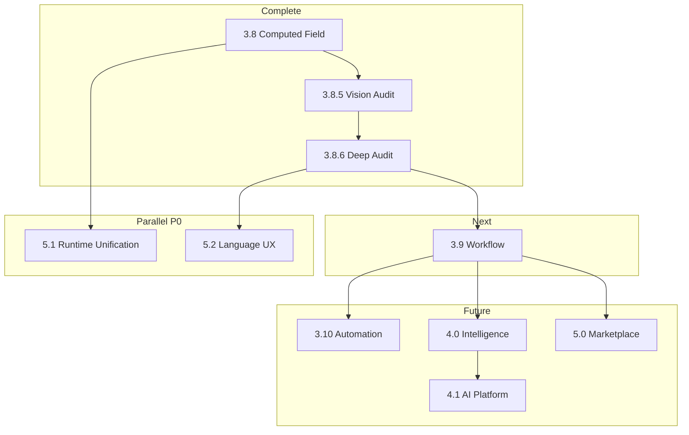

# Program Implementation Map — Program 3.8.6

**Date:** 2026-06-30  
**Scope:** Audit 9 — Future programs with dependencies, assets, and examples  
**SSOT:** [PROGRAM-REGISTRY.md](./PROGRAM-REGISTRY.md)

---

## 1. Completed Programs (Evidence)

| Program | Objective | Key deliverable | Gate | Status |
|---------|-----------|-----------------|------|--------|
| 3.7 | Intent Resolver implementation | `src/studio/intent/resolver/` | G305 | ✅ |
| 3.8 | Business Computed Field | `src/studio/business/computed/` | G306 | ✅ |
| 3.8.5 | Vision compliance audit | 5 audit docs | D-069 | ✅ |
| 3.8.6 | Platform deep audit | 11 audit docs | D-070 | ✅ (this mission) |

---

## 2. Active — Program 3.9 Business Workflow

| Dimension | Detail |
|-----------|--------|
| **Objective** | Second official Business Asset — multi-step process with states/transitions |
| **Dependencies** | 3.8 ✅, 3.8.5 ✅, 3.8.6 ✅, D-063 Derivation, D-064 Resolver |
| **Prerequisites** | G306 pattern established; Resolver extension point pattern |
| **Business Assets** | Business Workflow (new) |
| **Business Objects** | Workflow, State, Transition, Trigger |
| **Studios** | Workflow Studio (new designer or shell extension) |
| **Runtime** | Workflow projection → state machine executor (partial — architecture first) |
| **Resolver** | New derivation kind `process.workflow` |
| **Marketplace** | PublishingMetadata pattern from Computed Field |
| **Intelligence** | Process Mining hooks (metadata only) |
| **Knowledge** | Workflow templates in Knowledge Graph (future) |

**Example flow:**
1. Author: "Quando pedido aprovado, enviar para faturamento"
2. Business Language → Intent → Resolver → Business Workflow Asset
3. Asset projects to Runtime state machine config
4. Runtime executes transitions on events (event bus — not yet built)

**P0 parallel tracks (do not block 3.9 architecture):**
- Runtime Formula Unification (EPDA-P0-02)
- Business Language Product Shell (EPDA-P0-04)

---

## 3. Planned — Program 3.10 Business Automation

| Dimension | Detail |
|-----------|--------|
| **Objective** | Event-triggered business actions |
| **Dependencies** | 3.9 Workflow, TD-010 event bus |
| **Prerequisites** | Backend event infrastructure |
| **Business Assets** | Business Automation |
| **Runtime** | Automation executor |
| **Resolver** | `automation.rule` derivation kind |

---

## 4. Planned — Program 3.11 Business Dashboard

| Dimension | Detail |
|-----------|--------|
| **Objective** | Composed KPI/visualization asset |
| **Dependencies** | Computed Field, Indicators |
| **Business Assets** | Business Dashboard |
| **Studios** | Dashboard Studio |
| **Runtime** | Dashboard projection renderer |

---

## 5. Planned — Program 3.12 Business Report

| Dimension | Detail |
|-----------|--------|
| **Objective** | Structured report generation |
| **Dependencies** | Document model, MDP |
| **Business Assets** | Business Report |
| **Runtime** | Report engine |

---

## 6. Planned — Program 4.0 Enterprise Intelligence Implementation

> **Superseded program ID (2026-06-30):** "Program 4" now means **Universal Meta Model** per [PROGRAM-REGISTRY.md](./PROGRAM-REGISTRY.md). Enterprise Intelligence implementation will receive a new program ID. MMM track: [docs/meta-model/ROADMAP.md](../meta-model/ROADMAP.md).

| Dimension | Detail |
|-----------|--------|
| **Objective** | First code for Business Memory, Knowledge Graph |
| **Dependencies** | D-060, event bus, 3+ Business Assets |
| **Prerequisites** | Audit trail ingestion, asset lineage storage |
| **Business Objects** | Memory record, Knowledge node |
| **Studios** | None (consumes asset metadata) |
| **Runtime** | Event ingestion pipeline |
| **Intelligence** | Business Memory, Knowledge Graph MVP |

---

## 7. Planned — Program 4.1 AI Platform / Business Language Product

| Dimension | Detail |
|-----------|--------|
| **Objective** | NL authoring in product UI |
| **Dependencies** | D-065, Intent Resolver, LLM integration |
| **Prerequisites** | Business Language parser production-ready |
| **Studios** | Assisted authoring in all designers |
| **Resolver** | NL → Intent pipeline |

---

## 8. Planned — Program 5.0 Marketplace

| Dimension | Detail |
|-----------|--------|
| **Objective** | Publish/share/install Business Asset packages |
| **Dependencies** | 3+ asset types, PublishingMetadata wired |
| **Prerequisites** | Asset versioning, tenant isolation |
| **Business Assets** | Marketplace Package |
| **Runtime** | Package install/sync |

---

## 9. Planned — Program 5.1 Runtime Unification (Recommended Program ID)

| Dimension | Detail |
|-----------|--------|
| **Objective** | Single formula evaluation path; CRB multi-module |
| **Dependencies** | FORMULA-RUNTIME-UNIFICATION-PLAN.md |
| **Prerequisites** | D-062 plan accepted |
| **Business Assets** | Computed Field projection wired end-to-end |
| **Runtime** | Replace campoEngine primary path |
| **Decision needed now** | Assign official Program ID (Q20) |

---

## 10. Planned — Program 5.2 Business Language UX Track

| Dimension | Detail |
|-----------|--------|
| **Objective** | Dual Authoring in product — Business First default |
| **Dependencies** | D-065, 4.1 partial |
| **Prerequisites** | Hide expressionSource from default UX |
| **Studios** | Business shell overlay |

---

## 11. Dependency Graph (Future)

---

## 12. Certification (Program Map)

**Will current program sequence reach EOS?**  
**CONDITIONAL YES** — if 3.9–5.x execute per architecture AND parallel P0 tracks (Runtime Unification, Language UX, Intelligence) are scheduled with Program IDs.

**Gap:** ROADMAP Phase 6 "Marketplace = Program 3" collision (AD-P2-14) — PROGRAM-REGISTRY is SSOT; ROADMAP needs sync.
