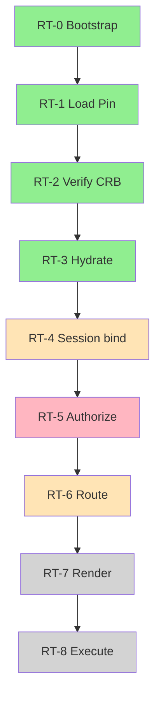
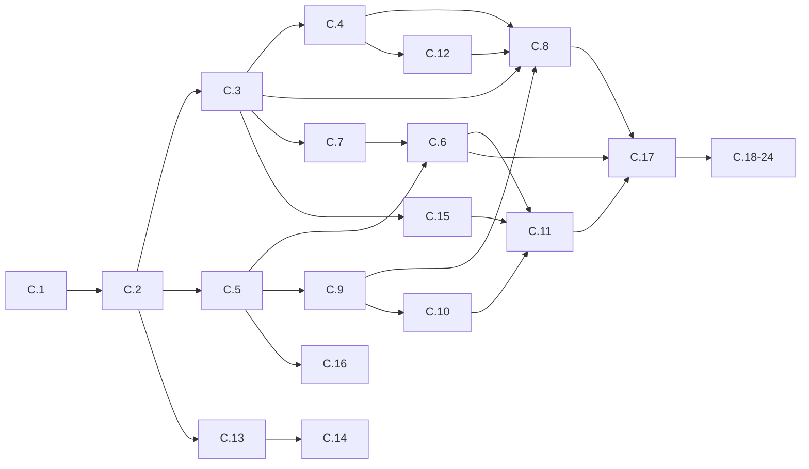

# HANDOFF COMPLETO — MAK Gestão / Foundation C (Runtime Bridge)

**Gerado:** 2026-07-08 (atualizado — versão completa)  
**Repo:** `maikelimaadm-stack/PROJETOMG`  
**Branch base:** `main`  
**HEAD atual:** `66e172cf` — Merge PR #391 (Foundation C.4)  
**Último slice mergeado:** **C.4** · **Próximo:** **C.5**

> **Como usar:** Copie este arquivo inteiro para um novo chat (ChatGPT, Cursor, Claude, etc.) no início da conversa.  
> Ele substitui memória de chat — contém visão, estado, estrutura, edições feitas, regras, roadmap e próximos passos.

---

## Índice

1. [Resumo executivo](#1-resumo-executivo)
2. [Visão de produto e ideias futuras](#2-visão-de-produto-e-ideias-futuras)
3. [O que é o projeto hoje](#3-o-que-é-o-projeto-hoje)
4. [Arquitetura em camadas](#4-arquitetura-em-camadas)
5. [Programa atual — Foundation C](#5-programa-atual--foundation-c)
6. [Onde paramos (estado exato)](#6-onde-paramos-estado-exato)
7. [Histórico de implementação (C.0 → C.4)](#7-histórico-de-implementação-c0--c4)
8. [Pipeline Runtime e estágios RT](#8-pipeline-runtime-e-estágios-rt)
9. [Estrutura de código detalhada](#9-estrutura-de-código-detalhada)
10. [Módulos M01–M24 (backlog completo)](#10-módulos-m01m24-backlog-completo)
11. [SSOT, governança e regras permanentes](#11-ssot-governança-e-regras-permanentes)
12. [Decisões D-RI (Runtime Implementation)](#12-decisões-d-ri-runtime-implementation)
13. [Próximo passo — C.5 (detalhado)](#13-próximo-passo--c5-detalhado)
14. [Roadmap Foundation C (C.5 → C.24)](#14-roadmap-foundation-c-c5--c24)
15. [Foundations futuras (D → L)](#15-foundations-futuras-d--l)
16. [Riscos conhecidos](#16-riscos-conhecidos)
17. [Débito técnico](#17-débito-técnico)
18. [Programas e ideias além do Runtime](#18-programas-e-ideias-além-do-runtime)
19. [Comandos e workflow de dev](#19-comandos-e-workflow-de-dev)
20. [Processo de entrega por slice](#20-processo-de-entrega-por-slice)
21. [Instrução para novo agente/chat](#21-instrução-para-novo-agentechat)
22. [Histórico git e PRs](#22-histórico-git-e-prs)
23. [Mapa de documentos obrigatórios](#23-mapa-de-documentos-obrigatórios)

---

## 1. Resumo executivo

| Campo | Valor |
|-------|-------|
| **Produto** | MAK Gestão — ERP metadata-driven evoluindo para **Enterprise Operating System (EOS)** |
| **Versão** | `0.4.0-rc.2` |
| **Programa ativo** | **Foundation C — Runtime Bridge** (Program 4.05) |
| **Autorização** | D-RI-16 — Global Architecture Certificate (6 blocos SSOT sincronizados) |
| **Código novo** | `src/runtime/` — Universal Runtime v2 |
| **Código legado (transicional)** | `src/framework/mak/runtime/` — eliminado em Foundation E |
| **Slices concluídos** | C.0, C.0.2, C.1, C.2, C.3, C.4 |
| **Testes runtime** | **66/66 PASS** (`npm run test:runtime`) |
| **Gates PASS** | G423-01 até G423-08 |
| **Próximo slice** | **C.5** — M20 Service Locator + M09 Permission Engine |
| **Meta final Foundation C** | Gate master **G423** — RT-0→RT-8 completo, empresas via CRB sem boot cache |

**Em uma frase:** Estamos construindo o runtime universal que carrega CRB assinado, hidrata registries, resolve dependências, roteia URLs — e em C.5 vamos ligar DI + permissões reais antes de renderizar telas.

---

## 2. Visão de produto e ideias futuras

### 2.1 Pivot estratégico (D-057 — MAK 2035)

MAK Gestão deixa de ser posicionado apenas como "ERP" e passa a ser um **Enterprise Operating System (EOS)**:

| Mental model ERP | Mental model EOS |
|------------------|------------------|
| Módulos possuem features | **Capabilities** possuem features |
| Telas são o produto | **Business Objects** são o produto |
| TI configura software | **Negócio autora** intent |
| Relatórios são add-ons | **Intelligence** é nativa |
| Integrações são projetos | Integrações são **assets reutilizáveis** |
| IA é chat lateral | IA **acelera** authoring (opcional, nunca mutação silenciosa) |

**Importante:** Isso é visão e vocabulário — não é rename obrigatório de código hoje.

### 2.2 Pilares 2035 (documentados, maioria não implementada)

| Pilar | Descrição | Status |
|-------|-----------|--------|
| Universal Business Objects | Um modelo para todos artefatos | Docs ✅ |
| Universal Automation | Event → condition → action | Docs ✅ |
| Universal Capabilities | Catálogo de features de negócio | Docs ✅ |
| Business Intent Layer | NL/visual → executável | Arquitetura ✅ · UI ❌ |
| Knowledge Platform | Memory + Knowledge Graph | Docs ✅ (Programs 3.12–3.13) |
| Decision Platform | Rules, policies | Docs ✅ |
| Learning Platform | Mining, maturity | Docs ✅ |
| Digital Twin | Simular antes de produção | Docs ✅ |
| Marketplace Intelligence | Assets certificados reutilizáveis | Foundation I (futuro) |
| Collaborative Intelligence | Human + AI + audit | Visão ✅ |

### 2.3 Princípio Business Asset (D-068)

Tudo que o usuário cria é **asset reutilizável da empresa**:
- Fórmulas, automações, dashboards, workflows, relatórios, integrações, validações, permissões
- **Nada pertence a uma tela** — tudo pertence ao **negócio**
- Studios **editam assets**, não criam features novas
- Runtime **executa projeções derivadas** apenas

### 2.4 Autonomia progressiva (horizonte longo)

| Estágio | Comportamento |
|---------|---------------|
| Self Documentation | Plataforma documenta seus próprios objetos |
| Self Optimization | Tuning aprovado pelo engine de melhoria |
| Autonomous Business | Loop fechado só para ações pré-certificadas de baixo risco |

**Constraint constitucional:** Accountability humano e RBAC permanecem — autonomia é **scoped**, nunca cross-tenant.

### 2.5 Multi-agent (visão, não implementado)

Agentes especializados (authoring, integration, audit, mining) coordenam via:
- Event bus da Platform Core
- Knowledge graph context
- Governance policies
- Human approval gates

### 2.6 Ideias futuras do Runtime (pós-G423)

| Ideia | Foundation | Gate |
|-------|------------|------|
| Studios MMM-native (17 designers) | D | G424 |
| Eliminar boot cache / `generatedModules.json` | E | G425 |
| Event Bus distribuído DB-backed | F | G426 |
| Generic Repository unificado (EAV) | G | G427 |
| Primeiro módulo zero-code end-to-end | H | G428 |
| Marketplace `.makpkg` install/publish | I | G429 |
| AI Gateway (AICandidate pipeline) | J | G430 |
| Intelligence L10 (Memory/KG ingestion) | K | G431 |
| ERP como Application packages (Financeiro, Vendas) | L | G432 |

**Regra:** Nenhum trabalho full em D, E, F, Marketplace ou ERP até **G423 PASS**.

---

## 3. O que é o projeto hoje

### 3.1 Stack técnica

| Camada | Tecnologia |
|--------|------------|
| Frontend | React 18 + Vite 6 + React Query + Tailwind/shadcn |
| Backend | Fastify 5 + Prisma 6 + PostgreSQL |
| Auth | JWT + Supabase (prod) · mock L1 in-memory (runtime tests) |
| Metadata | MDP (MAK Data Platform) + CRB `mmm-crb-v1` |
| Testes | Node test runner (`node --test`) + Playwright E2E |

### 3.2 Repositório

```
/workspace/                    # Frontend React/Vite
/workspace/backend/            # Fastify + Prisma (opcional local)
```

**Dev padrão (sem secrets Supabase):**
```bash
cp .env.local.example .env.local
npm run dev   # http://127.0.0.1:5173 — proxy /api → Railway
```

**Stack local completa:** requer `backend/.env` com DATABASE_URL, SUPABASE_*, JWT_SECRET.

### 3.3 Módulos de domínio certificados (runtime legado)

| moduleId | Página | Padrão | Arquivos |
|----------|--------|--------|----------|
| empresas | PAGEMP | Reference — factory overrides | 42 |
| cadcps | PAGCPS | Thin page + domain runtime | 18 |

**Meta C.17:** empresas roda via CRB novo runtime sem boot cache SSOT.

### 3.4 Config Engines (V13–V20) — congelados

Layout V13 · Field V14 · Validation V16 · Formula V17 · Events V18 · Actions V19 · Workflow V20 — todos gate-certified.

---

## 4. Arquitetura em camadas

### 4.1 Mapa atual (simplificado)

```
Domain modules (empresas, cadcps) → ModeloBase1 → framework/mak → cadastro-engine → API/Prisma
                                              ↘ framework/cadastro (legacy, transicional)

MAK DATA PLATFORM (L4) → Entity ✅ · Data ✅ · Relationship ✅ · Registry ✅ · Publish ✅
Runtime Bridge (L2)     → CRB hydration ✅ (Phase 1E) · Universal Runtime v2 em progresso (Foundation C)
Platform Core (L3)      → auth, tenant, RBAC parcial · event bus ❌
```

### 4.2 Seis blocos SSOT sincronizados (C.0.2)

| Bloco | Path | Status |
|-------|------|--------|
| Meta Model (MMM) | `docs/meta-model/` | ✅ Frozen (4.01–4.04) |
| Platform Architecture | `docs/platform-architecture/` | ✅ |
| Platform Behavior | `docs/platform-behavior/` | ✅ |
| Platform Protocol (UEP) | `docs/platform-protocol/` | ✅ |
| Platform Authoring (UAS) | `docs/platform-authoring/` | ✅ |
| Runtime Implementation | `docs/runtime-implementation/` | ✅ Plan · **code em progresso** |

### 4.3 Foundation sequence (roadmap oficial)

```
A (Identity) → B (MMM) → B.5 (Behavior) → B.6 (Protocol) → B.7 (Authoring)
  → C.0 (Impl Plan) → C (Runtime code) → D (Studio MMM) + E (Legacy Elim)
  → F (Event Bus) → G (Generic Repo) → H (Low-Code) → I (Marketplace)
  → J (AI Gateway) → K (Intelligence L10) → L (ERP Applications)
```

**Estamos em:** Foundation **C** (código), slice **C.5**.

---

## 5. Programa atual — Foundation C

### 5.1 Objetivo

Implementar o **Universal Runtime** que:
1. Consome CRB assinado (não boot cache como SSOT)
2. Implementa UEP (Universal Execution Protocol)
3. Renderiza output de UAS (Universal Authoring Specification)
4. Orquestra RT-0 → RT-8

### 5.2 Princípios de entrega

- **Slices C.1–C.24** — não novos Program IDs (D-RI-09)
- **1 slice = 1 PR** (regra permanente desde C.4)
- **Sem alteração arquitetural** — SSOT intacto (exceto `docs/evidence/`)
- **Cada módulo novo = diagrama Mermaid** em `MODULE-DIAGRAMS.md`
- **Gates G423-01..24** por módulo + gate master **G423** no C.17

### 5.3 O que Foundation C NÃO faz (deferido)

| Item | Quando |
|------|--------|
| Event Bus distribuído | Foundation F |
| Generic Repository completo | Foundation G |
| Scheduler / Background Jobs | Foundation F |
| 9 view modes além table+form | C.18–C.24 (pós-G423) |
| Eliminar boot cache | Foundation E |
| Studios designers full | Foundation D (após G423) |

---

## 6. Onde paramos (estado exato)

### 6.1 Tabela de slices

| Slice | Módulos | Status | PR | Testes acum. |
|-------|---------|--------|-----|--------------|
| C.0 | Docs runtime-implementation | ✅ mergeado | #386 | — |
| C.0.2 | SSOT remediation + certificado global | ✅ mergeado | #387 | — |
| C.1 | M02 Context + M01 Bootstrap RT-0 | ✅ mergeado | #388 | 11 |
| C.2 | M04 Registry + M03 Session | ✅ mergeado | #389 | 30 |
| C.3 | M05 Loader + M06 CRB Loader | ✅ mergeado | #390 | 47 |
| C.4 | M07 Dependency + M08 Router | ✅ mergeado | #391 | 66 |
| **C.5** | **M20 Service Locator + M09 Permission** | ⏳ **PRÓXIMO** | — | — |

### 6.2 Pipeline que funciona hoje (testes)

```
Bootstrap (M01 RT-0)
  → Context (M02)
  → Session (M03 mock L1)
  → Registry (M04)
  → Loader (M05)
  → CRB Loader (M06 verify + hydrate V13–V20)
  → Dependency Resolver (M07 DAG + topological order)
  → Runtime Router (M08 route table + URL match)
  → Runtime Ready (status: 'runtime-ready')
```

**Orquestrador:** `loadRuntimeBundle()` em `src/runtime/core/bootstrap/loadRuntimeBundle.js`

### 6.3 O que ainda NÃO existe

| Capability | Slice previsto |
|------------|----------------|
| Service Locator real (DI wire) | C.5 |
| Permission Engine real | C.5 |
| `canActivate()` bloqueando rotas | C.5 |
| Action Engine + UEC dispatch | C.6 |
| Workflow instance host | C.7 |
| Render (table/form) | C.8, C.17 |
| Expression/Formula adapters (G302) | C.9 |
| Validation Engine | C.10 |
| Execution pipeline UP-09 5 stages | C.11 |
| State Engine + USM | C.12 |
| Plugin Engine | C.13 |
| Connector HTTP | C.14 |
| Cache distribuído + Event Bus | C.15 |
| Transaction Manager BE | C.16 |
| RT-0→RT-8 completo + G423 master | C.17 |
| 7 view modes extras | C.18–C.24 |

---

## 7. Histórico de implementação (C.0 → C.4)

### 7.1 C.0 + C.0.2 — Documentação e certificação

| PR | Conteúdo |
|----|----------|
| #386 | Foundation C.0 — plano completo em `docs/runtime-implementation/` (16 docs) |
| #387 | C.0.2 — remediação SSOT, certificado global 6 blocos, D-RI-16 |

**Entregáveis C.0:** backlog M01–M24, DAG, interfaces, contratos RT-C-NN, gates G423-NN, delivery planning C.1–C.24, riscos, auditoria final.

### 7.2 C.1 — Context + Bootstrap RT-0 (PR #388)

| Item | Detalhe |
|------|---------|
| M02 | `RuntimeContext` imutável, traceId, tenant isolation |
| M01 | `bootstrap()` / `destroy()` RT-0 shell; `hydrate()` deferred |
| Arquivos | 18 criados, ~520 linhas |
| Gates | G423-01 (partial), G423-02 PASS |
| Débito | M20/M24 stubs mínimos; hydrate em C.3 |

**Arquivos-chave criados:**
- `src/runtime/core/context/`
- `src/runtime/core/bootstrap/bootstrap.js`, `phases/rt0-shell.js`
- `src/runtime/infra/service-locator/serviceLocator.js` (stub)
- `src/runtime/infra/observability/tracer.js` (stub)

### 7.3 C.2 — Session + Registry (PR #389)

| Item | Detalhe |
|------|---------|
| M03 | WebSessionManager, mock L1 auth, refresh, logout, fail-closed |
| M04 | RegistryManager, 12 tipos, duplicate throws, freeze post-hydrate |
| Arquivos | 32, ~1.050 linhas |
| Gates | G423-03, G423-04 + regressão 01–02 |
| Débito | Mock L1 in-memory; sem Redis AccessScope cache |

**12 RegistryTypes:** handlers, renderers, connectors, plugins, routes, permissions, validations, formulas, expressions, actions, workflows, layouts (conforme SSOT).

### 7.4 C.3 — Loader + CRB Loader (PR #390)

| Item | Detalhe |
|------|---------|
| M05 | LoaderManager, pipeline, pin validation, cache in-memory |
| M06 | CRBLoader verify/hydrate, V13–V20, `mmm-crb-v1` |
| M01 | hydrate RT-1→RT-3 wired parcialmente |
| Arquivos | 37, ~1.568 linhas |
| Gates | G423-05, G423-06 + regressão 01–04 |
| Métricas baseline | bootstrap ~4ms, CRB ~1ms, hydrate ~1ms, 16 registry objects |

**Problemas resolvidos no CI (antes do merge):**
- `RegistryError` import faltando em `registryManager.js`
- `Buffer` → `TextDecoder` em `BundleReader.js` (ESLint browser env)
- ESLint node globals override para `src/runtime/**` em `eslint.config.js`

**Ordem de merge:** C.2 (#389) mergeado primeiro; C.3 (#390) rebaseado e corrigido depois.

### 7.5 C.4 — Dependency Resolver + Router (PR #391)

| Item | Detalhe |
|------|---------|
| M07 | DAG, cycle detection, topological sort, DependencyGraph/Analyzer/Sorter |
| M08 | RuntimeRouter, RouteRegistry, RouteMatcher, URL → screenId + params |
| Pipeline | `loadRuntimeBundle()` estendido até Runtime Ready |
| Arquivos | 35, ~1.450 linhas |
| Gates | G423-07, G423-08 + regressão 01–06 |
| Métricas C.4 | dep resolve ~0.1ms, 1 route (fixture empresas), 19 testes do slice |

**Débito criado em C.4:**
- `router.canActivate()` sempre retorna `true` (stub até M09 em C.5)
- Sem host React navigation ainda

**Diagramas Mermaid:** `docs/evidence/foundation-c4/MODULE-DIAGRAMS.md` (regra permanente C.4+)

### 7.6 Resumo de edições por área

| Área | O que mudou |
|------|-------------|
| `src/runtime/` | Novo runtime completo C.1–C.4 (~100+ arquivos) |
| `scripts/gates/` | g423-01 até g423-08 |
| `package.json` | test:runtime, test:runtime:c1–c4, gate:g423-01–08 |
| `eslint.config.js` | Override node globals para runtime |
| `docs/evidence/foundation-c1..c4/` | Certification reports + diagrams |
| SSOT `docs/runtime-implementation/` | **NÃO alterado** (apenas leitura) |

---

## 8. Pipeline Runtime e estágios RT

### 8.1 RT-0 → RT-8 (SSOT: `06-BOOTSTRAP-SEQUENCE.md`)

| Estágio | Nome | Status atual | Módulos |
|---------|------|--------------|---------|
| RT-0 | Bootstrap shell | ✅ C.1 | M01, M02, M20 stub, M24 stub |
| RT-1 | Load Pin | ✅ parcial C.3 | M03, M05 |
| RT-2 | Verify CRB | ✅ C.3 | M05, M06 |
| RT-3 | Hydrate registries | ✅ C.3–C.4 | M06, M04, M07, M08 |
| RT-4 | Session bind | ⏳ parcial | M03 |
| RT-5 | Authorize | ⏳ **C.5** | M09, M08 canActivate |
| RT-6 | Route match | ✅ C.4 (sem guard real) | M08 |
| RT-7 | Render | ❌ C.8+ | M12 |
| RT-8 | Execute | ❌ C.11+ | M16 |

### 8.2 Fluxo Mermaid (estado C.4)



Verde = implementado · Amarelo = parcial · Rosa = próximo (C.5) · Cinza = futuro

### 8.3 API pública exportada (`src/runtime/index.js`)

```javascript
// Bootstrap
bootstrap, hydrate, hydrateWithBundle, destroy, loadRuntimeBundle

// Context
createContext, createEmptyAccessScope, RuntimeContext

// Session
createSessionManager, WebSessionManager, createMockL1Auth

// Registry
createRegistry, RegistryManager, REGISTRY_TYPES

// Loader + CRB
createLoader, LoaderManager, createCrbLoader, CRBLoader

// Dependency + Router
createDependencyResolver, DependencyResolver
createRuntimeRouter, RuntimeRouter

// Metrics
captureRuntimeMetrics
```

---

## 9. Estrutura de código detalhada

```
src/runtime/
├── index.js                         # API pública
├── types/
│   ├── context.js, crb.js, loader.js, registry.js
│   ├── session.js, dependency.js, router.js, metrics.js
│   ├── uec.js, index.js
├── core/
│   ├── bootstrap/
│   │   ├── bootstrap.js             # M01 — bootstrap/hydrate/destroy
│   │   ├── loadRuntimeBundle.js     # Orquestrador C.4 pipeline
│   │   ├── errors.js
│   │   └── phases/rt0-shell.js
│   ├── context/                     # M02 — RuntimeContext imutável
│   ├── session/                     # M03 — WebSessionManager + mockL1Auth
│   ├── registry/                    # M04 — 12 tipos, freeze
│   ├── loader/                      # M05 — cache in-memory
│   ├── crb/                         # M06 — verify, hydrate, BundleReader
│   ├── dependency/                  # M07 — DAG, topological sort
│   └── router/                      # M08 — route table, URL match
├── infra/
│   ├── service-locator/             # M20 STUB — implementar C.5
│   └── observability/
│       ├── tracer.js                # stub
│       └── runtimeMetrics.js        # métricas baseline
└── __tests__/
    ├── fixtures/empresas-crb.fixture.js
    ├── context/, bootstrap/, session/, registry/
    ├── loader/, crb/, dependency/, router/
    └── integration/runtime-bundle.test.js

scripts/gates/
├── g423-01-bootstrap-shell.mjs
├── g423-02-context.mjs
├── g423-03-session.mjs
├── g423-04-registry.mjs
├── g423-05-loader.mjs
├── g423-06-crb-loader.mjs
├── g423-07-dependency.mjs
└── g423-08-router.mjs

docs/evidence/
├── foundation-c1/CERTIFICATION-REPORT.md
├── foundation-c2/CERTIFICATION-REPORT.md
├── foundation-c3/CERTIFICATION-REPORT.md
├── foundation-c4/CERTIFICATION-REPORT.md
├── foundation-c4/MODULE-DIAGRAMS.md
└── FOUNDATION-C-HANDOFF.md          # este arquivo
```

### 9.1 Código legado (transicional — NÃO deletar ainda)

| Path | Papel |
|------|-------|
| `src/framework/mak/runtime/createMakRuntime.js` | Runtime v1 — migrar para `src/runtime/` |
| `src/modules/empresas/runtime/` | Views empresas — alvo C.8/C.17 |
| `src/modules/cadcps/runtime/` | Views cadcps — escopo G423 |
| `config/generatedModules.json` | Boot cache — eliminar Foundation E |
| `config/cadastro-modules.registry.json` | Cache paralelo MDP |

---

## 10. Módulos M01–M24 (backlog completo)

| ID | Módulo | Camada | Gate | Slice | Status |
|----|--------|--------|------|-------|--------|
| M01 | Bootstrap | Core | G423-01 | C.1/C.17 | ⏳ partial |
| M02 | Context | Core | G423-02 | C.1 | ✅ |
| M03 | Session | Core | G423-03 | C.2 | ✅ |
| M04 | Registry | Core | G423-04 | C.2 | ✅ |
| M05 | Loader | Core | G423-05 | C.3 | ✅ |
| M06 | CRB Loader | Core | G423-06 | C.3 | ✅ |
| M07 | Dependency Resolver | Core | G423-07 | C.4 | ✅ |
| M08 | Router | Core | G423-08 | C.4 | ✅ |
| M09 | Permission Engine | Engine | G423-09 | C.5 | ❌ |
| M10 | Action Engine | Engine | G423-10 | C.6 | ❌ |
| M11 | Workflow Engine | Engine | G423-11 | C.7 | ❌ |
| M12 | Render Engine | Engine | G423-12 | C.8/C.17 | ❌ |
| M13 | Expression Engine | Engine | G423-13 | C.9 | ❌ |
| M14 | Formula Engine | Engine | G423-14 | C.9 | ❌ |
| M15 | Validation Engine | Engine | G423-15 | C.10 | ❌ |
| M16 | Execution Engine | Engine | G423-16 | C.11 | ❌ |
| M17 | State Engine | Engine | G423-17 | C.12 | ❌ |
| M18 | Plugin Engine | Engine | G423-18 | C.13 | ❌ |
| M19 | Connector Engine | Engine | G423-19 | C.14 | ❌ |
| M20 | Service Locator | Infra | G423-20 | C.5 | ⏳ stub |
| M21 | Cache | Infra | G423-21 | C.15 | ❌ |
| M22 | Event Bus | Infra | G423-22 | C.15 | ❌ |
| M23 | Transaction Manager | Infra | G423-23 | C.16 | ❌ |
| M24 | Observability | Infra | G423-24 | C.17 | ⏳ stub |

**Fora do escopo C (foundations posteriores):** Scheduler, Background Jobs, Localization, Feature Flags, Storage Adapter.

---

## 11. SSOT, governança e regras permanentes

### 11.1 Documentos SSOT (NÃO alterar sem autorização)

| Prioridade | Documento |
|------------|-----------|
| 1 | `README_AI.md` — leitura obrigatória antes de codar |
| 2 | `docs/runtime-implementation/` — plano de implementação |
| 3 | `docs/platform-architecture/` |
| 4 | `docs/platform-behavior/` |
| 5 | `docs/platform-protocol/` (UEP — runtime DEVE implementar) |
| 6 | `docs/platform-authoring/` (UAS) |
| 7 | `docs/meta-model/` |
| 8 | `docs/constitution/` |
| 9 | `docs/engineering/CURRENT-STATE.md`, `PROJECT-STATUS.md` |

### 11.2 Regras de implementação

| Regra | Detalhe |
|-------|---------|
| 1 slice = 1 PR | Desde C.4 — obrigatório |
| Diagrama Mermaid | Cada módulo novo em `MODULE-DIAGRAMS.md` |
| Sem alteração SSOT | Exceto `docs/evidence/` |
| Sem decisão arquitetural nova | Conflitos resolvem upstream |
| Reutilizar engines congelados | G302 para Expression/Formula (D-RI-10) |
| CRB-only pós-C | Boot cache é transicional (D-RI-04) |
| Runtime não query MMM DB | Pin/CRB via Internal API (D-RI-13) |
| Fail-closed permissions | deny > allow > default deny (R-05) |

### 11.3 Pre-flight checklist (antes de qualquer código)

1. Ler `README_AI.md`
2. Ler `docs/evidence/FOUNDATION-C-HANDOFF.md` (este arquivo)
3. Ler slice específico em `10-DELIVERY-PLANNING.md`
4. Ler done criteria em `08-DONE-CRITERIA.md`
5. Ler interfaces em `03-INTERFACES.md`
6. Verificar `PROJECT-STATUS.md` não está desatualizado vs código

### 11.4 Relatório obrigatório por slice (CERTIFICATION-REPORT.md)

Tabela com: Arquivos modificados · Linhas · Módulos · Gates · Testes · Contratos · Decisões alteradas (Nenhuma) · Débito · Métricas · Próximo slice

---

## 12. Decisões D-RI (Runtime Implementation)

| ID | Decisão |
|----|---------|
| D-RI-01 | Plano não altera arquitetura — deriva dos 5 pilares |
| D-RI-02 | Novo root `src/runtime/`; legado transicional até Foundation E |
| D-RI-03 | UEP é contrato de implementação |
| D-RI-04 | CRB-only; boot cache transicional até G423-20 |
| D-RI-05 | Gates G423-01..24 + master G423 |
| D-RI-06 | FE: bootstrap/hydrate/render · BE: permission TX, GR, workflow, outbox |
| D-RI-07 | Generic Repository deferred — bridge empresas/cadcps suficiente para G423 |
| D-RI-08 | Event Bus stub in-process em C; distribuído em Foundation F |
| D-RI-09 | Slices C.1–C.24, não Program IDs |
| D-RI-10 | Reutilizar G302 (Expression/Formula) via adapter |
| D-RI-11 | Table + form primeiro; 9 view modes em C.18–C.24 |
| D-RI-12 | Workflow host minimal; timers em Foundation F |
| D-RI-13 | Runtime nunca query MMM persistence diretamente |
| D-RI-14 | C.0 audit PASS autoriza código; cada slice precisa gate PASS |
| D-RI-15 | Sexto bloco (runtime-implementation) completa foundation set |
| D-RI-16 | C.0.2 remediação SSOT; prefixos RT-C-NN, PUB-C-NN, MMM-C-NN |

---

## 13. Próximo passo — C.5 (detalhado)

### 13.1 Missão

Implementar **exclusivamente** slice **C.5** — sem antecipar C.6+.

### 13.2 Módulos

#### M20 — Service Locator

| Item | Requisito |
|------|-----------|
| Responsabilidade | DI container; singleton vs scoped lifetimes |
| Wire | Todos serviços core M01–M08 registrados e resolvíveis |
| Substitui | Stub vazio em RT-0 |
| Depende de | M04 Registry, M07 Dependency Resolver |
| Gate | G423-20 |

#### M09 — Permission Engine

| Item | Requisito |
|------|-----------|
| Responsabilidade | RBAC/ABAC; `can(action, resource, context)` |
| Matriz CRB | deny > allow > default deny |
| API | `can()`, `filterVisible` |
| Wire | `router.canActivate()` — hoje sempre `true` |
| FE | hide/disable UI · BE | enforcement antes de handlers |
| Gate | G423-09 |

### 13.3 Exit criteria C.5

- Rotas não autorizadas bloqueadas em **RT-5**
- Todos serviços core resolvíveis via Service Locator pós RT-3
- Gates G423-09, G423-20 PASS
- Regressão G423-01..08 PASS
- `npm run test:runtime` verde
- `CERTIFICATION-REPORT.md` + `MODULE-DIAGRAMS.md` (M09, M20)
- Métricas atualizadas em `runtimeMetrics.js`

### 13.4 Branch sugerida

```
cursor/foundation-c5-locator-permission-0b52
```

### 13.5 Referências SSOT para C.5

- `docs/runtime-implementation/10-DELIVERY-PLANNING.md` § C.5
- `docs/runtime-implementation/08-DONE-CRITERIA.md` M09, M20
- `docs/runtime-implementation/03-INTERFACES.md` — IPermissionEngine, IServiceLocator
- `docs/runtime-implementation/04-MODULE-CONTRACTS.md` RT-C-09, RT-C-20
- `docs/runtime-implementation/09-GATES.md`
- `docs/runtime-implementation/06-BOOTSTRAP-SEQUENCE.md` RT-5

---

## 14. Roadmap Foundation C (C.5 → C.24)

| Slice | Módulos | Gates | Entrega |
|-------|---------|-------|---------|
| **C.5** | M20, M09 | G423-20, G423-09 | DI + Permission |
| C.6 | M10 | G423-10 | Action Engine + UEC dispatch |
| C.7 | M11 | G423-11 | Workflow instance host |
| C.8 | M12 (table) | G423-12* | Table view adapter + empresas list |
| C.9 | M13, M14 | G423-13, G423-14 | Expression + Formula (G302 adapter) |
| C.10 | M15 | G423-15 | Validation Engine |
| C.11 | M16 | G423-16 | Execution pipeline UP-09 5 stages |
| C.12 | M17 | G423-17 | State Engine + USM |
| C.13 | M18 | G423-18 | Plugin Engine |
| C.14 | M19 | G423-19 | Connector HTTP |
| C.15 | M21, M22 | G423-21, G423-22 | Cache + Event Bus stub |
| C.16 | M23 | G423-23 | Transaction Manager BE |
| **C.17** | M01, M24, M12 (form) | G423-01, G423-24, G423-12, **G423** | RT-8 completo + form + **gate master** |
| C.18 | kanban | G423-12 ext | View mode |
| C.19 | calendar | G423-12 ext | View mode |
| C.20 | chart | G423-12 ext | View mode |
| C.21 | map | G423-12 ext | View mode |
| C.22 | timeline | G423-12 ext | View mode |
| C.23 | card/grid | G423-12 ext | View mode |
| C.24 | embedded/widget | G423-12 ext | View mode |

### 14.1 Dependências entre slices



### 14.2 Tracks paralelos (após C.5)

| Track A | Track B |
|---------|---------|
| C.6 → C.11 (execução) | C.8 → C.9 (render) |
| C.7 (workflow) | C.12 (state) |
| C.13 → C.14 (plugins/connectors) | C.15 (cache/events) |

Conflitos resolvidos na integração **C.17**.

### 14.3 Critical path para G423

```
C.3 (CRB) → C.5 (Permission) → C.8 (Render table) → C.11 (Execution) → C.17 (G423 master)
```

---

## 15. Foundations futuras (D → L)

| ID | Nome | Escopo | Gate | Bloqueado por |
|----|------|--------|------|---------------|
| D | Studio MMM-native | 17 designers → MMM API | G424 | G423 PASS |
| E | Legacy Elimination | Boot cache, generator, UsuarioPerfil | G425 | G423 PASS |
| F | Event Bus L1 | Domain event transport DB-backed | G426 | G423 PASS |
| G | Generic Repository | EAV + adapters unified API | G427 | C |
| H | Low-Code Certification | Zero-code module end-to-end | G428 | D, G |
| I | Marketplace v1 | .makpkg install/publish | G429 | B, C |
| J | AI Gateway | AICandidate pipeline production | G430 | F, D |
| K | Intelligence L10 | Memory/KG event ingestion | G431 | F |
| L | ERP Applications | Financeiro, Vendas packages | G432 | H |

**Preparação read-only Studio:** pode começar após **G423-06** (CRB loader certificado).

---

## 16. Riscos conhecidos

| ID | Risco | Mitigação |
|----|-------|-----------|
| R-01 | Boot cache ainda usado como SSOT | Legacy adapter G423-20; eliminar em E |
| R-02 | CRB só empresas em prod | Escopo G423 = empresas + cadcps |
| R-03 | FE/BE runtime drift | `src/runtime/types/` compartilhado |
| R-04 | G302 adapter mismatch | Contract tests em M13/M14 |
| R-05 | Permission gaps no CRB | Fail-closed default deny |
| R-06 | Event Bus stub insuficiente | Documentar semântica; F substitui |
| R-07 | Workflow schema Prisma ausente | Tabela minimal em C.7 |
| R-08 | 11 view modes atrasam C | Só table+form para G423 |
| R-09 | Imports bypass DAG | ESLint + G423-07 |
| R-10 | Internal API instável | Contract tests Railway staging |
| R-11 | Multi-company scope bugs | RT-5 test matrix + E2E |
| R-14 | Merge conflicts slices paralelos | Integração C.17 |
| R-15 | Runtime query MMM DB | Lint rule D-RI-13 |

**Escalation:** G423-06 falha 2 sprints → revisar CRB publish; E2E empresas falha C.17 → não waive G423.

---

## 17. Débito técnico

### 17.1 Débito do Runtime (por slice que resolve)

| Item | Resolve em |
|------|------------|
| Service Locator vazio | **C.5** |
| `canActivate()` sempre true | **C.5** |
| Mock L1 in-memory (sem Redis/JWT real) | C.15+ / prod |
| Loader cache só in-memory | C.15 (M21) |
| `hydrate()` full RT-0→RT-8 | C.17 |
| Render/Action/Workflow/Execution | C.6–C.11 |
| Backend mirror `backend/src/runtime/` | futuro |
| Host React navigation | C.8+ |

### 17.2 Débito da plataforma (P1 ativo)

| ID | Item |
|----|------|
| TD-003 | 78 arquivos importam `framework/cadastro/` legacy |
| TD-004 | Nomenclatura empresas em ModeloBase1 generic layer |
| TD-006 | MakCadastroTable monolith 2.407 LOC |
| TD-009 | Typecheck noise em `src/shared/ui/*` (baseline CI) |

### 17.3 Inconsistências doc vs código

`PROJECT-STATUS.md` e `README_AI.md` ainda dizem "C.1 next" — **código está em C.5**. Este handoff é a fonte de verdade operacional até atualização formal dos docs de status.

---

## 18. Programas e ideias além do Runtime

### 18.1 Programs 3.x (Intelligence — documentados, maioria não implementados)

| Program | Tema | Status |
|---------|------|--------|
| 3.7 | Business Intent Resolver | ✅ G305 |
| 3.8 | Business Computed Fields | ✅ G306 |
| 3.9 | Workflow | ⏳ next Studio |
| 3.10–3.27 | Business Workflow → Lifecycle Sync | ✅ docs |
| 3.5A | Enterprise Intelligence Vision | ✅ D-060 frozen |

### 18.2 MAK Studio (Foundation frozen D-052)

| Component | Gate | Status |
|-----------|------|--------|
| Computation Engine | G302 | ✅ |
| Formula Builder | G303A | ✅ |
| Intent Resolver | G305 | ✅ |
| Business Computed Field | G306 | ✅ |
| Formula Builder impl G303B | — | planned |

**Rotas Studio:** `/studio`, `/studio/prototype`, `/studio/empresas/layout`, `/studio/empresas/field`, `/studio/empresas/formula`

### 18.3 MDP (MAK Data Platform) — completo

Entity MDP-1 · Data MDP-2 · Relationship MDP-3 · Registry MDP-4 · Publish MDP-5 — todos frozen D-025, D-026.

### 18.4 Não implementado (verificado em código)

| Capability | Status |
|------------|--------|
| Enterprise Intent/Knowledge/Intelligence/Twin UI | Docs only |
| Marketplace | Not started |
| AI Platform | Not started |
| Offline-first / Sync Engine | Preferences cache only |
| Backend domain event bus | Deferred post Studio MVP |
| Full entity Data Dictionary | CADCPS partial |

### 18.5 Governança de prioridade (ROADMAP)

1. Estabilidade
2. Arquitetura
3. Correções
4. Preparação da Plataforma
5. MAK Studio
6. Novos módulos

**D-028:** 10 perguntas de impacto enterprise antes de implementar.  
**D-029:** 18 Engineering Principles obrigatórios.

---

## 19. Comandos e workflow de dev

### 19.1 Desenvolvimento

```bash
# Frontend (padrão — proxy Railway)
cp .env.local.example .env.local
npm run dev                    # http://127.0.0.1:5173

# Backend local (opcional)
cd backend && npm run seed && npm run dev   # :3001
```

### 19.2 Runtime — testes e gates

```bash
# Todos os testes runtime (66)
npm run test:runtime

# Por slice
npm run test:runtime:c1   # 11 tests
npm run test:runtime:c2   # session + registry
npm run test:runtime:c3   # loader + crb + integration
npm run test:runtime:c4   # dependency + router

# Gates implementados
npm run gate:g423-01   # Bootstrap
npm run gate:g423-02   # Context
npm run gate:g423-03   # Session
npm run gate:g423-04   # Registry
npm run gate:g423-05   # Loader
npm run gate:g423-06   # CRB Loader
npm run gate:g423-07   # Dependency
npm run gate:g423-08   # Router

# Qualidade geral
npm run lint
npm run typecheck          # noise conhecido shadcn
npm run build
npm run verify:governance  # G31–G261
npm run verify:ci          # mirror CI completo
```

### 19.3 E2E

```bash
npm run test:e2e:empresas-novo   # mock frontend only
npm run test:e2e                 # full — precisa backend/.env
npx playwright install chromium  # primeira vez
```

**Gotchas:**
- E2E usa cliente `kaiman`; seed default `maike` — alinhar `SEED_CLIENTE_CODIGO`
- `VITE_DEV_AUTO_LOGIN=true` conflita com Playwright mocks

---

## 20. Processo de entrega por slice

### 20.1 Checklist C.N

1. Branch: `cursor/foundation-cN-<nome>-0b52`
2. Implementar **somente** escopo do slice
3. Testes em `src/runtime/__tests__/`
4. Gates novos + regressão anteriores
5. `docs/evidence/foundation-cN/CERTIFICATION-REPORT.md`
6. `docs/evidence/foundation-cN/MODULE-DIAGRAMS.md` (Mermaid)
7. Atualizar `runtimeMetrics.js` se aplicável
8. `npm run lint` + `npm run test:runtime`
9. PR draft → CI verde → merge
10. **Zero** alteração SSOT (exceto evidence)

### 20.2 Definition of slice done

- [ ] Done criteria do módulo PASS (`08-DONE-CRITERIA.md`)
- [ ] Gate G423-NN PASS
- [ ] Regressão gates anteriores PASS
- [ ] Nenhuma decisão arquitetural alterada
- [ ] Evidence folder atualizado
- [ ] PR mergeado em `main`

---

## 21. Instrução para novo agente/chat

### 21.1 Prompt inicial (copiar)

```
Você está continuando o projeto MAK Gestão ERP — Foundation C (Runtime Bridge)
no repositório maikelimaadm-stack/PROJETOMG.

CONTEXTO: Leia o handoff completo abaixo. Ele contém visão, estado, estrutura,
histórico de edições, regras e próximo passo.

ESTADO ATUAL:
- Foundation C slices C.1–C.4 MERGEADOS em main
- 66 testes runtime PASS
- Gates G423-01 até G423-08 PASS
- Pipeline: Bootstrap → Context → Session → Registry → CRB → Loader
  → Dependency → Router → Runtime Ready
- Service Locator é STUB; canActivate() sempre true

PRÓXIMO PASSO EXCLUSIVO:
Foundation C.5 — M20 Service Locator + M09 Permission Engine
Gates: G423-20, G423-09 + regressão G423-01..08
Branch: cursor/foundation-c5-locator-permission-0b52
Exit: rotas não autorizadas bloqueadas em RT-5

REGRAS INVIOLÁVEIS:
1. Um slice por PR — não antecipar C.6+
2. Não alterar docs/runtime-implementation/ nem decisões SSOT
3. Ler README_AI.md e contratos antes de codar
4. Entregar CERTIFICATION-REPORT + MODULE-DIAGRAMS (Mermaid)
5. Atualizar runtimeMetrics
6. Reutilizar padrões dos slices C.1–C.4 (estrutura de pastas, errors, tests, gates)

[cole aqui o restante deste arquivo FOUNDATION-C-HANDOFF.md]
```

### 21.2 O que NÃO fazer

- Não criar Render Engine em C.5
- Não modificar `docs/runtime-implementation/` (SSOT)
- Não implementar múltiplos slices num PR
- Não query Prisma/MMM direto do runtime
- Não reimplementar Expression/Formula (usar G302 adapter em C.9)
- Não eliminar boot cache ainda (Foundation E)

### 21.3 Padrão de código estabelecido (C.1–C.4)

Cada módulo segue:
```
core/<module>/
  <module>Manager.js ou <Module>.js   # facade principal
  <Component>.js                       # sub-componentes
  errors.js                            # erros tipados MAK-L3-RUNTIME-NNN
types/<module>.js                      # JSDoc types
__tests__/<module>/<module>.test.js
scripts/gates/g423-NN-<name>.mjs
```

Erros usam códigos `MAK-L3-RUNTIME-00X`. Testes usam `node --test`. Fixture CRB: `empresas-crb.fixture.js`.

---

## 22. Histórico git e PRs

### 22.1 Commits relevantes (main)

```
66e172cf Merge PR #391 — C.4 Dependency + Router
bac7ffa6 feat(runtime): Foundation C.4 — M07 + M08
2860092d Merge PR #390 — C.3 Loader + CRB
0bc532d9 fix(runtime): ESLint CI C.3
74463401 feat(runtime): Foundation C.3 — M05 + M06
e630d9f9 Merge PR #389 — C.2 Session + Registry
74dfb388 feat(runtime): Foundation C.2 — M03 + M04
608fce84 Merge PR #388 — C.1 Context + Bootstrap
38a3abf3 feat(runtime): Foundation C.1 — M02 + M01 RT-0
ddac7627 docs: C.0.2 SSOT remediation (D-RI-16)
5328df98 docs: C.0 Runtime Implementation Plan
```

### 22.2 PRs Foundation C

| PR | Slice | Branch |
|----|-------|--------|
| #386 | C.0 | docs plan |
| #387 | C.0.2 | SSOT remediation |
| #388 | C.1 | cursor/foundation-c1-context-bootstrap-0b52 |
| #389 | C.2 | Foundation C.2 Session + Registry |
| #390 | C.3 | cursor/foundation-c3-* (rebased) |
| #391 | C.4 | cursor/foundation-c4-dependency-router-0b52 |
| #392 | Handoff doc | cursor/foundation-c-handoff-doc-0b52 |

### 22.3 Métricas acumuladas por slice

| Slice | Arquivos | Linhas ~ | Testes | Gates novos |
|-------|----------|----------|--------|-------------|
| C.1 | 18 | 520 | 11 | 01, 02 |
| C.2 | 32 | 1.050 | 30 | 03, 04 |
| C.3 | 37 | 1.568 | 47 | 05, 06 |
| C.4 | 35 | 1.450 | 66 | 07, 08 |
| **Total** | **~122** | **~4.588** | **66** | **8 gates** |

---

## 23. Mapa de documentos obrigatórios

### Leitura antes de C.5

| # | Documento | Path |
|---|-----------|------|
| 1 | Este handoff | `docs/evidence/FOUNDATION-C-HANDOFF.md` |
| 2 | AI entry point | `README_AI.md` |
| 3 | Delivery C.5 | `docs/runtime-implementation/10-DELIVERY-PLANNING.md` |
| 4 | Done criteria M09/M20 | `docs/runtime-implementation/08-DONE-CRITERIA.md` |
| 5 | Interfaces | `docs/runtime-implementation/03-INTERFACES.md` |
| 6 | Contratos RT-C-09/20 | `docs/runtime-implementation/04-MODULE-CONTRACTS.md` |
| 7 | Bootstrap RT-5 | `docs/runtime-implementation/06-BOOTSTRAP-SEQUENCE.md` |
| 8 | Gates | `docs/runtime-implementation/09-GATES.md` |
| 9 | Riscos R-05 | `docs/runtime-implementation/11-RISKS.md` |
| 10 | Certificados anteriores | `docs/evidence/foundation-c1..c4/` |

### Visão e roadmap (contexto)

| Documento | Path |
|-----------|------|
| Foundation Roadmap | `docs/platform-architecture/18-FOUNDATION-ROADMAP.md` |
| Platform Vision 2035 | `docs/vision/MAK-2035-PLATFORM-VISION.md` |
| Engineering Roadmap | `docs/engineering/ROADMAP.md` |
| Project Status | `docs/engineering/PROJECT-STATUS.md` |
| Current State | `docs/engineering/CURRENT-STATE.md` |
| Decisions | `docs/engineering/DECISIONS.md` |
| Constitution | `docs/constitution/00-MAK-CONSTITUTION.md` |

### Evidências de certificação

```
docs/evidence/foundation-c1/CERTIFICATION-REPORT.md
docs/evidence/foundation-c2/CERTIFICATION-REPORT.md
docs/evidence/foundation-c3/CERTIFICATION-REPORT.md
docs/evidence/foundation-c4/CERTIFICATION-REPORT.md
docs/evidence/foundation-c4/MODULE-DIAGRAMS.md
```

---

## Apêndice A — Contexto da sessão que gerou este arquivo

**Pedido do usuário:** Criar arquivo compacto/completo para colar em novo chat ChatGPT com tudo sobre o projeto — onde paramos, estrutura, edições, ideias futuras.

**Trabalho realizado na conversa:**
1. Foundation C.1–C.4 implementados e mergeados (PRs #388–#391)
2. C.3 teve fix ESLint antes do merge (após C.2 mergeado primeiro)
3. Identificado próximo passo: **C.5** (M20 + M09)
4. Criado este handoff em `docs/evidence/FOUNDATION-C-HANDOFF.md`
5. PR #392 para disponibilizar o documento no repo

**Branch naming policy (Cloud Agent):** `cursor/<descriptive-name>-0b52`

---

## Apêndice B — Glossário rápido

| Termo | Significado |
|-------|-------------|
| CRB | Canonical Runtime Bundle — SSOT de estrutura UI `mmm-crb-v1` |
| UEP | Universal Execution Protocol — pipeline 5 estágios |
| UAS | Universal Authoring Specification — output dos designers |
| MDP | MAK Data Platform — metadata persistence |
| MMM | Universal Meta Model |
| RT-N | Estágio N do runtime lifecycle (0–8) |
| G423-NN | Sub-gate do módulo NN |
| G423 | Gate master — Foundation C completa |
| EOS | Enterprise Operating System |
| BOS | Business Operating Shell — home `/` |
| AccessScope | Payload L1 auth com tenant, permissions, companies |
| EnvironmentPin | Pin que aponta bundleId + definitionVersionId |
| USM | Universal State Machine — 10 estados, 20 ops |
| Fail-closed | Default deny quando permissão ausente |

---

*Fim do handoff completo — Foundation C · Runtime Bridge · MAK Gestão ERP*  
*Última atualização: 2026-07-08 · Próximo: Foundation C.5*
