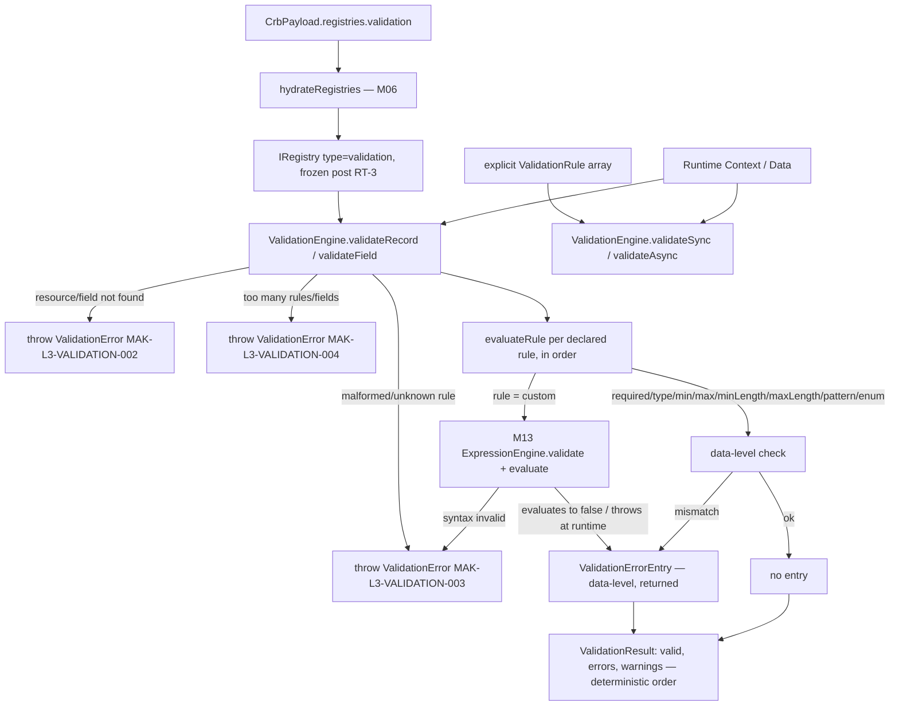
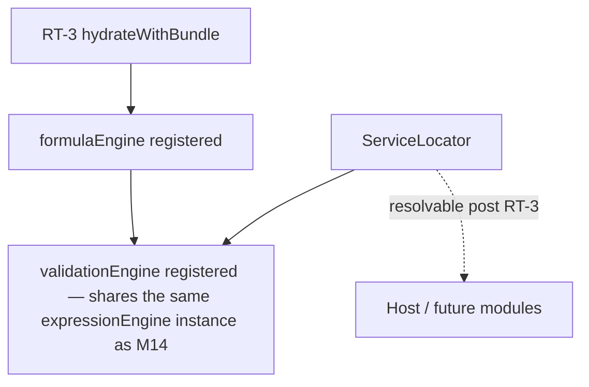
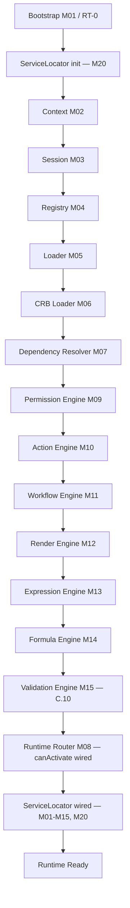

# Foundation C.10 — Module Diagrams

Permanent requirement (C.4+): each Runtime module ships with a Mermaid diagram showing position and dependencies.

---

## M15 — Validation Engine

**Depends on:** M04 Registry (hydrated `validation` bucket), M13 Expression Engine (composed for `custom` rules, never duplicated)
**Consumed by:** future M16 Execution Engine (UP-09 stage 1 — Validate); not wired into that pipeline in this slice (M16 doesn't exist yet)

---

## Service Locator (M20) wiring

`loadRuntimeBundle.js` builds the `ValidationEngine` from the frozen, hydrated registry and the **same** `ExpressionEngine` instance already built for M14 (single shared instance, not a second parser) immediately after M14 wiring; `bootstrap.js` registers it into the Service Locator alongside every other RT-3 service.

---

## C.10 Pipeline Position

**Foundation C status after C.10:** RT-8 step 8.4 (M15 validation, UP-09 stage 1) now has a real, sandboxed, deterministic implementation — but it is not yet invoked from a full 5-stage execution pipeline (Validate → Authorize → Execute → Audit → Respond), since M16 Execution Engine doesn't exist yet. No Execution Engine, State Engine, Studio, or Marketplace code exists in `src/runtime/core/validation/`.
