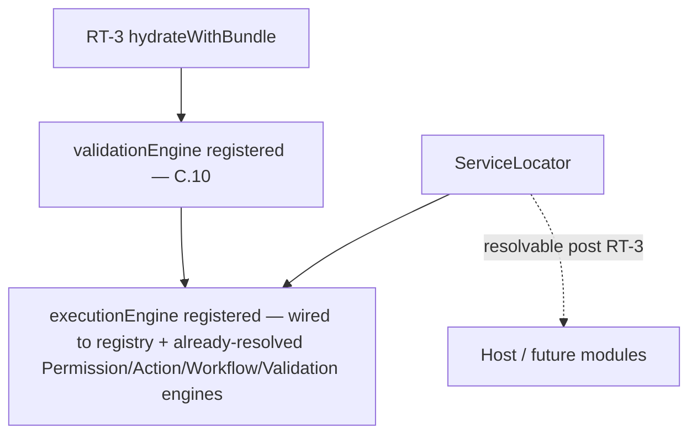
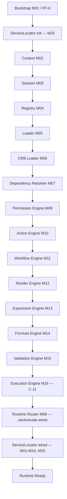

# Foundation C.11 — Module Diagrams

Permanent requirement (C.4+): each Runtime module ships with a Mermaid diagram showing position and dependencies.

---

## M16 — Execution Engine

```mermaid
flowchart TB
  CRB[CrbPayload.registries.action / .workflow] --> HYD[hydrateRegistries — M06]
  HYD --> REG[IRegistry type=action|workflow, frozen post RT-3]
  REQ[UecRequest kind/type/payload] --> EE[ExecutionEngine.execute]
  CTX[Runtime Context / AccessScope] --> EE
  REG --> EE

  EE -->|invalid request/kind/payload/ctx| ERR002[UecResponse error MAK-L3-EXECUTION-002]
  EE -->|unroutable type / unknown action or workflow| ERR003[UecResponse error MAK-L3-EXECUTION-003]

  EE --> ROUTE{namespace}
  ROUTE -->|"action.*"| STAGE1A[Stage 1 Validate]
  ROUTE -->|"workflow.*"| STAGE1W[Stage 1 Validate]

  STAGE1A --> VAL[M15 ValidationEngine.validateRecord]
  STAGE1W --> VAL
  VAL -->|invalid| ERR006[UecResponse error MAK-L3-EXECUTION-006 + data.validation]
  VAL -->|valid / not declared| STAGE2[Stage 2 Authorize]

  STAGE2 --> PERM[M09 PermissionEngine.can]
  PERM -->|denied| ERR005[UecResponse error MAK-L3-EXECUTION-005]
  PERM -->|allowed / not declared| STAGE3[Stage 3 Execute]

  STAGE3 -->|"action.*"| ACT[M10 ActionEngine.dispatch]
  STAGE3 -->|"workflow.*"| WF[M11 WorkflowEngine.start]

  ACT --> RESP[Stage 5 Respond — UecResponse]
  WF --> RESP

  MISSING[required engine not wired] --> ERR004[UecResponse error MAK-L3-EXECUTION-004]
  STAGE1A -.-> MISSING
  STAGE2 -.-> MISSING
  STAGE3 -.-> MISSING
```

**Depends on:** M04 Registry (hydrated `action`/`workflow` buckets), M09 Permission Engine (Authorize), M10 Action Engine (Execute — action), M11 Workflow Engine (Execute — workflow), M15 Validation Engine (Validate)
**Consumed by:** host application (RT-8 entry point for UEC commands); future M17 State Engine / M22 Event Bus integrations are out of scope for this slice

---

## Service Locator (M20) wiring



`loadRuntimeBundle.js` builds the `ExecutionEngine` from the frozen, hydrated registry and the same Permission/Action/Workflow/Validation engine instances already constructed earlier in the same pipeline pass (no second instance of any dependency); `bootstrap.js` registers it into the Service Locator alongside every other RT-3 service.

---

## C.11 Pipeline Position



**Foundation C status after C.11:** RT-8 step 8.3 (M16 pipeline: Validate → Authorize → Execute → Respond) now has a real, deterministic, fail-safe implementation orchestrating M09/M10/M11/M15. Stage 4 (Audit logging) and the post-commit event-emit step (RT-C-15, M16 → M22) remain unimplemented because their providers (M24 Observability, M22 Event Bus) don't exist yet — scheduled for C.15/C.17. No State Engine, Transaction Engine, Plugin Engine, Studio, or Marketplace code exists in `src/runtime/core/execution/`.
