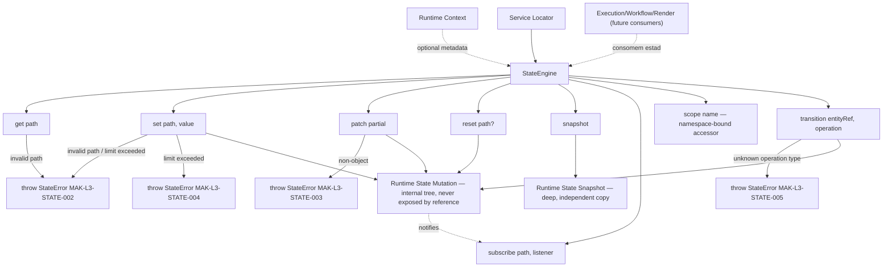
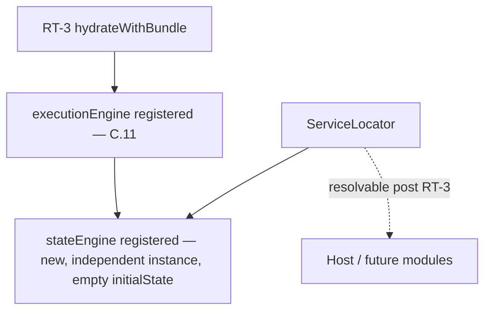
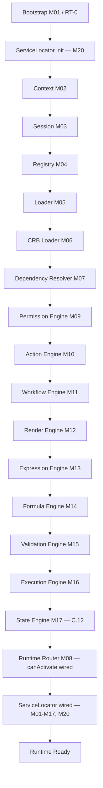

# Foundation C.12 — Module Diagrams

Permanent requirement (C.4+): each Runtime module ships with a Mermaid diagram showing position and dependencies.

---

## M17 — State Engine

**Depends on:** nothing mandatory — `StateEngine` has no required engine dependency; `initialState` is the only constructor input.
**Consumed by:** future Execution/Workflow/Render integrations (documented as future consumers, not wired in this slice); host application via Service Locator.

---

## Service Locator (M20) wiring

`loadRuntimeBundle.js` builds a default `StateEngine` with an empty `initialState` (no registry/CRB dependency needed — the engine is pure local state); `bootstrap.js` registers it into the Service Locator alongside every other RT-3 service.

---

## C.12 Pipeline Position

**Foundation C status after C.12:** local runtime state now has a real, deterministic, isolated implementation (`get`/`set`/`patch`/`reset`/`snapshot`/`subscribe`/`scope`), plus a minimal `transition()` for generic entity-scoped operations. It is registered in the Service Locator but **not yet wired as a required dependency** into Execution/Workflow/Render — those remain future, explicitly documented integration points, not implemented in this slice. No Transaction Engine, Cache, Event Bus, Plugin Engine, Connector Engine, Studio, or Marketplace code exists in `src/runtime/core/state/`.
