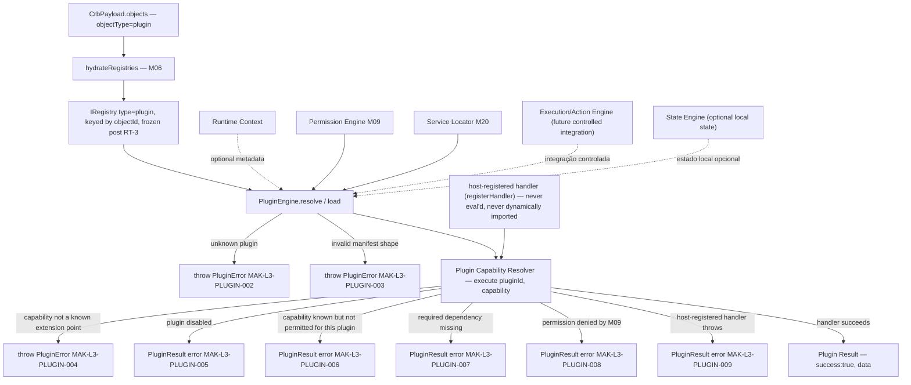
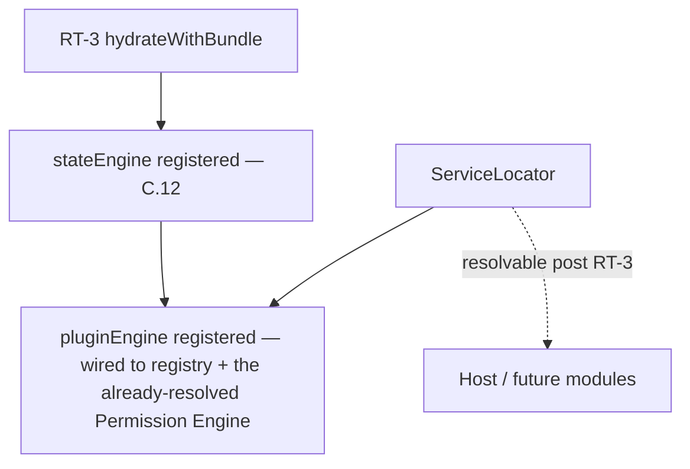
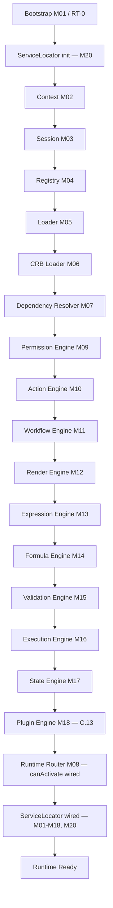

# Foundation C.13 — Module Diagrams

Permanent requirement (C.4+): each Runtime module ships with a Mermaid diagram showing position and dependencies.

---

## M18 — Plugin Engine

**Depends on:** M04 Registry (hydrated `plugin` bucket), M09 Permission Engine (delegated, optional per plugin)
**Consumed by:** future controlled integrations from Execution/Action Engine (not wired in this slice); host application via Service Locator.

---

## Service Locator (M20) wiring

`loadRuntimeBundle.js` builds the `PluginEngine` from the frozen, hydrated registry and the same `PermissionEngine` instance already resolved earlier in the same pipeline pass; `bootstrap.js` registers it into the Service Locator alongside every other RT-3 service.

---

## C.13 Pipeline Position

**Foundation C status after C.13:** RT-0 step 3.4 ("M18 load plugin manifests, no eval") now has a real, registry-driven, deterministic implementation. Manifests resolve from the hydrated CRB `plugin` bucket; capability execution always dispatches to a host-registered handler — never arbitrary plugin-supplied code. No Connector Engine, Cache, Event Bus, Transaction Engine, Studio, or Marketplace code exists in `src/runtime/core/plugin/`.
