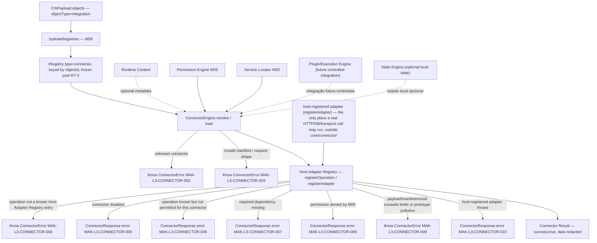
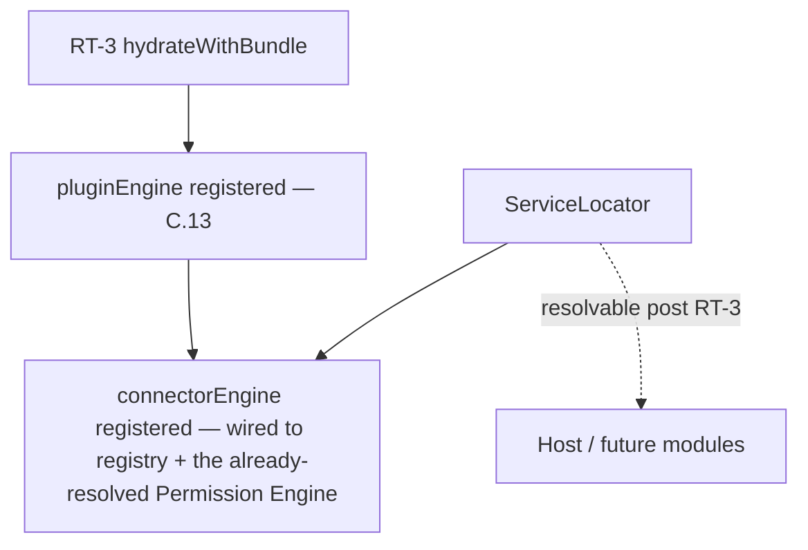
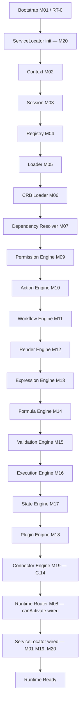

# Foundation C.14 — Module Diagrams

Permanent requirement (C.4+): each Runtime module ships with a Mermaid diagram showing position and dependencies.

---

## M19 — Connector Engine

**Depends on:** M04 Registry (hydrated `connector` bucket), M09 Permission Engine (delegated, optional per connector)
**Consumed by:** future controlled integrations from Plugin/Execution Engine (not wired in this slice); host application via Service Locator.

---

## Service Locator (M20) wiring

`loadRuntimeBundle.js` builds the `ConnectorEngine` from the frozen, hydrated registry and the same `PermissionEngine` instance already resolved earlier in the same pipeline pass; `bootstrap.js` registers it into the Service Locator alongside every other RT-3 service.

---

## C.14 Pipeline Position

**Foundation C status after C.14:** RT-C-17 (Plugin → Connector, "no eval, manifest-only") now has a real, registry-driven, deterministic implementation. Connector invocation always dispatches to a host-registered adapter — never a direct network call inside `core/connector/`. RT-C-18 (Connector → External systems, HTTP first) remains deliberately unimplemented at the transport level — that responsibility belongs to the host adapter, not this module (documented deviation). No Cache, Event Bus, Transaction Engine, Studio, or Marketplace code exists in `src/runtime/core/connector/`.
