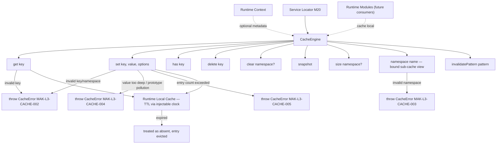
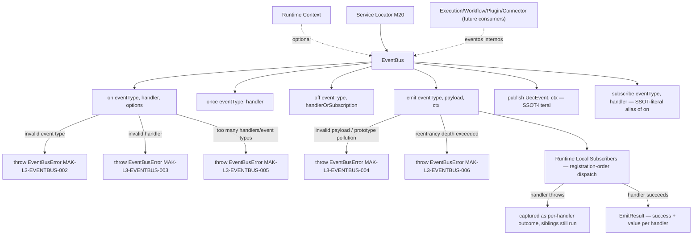
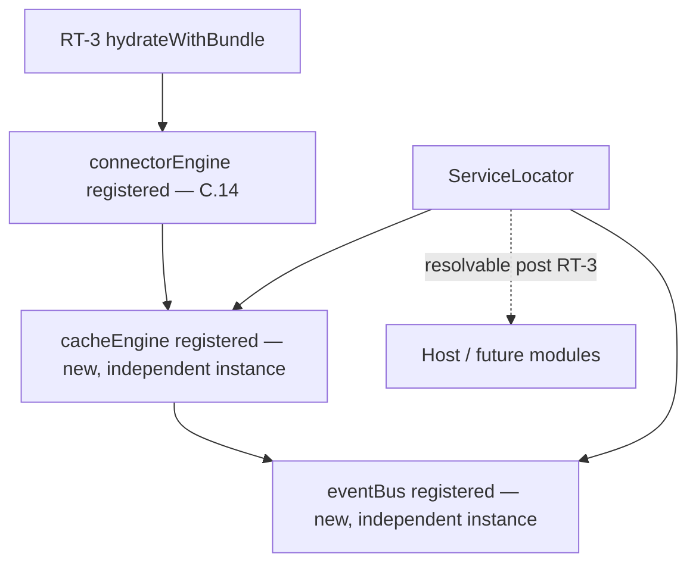
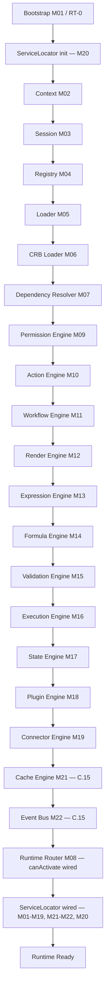

# Foundation C.15 — Module Diagrams

Permanent requirement (C.4+): each Runtime module ships with a Mermaid diagram showing position and dependencies.

---

## M21 — Cache Engine

**Depends on:** nothing mandatory — `CacheEngine` has no required engine dependency; an injectable `clock` is the only constructor option.
**Consumed by:** future runtime modules needing local memoization (not wired as a required dependency in this slice); host application via Service Locator.

---

## M22 — Event Bus

**Depends on:** nothing mandatory — `EventBus` has no required engine dependency.
**Consumed by:** future controlled integrations from Execution/Workflow/Plugin/Connector (documented as future consumers, not wired in this slice — D-RI-08 in-process stub, Foundation F replaces the transport); host application via Service Locator.

---

## Service Locator (M20) wiring

`loadRuntimeBundle.js` builds a default `CacheEngine` and `EventBus` (no registry/CRB dependency — both are pure runtime-local infrastructure); `bootstrap.js` registers both into the Service Locator alongside every other RT-3 service.

---

## C.15 Pipeline Position

**Foundation C status after C.15:** local runtime infrastructure for caching and in-process event distribution now exists (`ICache`/`IEventBus`, D-RI-08 stub). Neither is yet wired as a required dependency into RT-1/RT-3 bootstrap caching (pin/CRB) or into RT-8 post-commit event emission (M16 Execution → M22) — both remain future, explicitly documented integration points. No Transaction Engine, Observability Engine, Studio, or Marketplace code exists in `src/runtime/infra/cache/` or `src/runtime/infra/event-bus/`.
