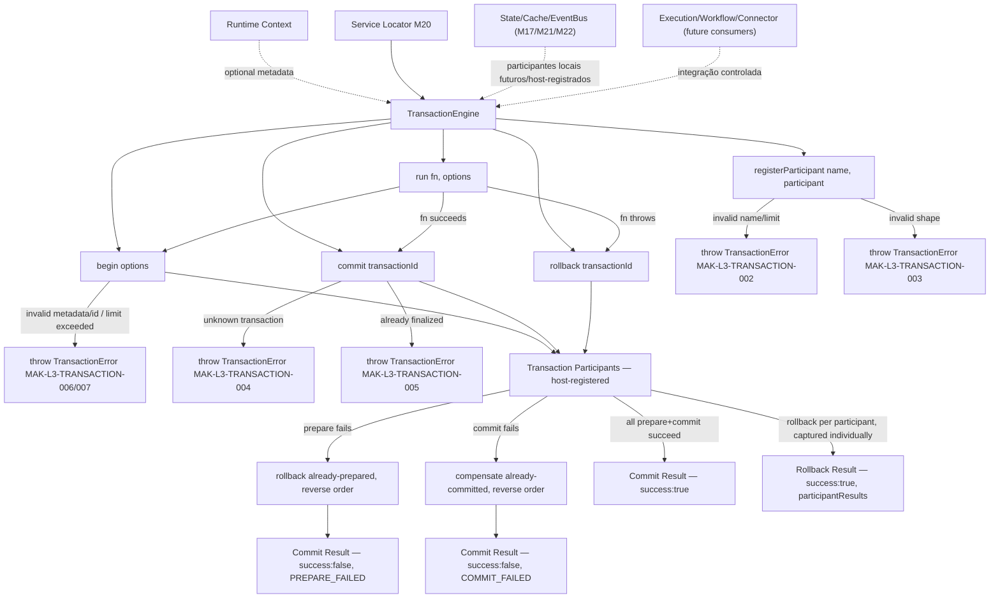
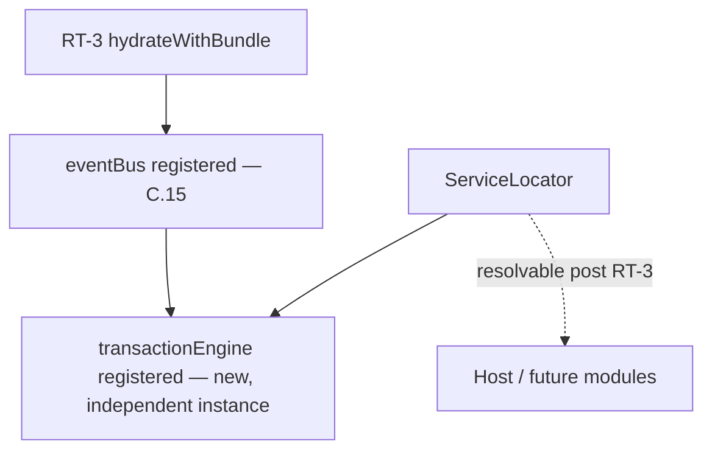
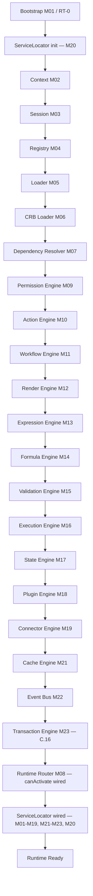

# Foundation C.16 — Module Diagrams

Permanent requirement (C.4+): each Runtime module ships with a Mermaid diagram showing position and dependencies.

---

## M23 — Transaction Engine

**Depends on:** nothing mandatory — `TransactionEngine` has no required engine dependency; an injectable `clock` and optional `maxActiveDurationMs` are the only constructor options.
**Consumed by:** future controlled integrations from Execution/Workflow/Connector (documented as future consumers, not wired in this slice); host application via Service Locator. State/Cache/Event Bus can be wrapped by a host-registered participant (illustrated in tests) without any forced coupling.

---

## Service Locator (M20) wiring

`loadRuntimeBundle.js` builds a default `TransactionEngine` (no registry/CRB dependency — pure runtime-local infrastructure, same as Cache/Event Bus); `bootstrap.js` registers it into the Service Locator alongside every other RT-3 service.

---

## C.16 Pipeline Position

**Foundation C status after C.16:** a real, deterministic, runtime-local unit-of-work coordinator now exists for M16 handlers and future consumers to build atomic-looking multi-participant operations over already-existing local infrastructure (State/Cache/Event Bus, if wrapped as participants). It is registered in the Service Locator but **not yet wired as a required dependency** into Execution/Workflow — those remain future, explicitly documented integration points. No real database/Prisma transaction, Observability Engine, Studio, or Marketplace code exists in `src/runtime/infra/transaction/`.
