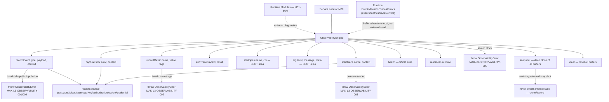
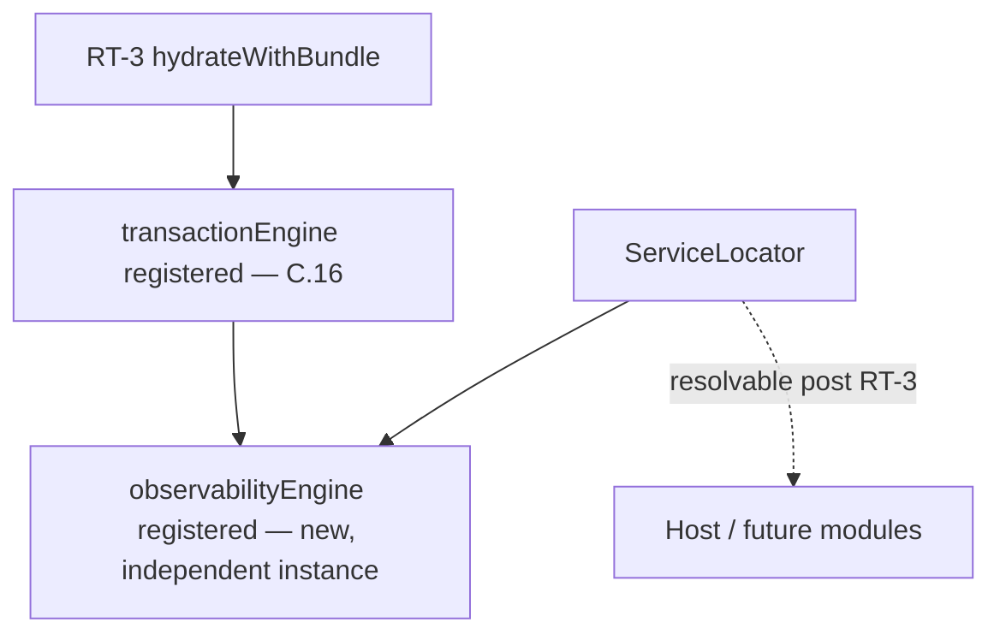
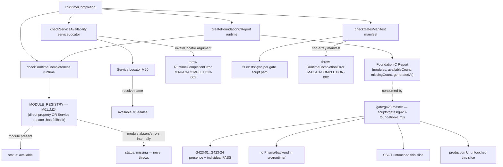

# Foundation C.17 — Module Diagrams

Permanent requirement (C.4+): each Runtime module ships with a Mermaid diagram showing position and dependencies.

---

## M24 — Observability Engine

**Depends on:** nothing mandatory — `ObservabilityEngine` has no required engine dependency; an injectable `clock` is the only constructor option.
**Consumed by:** any Runtime module via the Service Locator (`observabilityEngine`), for diagnostic recording; `RuntimeCompletion` checks its presence as M24 during the Foundation C audit. Never sends telemetry externally, never persists to disk/backend.

---

## Service Locator (M20) wiring

`loadRuntimeBundle.js` builds a default `ObservabilityEngine` (no registry/CRB dependency — pure runtime-local infrastructure, same as Cache/Event Bus/Transaction); `bootstrap.js` registers it into the Service Locator alongside every other RT-3 service.

---

## Runtime Completion — Foundation C closure audit

**Depends on:** nothing mandatory — pure static/read-only audit, no registry/CRB dependency. Deliberately **not** registered into the Service Locator (it audits the runtime, it isn't a runtime service).
**Consumed by:** `scripts/gates/g423-foundation-c.mjs` (master gate) and evidence generation. Never invoked by production UI, Studio, or Marketplace code.

---

## C.17 Pipeline Position

```mermaid
flowchart TD
  B[Bootstrap M01 / RT-0] --> SL0[ServiceLocator init — M20]
  SL0 --> C[Context M02]
  C --> S[Session M03]
  S --> R[Registry M04]
  R --> L[Loader M05]
  L --> CRB[CRB Loader M06]
  CRB --> DEP[Dependency Resolver M07]
  DEP --> PERM[Permission Engine M09]
  PERM --> ACT[Action Engine M10]
  ACT --> WF[Workflow Engine M11]
  WF --> REND[Render Engine M12]
  REND --> XE3[Expression Engine M13]
  XE3 --> FORM3[Formula Engine M14]
  FORM3 --> VAL3[Validation Engine M15]
  VAL3 --> EXE3[Execution Engine M16]
  EXE3 --> STATE3[State Engine M17]
  STATE3 --> PLUGIN3[Plugin Engine M18]
  PLUGIN3 --> CONN3[Connector Engine M19]
  CONN3 --> CACHE3[Cache Engine M21]
  CACHE3 --> EB3[Event Bus M22]
  EB3 --> TX3[Transaction Engine M23]
  TX3 --> OE4[Observability Engine M24 — C.17]
  OE4 --> RT[Runtime Router M08 — canActivate wired]
  RT --> SL3[ServiceLocator wired — M01-M24 all resolvable]
  SL3 --> READY[Runtime Ready]
  READY -.audited by, not part of pipeline.-> RC2[Runtime Completion — static audit tool]
```

**Foundation C status after C.17:** all 24 runtime modules (M01–M24) are implemented, wired through `loadRuntimeBundle.js`/`bootstrap.js`, and resolvable via the Service Locator. `RuntimeCompletion` provides a static, read-only audit confirming this composition without executing real Action/Workflow/Connector behavior. The master gate `gate:g423` validates the entire Foundation C surface in one command. No real database/Prisma transaction, no external telemetry export, no Studio, or Marketplace code exists in `src/runtime/`.
