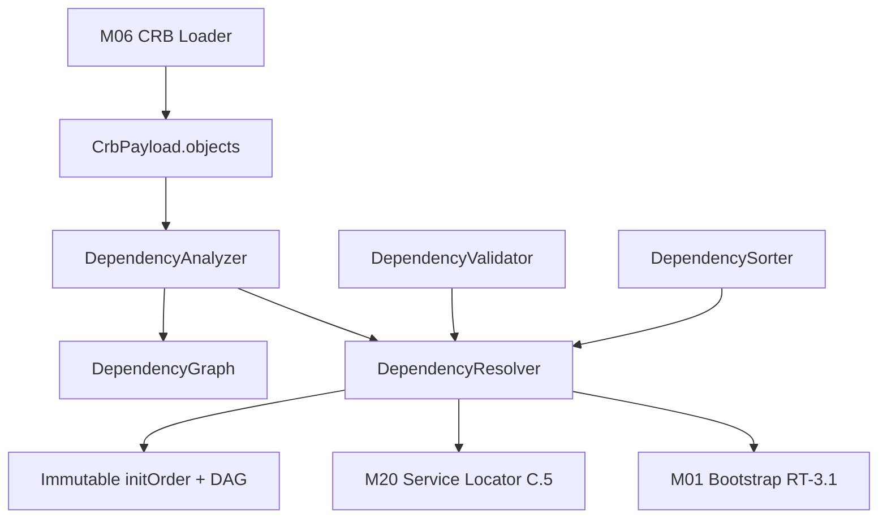
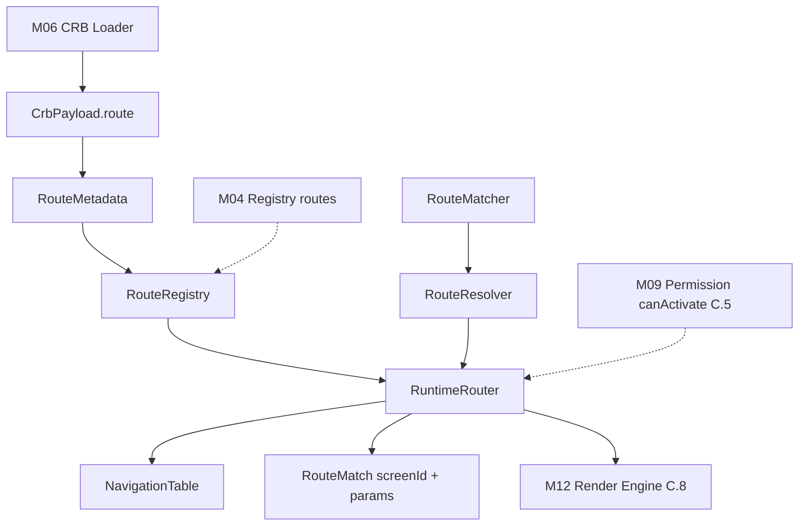
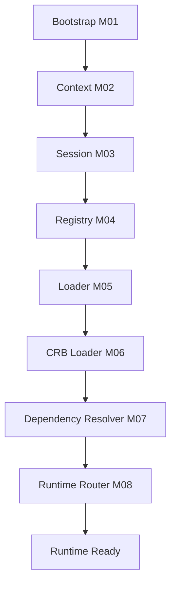

# Foundation C.4 — Module Diagrams

Permanent requirement (C.4+): each Runtime module ships with a Mermaid diagram showing position and dependencies.

---

## M07 — Dependency Resolver

**Depends on:** M06 CRB Loader (object envelopes)  
**Consumed by:** M01 Bootstrap, M20 Service Locator, M08 Router (indirect via init order)

---

## M08 — Runtime Router

**Depends on:** M06 CRB Loader, M04 Registry (route entries)  
**Consumed by:** M12 Render Engine, host navigation (C.8+)

---

## C.4 Pipeline Position

