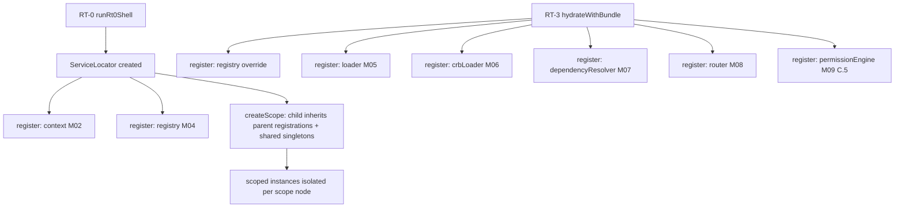
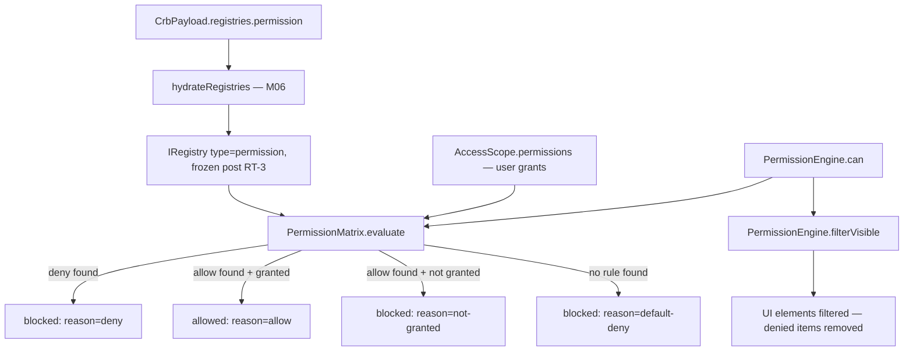
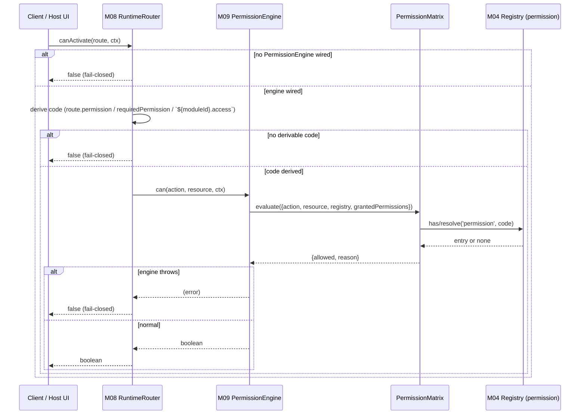
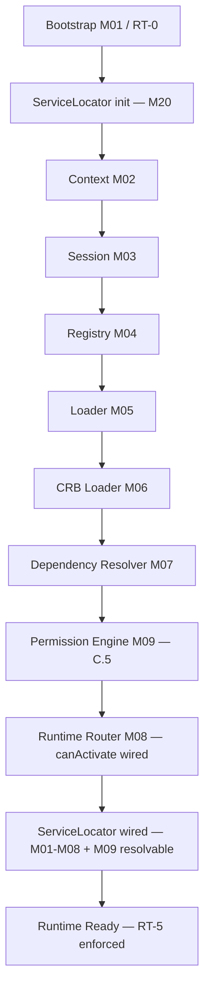

# Foundation C.5 — Module Diagrams

Permanent requirement (C.4+): each Runtime module ships with a Mermaid diagram showing position and dependencies.

---

## M20 — Service Locator

**Depends on:** none (pure infrastructure — M20 is the DI root)
**Consumed by:** RT-0 bootstrap (`rt0-shell.js`), RT-3 hydrate (`bootstrap.js`), any future module resolving core services (M10+)

**Lifetimes:**
- `singleton` — one instance shared across the whole locator tree (root-owned cache), regardless of which scope resolves it.
- `scoped` — one instance per locator node; a child scope never sees or pollutes a parent's (or sibling's) scoped instances.

---

## M09 — Permission Engine

**Depends on:** M04 Registry (hydrated `permission` bucket), M02 Context / AccessScope
**Consumed by:** M08 Router (`canActivate`, RT-5), future M12 Render Engine (`filterVisible`, C.8+)

**Decision rule (deny > allow > default deny):**
1. Any applicable `deny` entry (exact `${resource}.${action}` or wildcard `${resource}.*`) → blocked, unconditionally.
2. Else, an applicable `allow` entry → allowed **only if** its code is present in `AccessScope.permissions` (user must actually be granted it); otherwise blocked (`not-granted`).
3. No applicable entry at all → blocked (`default-deny`).
4. Invalid action/resource, invalid context/accessScope, or invalid/missing registry → blocked before matrix evaluation ever runs.

---

## RT-5 Authorize — Router integration

**Wiring point:** `loadRuntimeBundle.js` builds the `PermissionEngine` from the frozen, hydrated registry immediately after `registry.freeze()` (RT-3), then calls `router.setPermissionEngine(...)` before the router registers CRB routes. By the time any `canActivate()` call can occur, the engine is always present for the standard pipeline (`bootstrap()` → `hydrateWithBundle()`).

---

## C.5 Pipeline Position

**Foundation C status after C.5:** RT-0 → RT-6 have a real, non-stub implementation for authorization (RT-5). RT-7 (Render) and RT-8 (Execute) remain unimplemented — scheduled for C.8+ and C.11+ respectively, per `10-DELIVERY-PLANNING.md`. No Action Engine (M10), Workflow (M11), or Render (M12) code was introduced in this slice.
