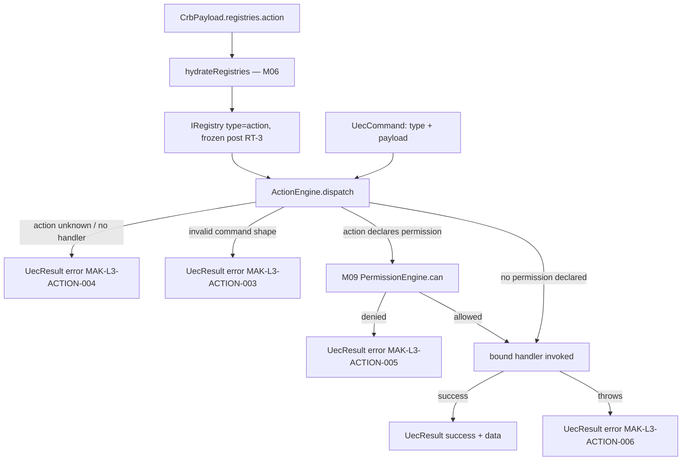
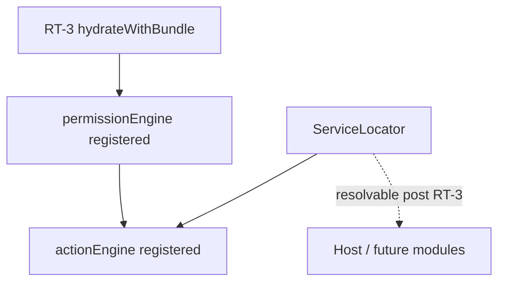
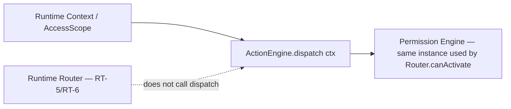
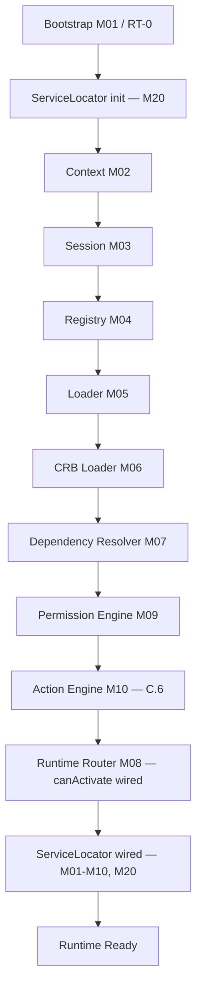

# Foundation C.6 — Module Diagrams

Permanent requirement (C.4+): each Runtime module ships with a Mermaid diagram showing position and dependencies.

---

## M10 — Action Engine

**Depends on:** M04 Registry (hydrated `action` bucket), M09 Permission Engine (delegated, not duplicated)
**Consumed by:** host app / future M16 Execution Engine (C.11) — dispatch is the entry point for UEC Commands

---

## Service Locator (M20) wiring

`loadRuntimeBundle.js` builds the `ActionEngine` from the frozen, hydrated registry and the already-built `PermissionEngine` immediately after RT-5 wiring; `bootstrap.js` registers it into the Service Locator (`instance._serviceLocator.register('actionEngine', ...)`) alongside `registry`, `loader`, `crbLoader`, `dependencyResolver`, `router`, `permissionEngine`.

---

## Router / Runtime Context relationship

**Note:** M10 does not depend on M08 Router at runtime — `canActivate()` (RT-5, route-level) and `ActionEngine.dispatch()` (action-level) are independent consumers of the same M09 `PermissionEngine` instance, avoiding duplicated permission logic (RT-C-09).

---

## C.6 Pipeline Position

**Foundation C status after C.6:** RT-8 "Execute" gains its first real dispatcher (M10) — but only command → handler resolution, not the full 5-stage UP-09 pipeline (Validate → Authorize → Execute → Audit → Respond), which remains scheduled for **M16 Execution Engine (C.11)**. No Workflow (M11, C.7) or Render (M12, C.8) code was introduced in this slice.
