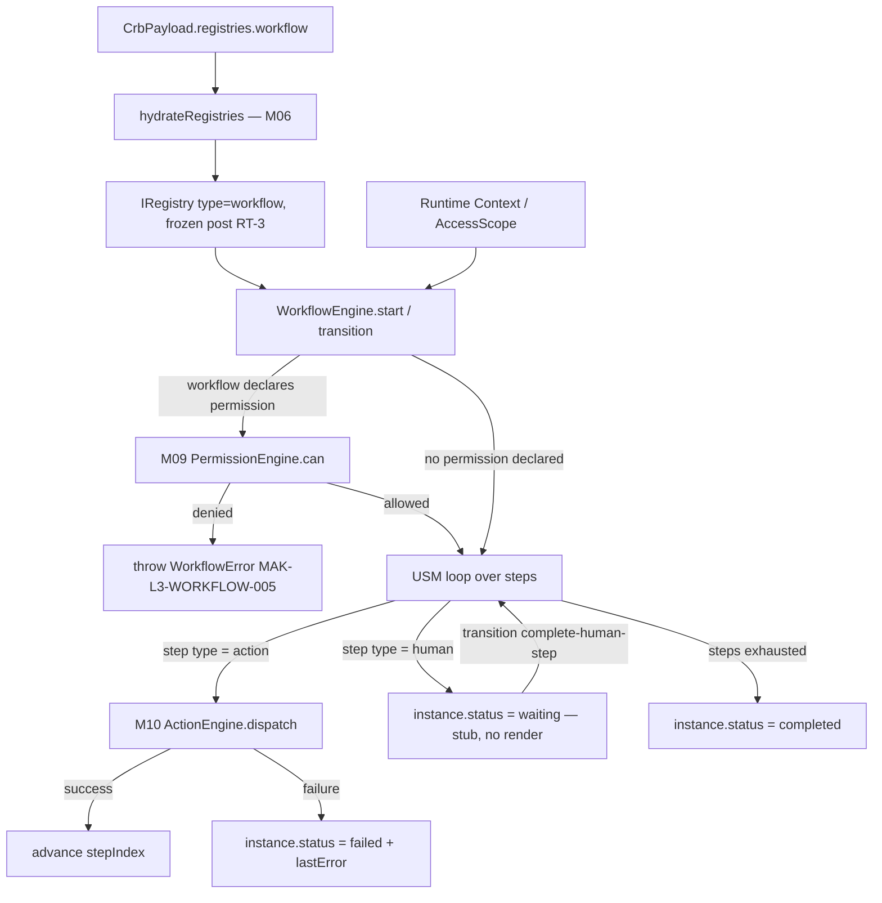
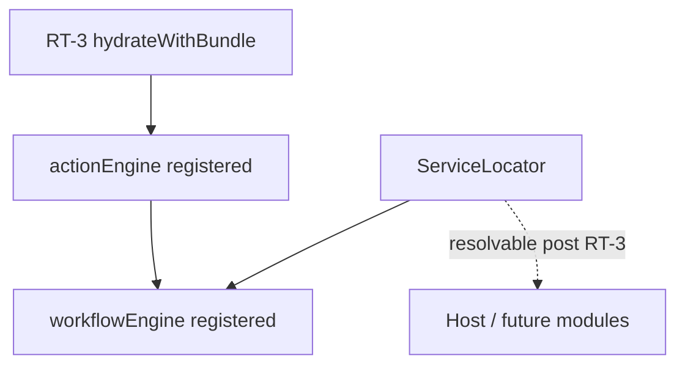
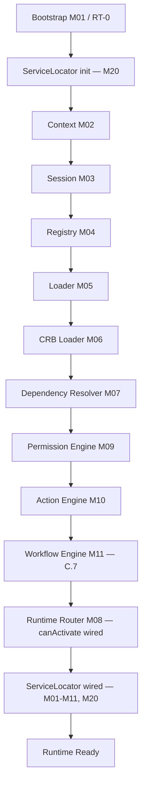

# Foundation C.7 — Module Diagrams

Permanent requirement (C.4+): each Runtime module ships with a Mermaid diagram showing position and dependencies.

---

## M11 — Workflow Engine

**Depends on:** M04 Registry (hydrated `workflow` bucket), M10 Action Engine (delegated, not duplicated), M09 Permission Engine (delegated, not duplicated)
**Consumed by:** host app (workflow-driven UI, out of scope for C.7 — no render introduced)

---

## Service Locator (M20) wiring

`loadRuntimeBundle.js` builds the `WorkflowEngine` from the frozen, hydrated registry and the already-built `ActionEngine`/`PermissionEngine` immediately after M10 wiring; `bootstrap.js` registers it into the Service Locator (`instance._serviceLocator.register('workflowEngine', ...)`) alongside `registry`, `loader`, `crbLoader`, `dependencyResolver`, `router`, `permissionEngine`, `actionEngine`.

---

## C.7 Pipeline Position

**Foundation C status after C.7:** Human tasks are queued as a stub (no UI) per done-criteria — real host-UI rendering of pending human steps remains **M12 Render Engine (C.8)**, not introduced here. No Render Engine, Studio, or Marketplace code exists in `src/runtime/core/workflow/`.
