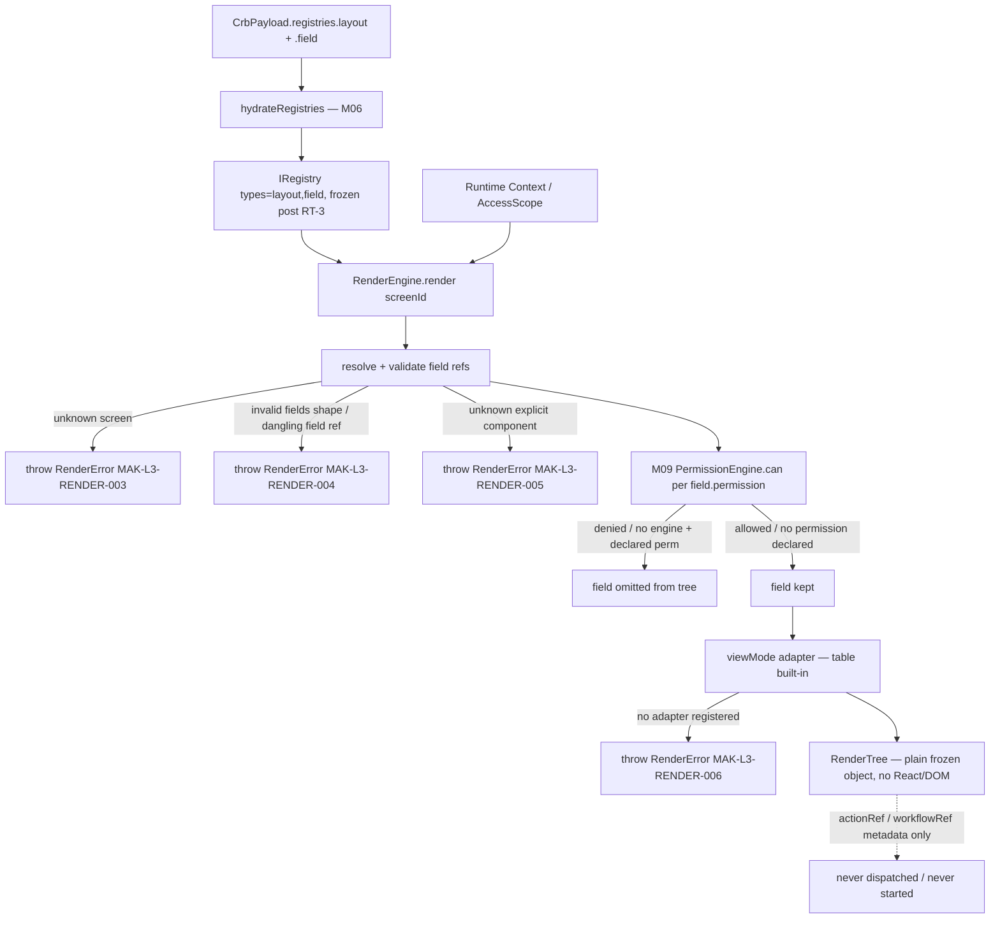
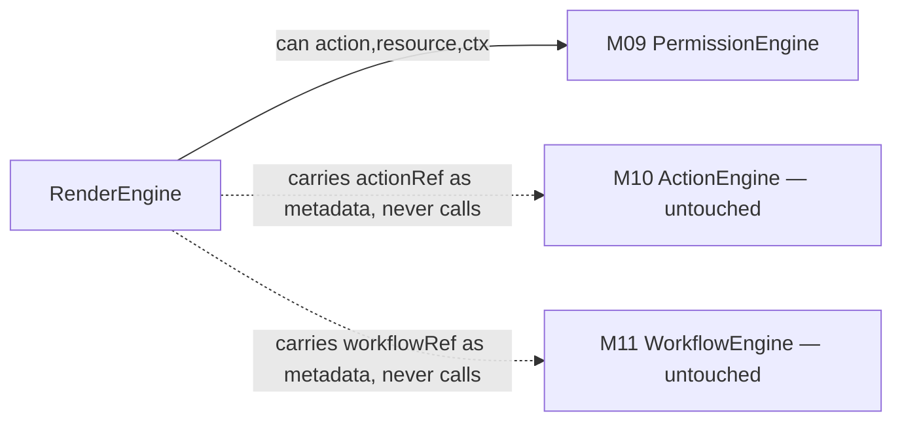
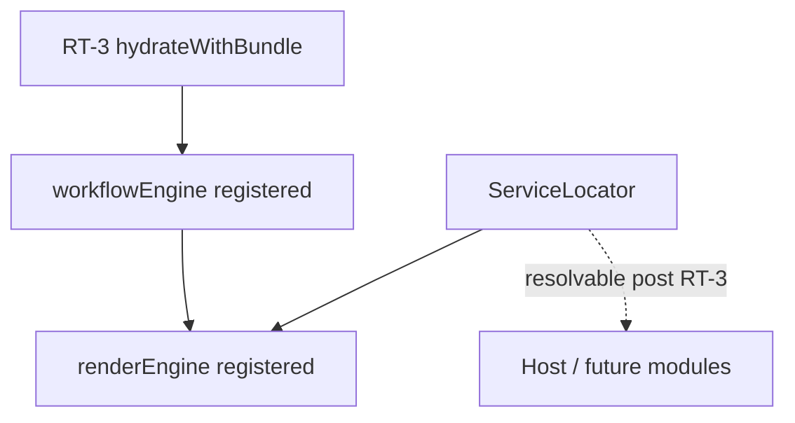
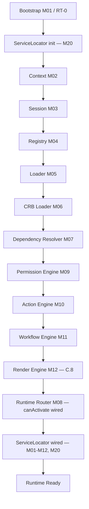

# Foundation C.8 — Module Diagrams

Permanent requirement (C.4+): each Runtime module ships with a Mermaid diagram showing position and dependencies.

---

## M12 — Render Engine

**Depends on:** M04 Registry (hydrated `layout`/`field` buckets), M09 Permission Engine (delegated, not duplicated)
**Consumed by:** future host UI (React mount, out of scope for C.8 — no render target introduced)

---

## Permission / Action / Workflow relationship (no auto-execution)

**Note:** M12 never imports or invokes `ActionEngine.dispatch()` or `WorkflowEngine.start()` — verified by tests using instrumented fake engines that assert zero invocations even when a field declares `actionRef`/`workflowRef`.

---

## Service Locator (M20) wiring

`loadRuntimeBundle.js` builds the `RenderEngine` from the frozen, hydrated registry and the already-built `PermissionEngine` immediately after M11 wiring; `bootstrap.js` registers it into the Service Locator alongside `registry`, `loader`, `crbLoader`, `dependencyResolver`, `router`, `permissionEngine`, `actionEngine`, `workflowEngine`.

---

## C.8 Pipeline Position

**Foundation C status after C.8:** RT-7 gains its first real, non-stub piece — table-adapter tree building with permission filtering — but step 7.2 (M13/M14 Expression/Formula binding evaluation) and 7.4 (actual React mount) remain unimplemented, scheduled for **C.9** and beyond. No Expression Engine, Formula Engine, Studio, or Marketplace code exists in `src/runtime/core/render/`.
