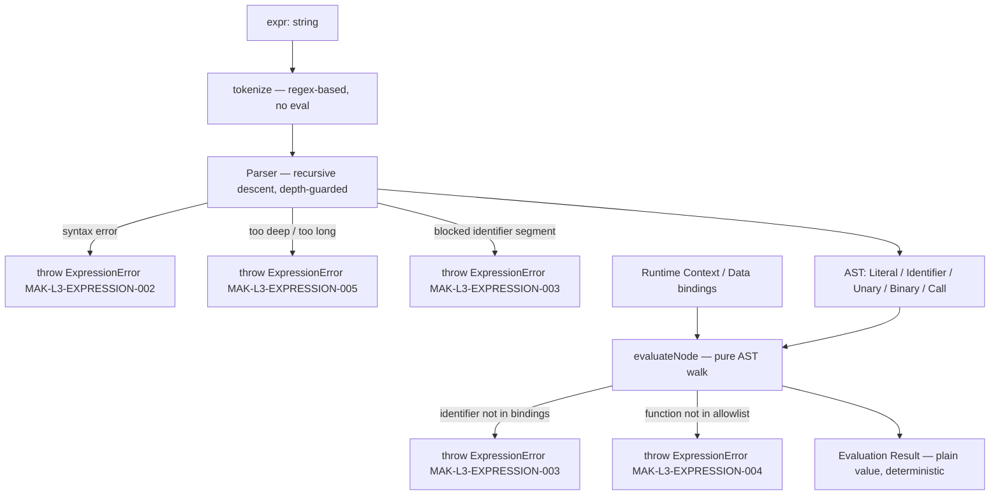
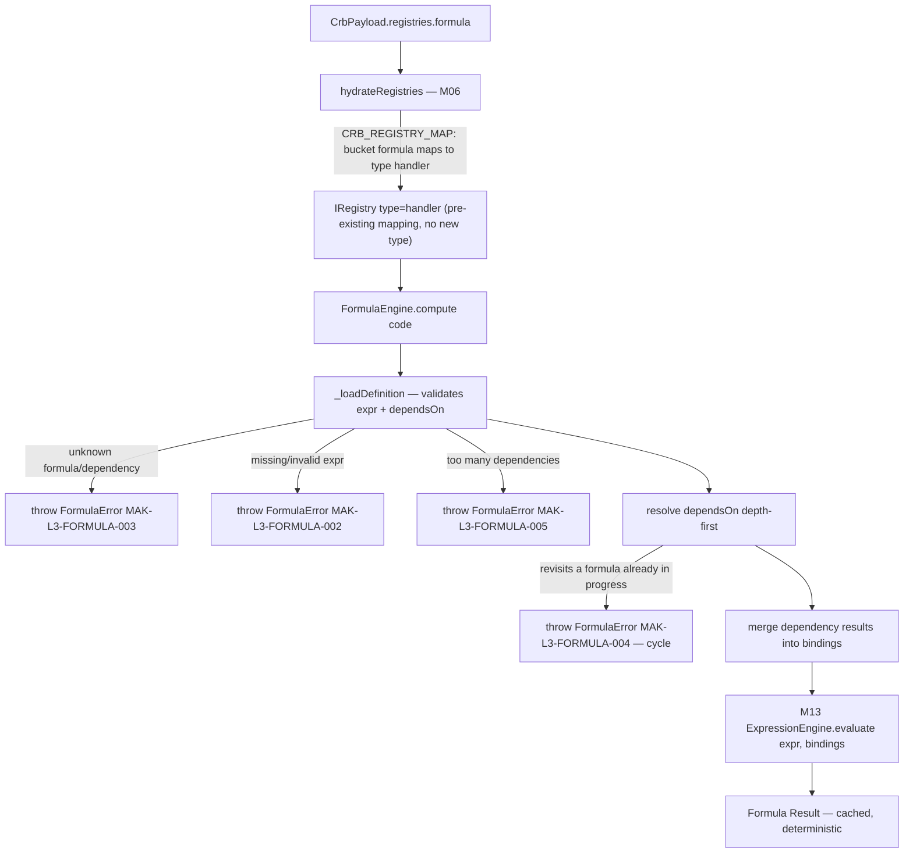
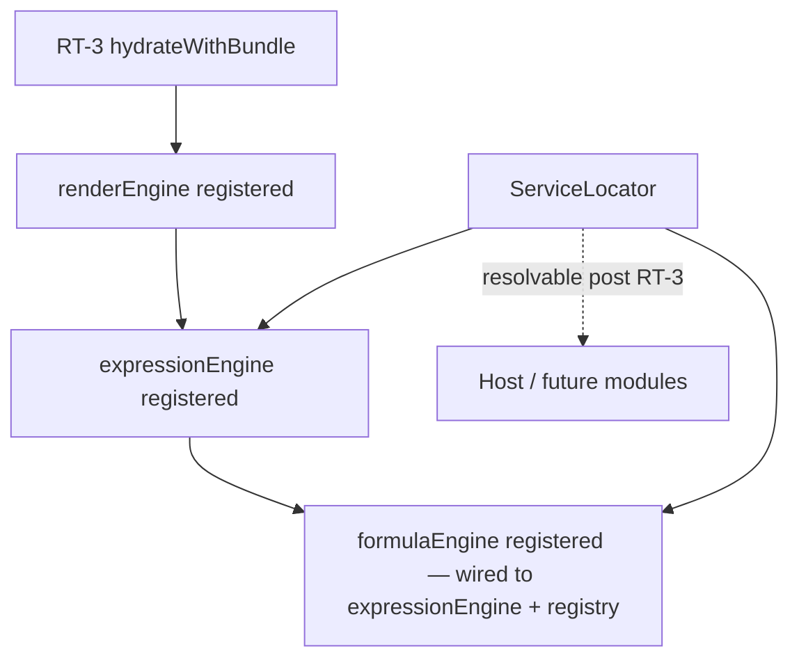
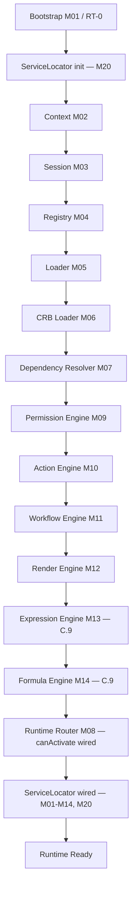

# Foundation C.9 — Module Diagrams

Permanent requirement (C.4+): each Runtime module ships with a Mermaid diagram showing position and dependencies.

---

## M13 — Expression Engine

**Depends on:** nothing beyond its own input (`expr`, `bindings`) — no registry, no context object required by the interface itself.
**Consumed by:** M14 Formula Engine (composition, never duplicated); future M12 Render / M15 Validation bindings evaluation (not wired in this slice).

---

## M14 — Formula Engine

**Depends on:** M04 Registry (hydrated `handler` bucket, sourced from CRB `formula`), M13 Expression Engine (composed, not duplicated)
**Consumed by:** future M12 Render (field value binding) / M15 Validation (not wired in this slice)

---

## Service Locator (M20) wiring

`loadRuntimeBundle.js` builds the `ExpressionEngine` (stateless, no dependencies) and then the `FormulaEngine` (wired to that same `ExpressionEngine` instance + the frozen, hydrated registry) immediately after M12 wiring; `bootstrap.js` registers both into the Service Locator alongside every other RT-3 service.

---

## C.9 Pipeline Position

**Foundation C status after C.9:** RT-7 step 7.2 (M13/M14 evaluate bindings/formulas) now has a real, sandboxed implementation — but it is not yet wired into M12 Render's field-value binding (that integration, plus M15 Validation consuming these engines, remains future work). No Validation Engine, Execution Engine, Studio, or Marketplace code exists in `src/runtime/core/expression/` or `src/runtime/core/formula/`.
