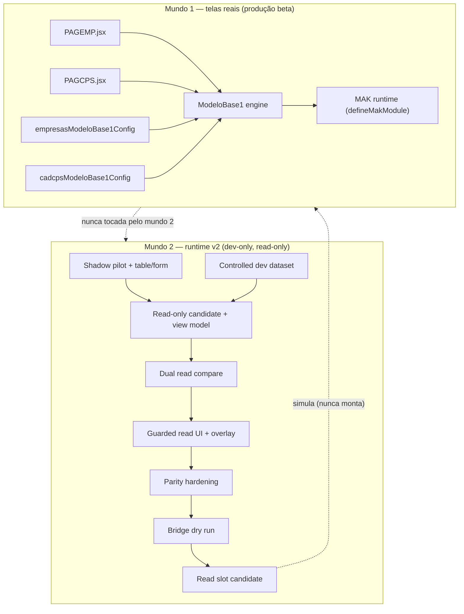

# CURRENT STATE MAP — Post-Foundation C runtime v2 + real cadastro screens

## Duas realidades paralelas

Hoje existem **dois mundos** que nunca se tocaram:

1. **Telas reais de cadastro** — Empresas e Campos Personalizados, ambas já rodando sobre o **motor ModeloBase1** (config-driven), via o **MAK runtime** (`src/framework/mak/runtime/defineMakModule.js`). Estas são as telas que o usuário vê.
2. **Cadeia runtime v2 (17 camadas)** — uma pipeline **dev-only, read-only, shadow/preview/simulação** construída pós-Foundation C que prova, sem tocar a tela real, que o runtime v2 consegue ler/representar Empresas. Nenhuma dessas camadas está montada em produção (exceto a rota dev `/__dev/runtime-v2/previews`, flag-off por padrão).

## Telas reais (mundo 1) — já sobre ModeloBase1

| Item | Path | Observação |
|---|---|---|
| Empresas — page | `src/modules/empresas/pages/PAGEMP.jsx` | `<ModeloBase1CadastroPage config={empresasModeloBase1Config} />` |
| Empresas — config ModeloBase1 | `src/modules/empresas/config/modeloBase1/empresasModeloBase1Config.js` | `buildModeloBase1ConfigFromMakModule(empresasMakModule, {...})` |
| Empresas — MAK module | `src/modules/empresas/config/empresasMakModule.js` | `defineMakModule(definition, metadata, {...})` |
| Empresas — rota | `src/App.jsx:242` | `/CadastroEmpresas` (montada direto) |
| Campos Personalizados — page | `src/modules/cadcps/pages/PAGCPS.jsx` | `<ModeloBase1CadastroPage config={cadcpsModeloBase1Config} />` |
| Campos Personalizados — config ModeloBase1 | `src/modules/cadcps/config/cadcpsModeloBase1Config.js` | `buildModeloBase1ConfigFromMakModule(cadcpsMakModule, {...})` |
| Campos Personalizados — rota | `generatedModules.json` | `/CadastroCamposPersonalizados` (rota gerada) |
| **ModeloBase1 engine** | `src/ModeloBase1/` (~35 subdirs: render, table, form, toolbar, search, layout, export, …) | Motor de cadastro compartilhado por todos os módulos |
| MAK runtime | `src/framework/mak/runtime/` | `defineMakModule`, `createMakRuntime`, `MakModuleContext` |

**Conclusão-chave:** Empresas e Campos Personalizados **já são consumidores do mesmo ModeloBase1**. A "conexão Empresas ↔ modeloBase1" e "Campos ↔ modeloBase1" que a estratégia antiga planejava **já existe** no nível de config.

## Cadeia runtime v2 (mundo 2) — 17 camadas dev-only

| # | Camada | Path principal | Objetivo | Status | Classificação |
|---|---|---|---|---|---|
| 1 | Foundation C runtime | `src/runtime/core/*`, `src/runtime/infra/*` | Motor runtime v2 (context/registry/render/state/…) | mergeado, 66+ testes | **manter essencial** |
| 2 | Shadow Mode | `src/runtime/shadow/runtimeShadowMode.js` | Comparação passiva legado×v2 | mergeado | manter suporte |
| 3 | Empresas Shadow Pilot | `src/runtime/shadow/pilots/empresasShadowPilot.js` | Descritor estrutural Empresas | mergeado | **manter essencial** (fonte de estrutura) |
| 4 | Empresas Table/Form Shadow | `src/runtime/shadow/pilots/empresasTableFormShadow.js` | Projeção table/form + diff | mergeado | **manter essencial** (projeção read) |
| 5 | Controlled Preview | `src/runtime/preview/controlledPreview.js` | Preview controlado | mergeado | manter suporte |
| 6 | Dev Preview Hub | `src/runtime/preview/dev/hub/` | Hub dev-only (Empresas+cadcps) | mergeado | manter suporte |
| 7 | Controlled Dev Dataset | `src/runtime/preview/dev/data/` | Dataset mock controlado | mergeado | **manter essencial** (dados beta) |
| 8 | Dev Preview Route | `src/runtime/preview/dev/route/` | Rota dev `/__dev/runtime-v2/previews` | mergeado | manter suporte |
| 9 | Route Mount/Activation | `registerRuntimeV2DevPreviewRoute.js` + `src/App.jsx` (mount dev-only) | Montagem dev-only da rota | mergeado | manter suporte |
| 10 | First Module Migration Planning | `src/runtime/migration/planning/` | Readiness/risk/rollback/fases | mergeado | manter suporte (plano) |
| 11 | Empresas Read-Only Candidate | `src/runtime/migration/empresas-readonly/` | View model read-only + write guard | mergeado | **manter essencial** |
| 12 | Empresas Dual Read Shadow Compare | `src/runtime/migration/empresas-dual-read/` | Comparação de snapshots + parity | mergeado | manter suporte (paridade) |
| 13 | Guarded Read UI Slice | `src/runtime/migration/empresas-guarded-read-ui/` | UI read-only dev-only | mergeado | manter suporte (preview) |
| 14 | Guarded Read UI Overlay | `.../overlay/` | Painel dev no preview | mergeado | manter suporte |
| 15 | Read UI Parity Hardening | `src/runtime/migration/empresas-read-ui-parity-hardening/` | Checklist/score de paridade | mergeado | manter como checklist |
| 16 | Read UI Bridge Dry Run | `src/runtime/migration/empresas-read-ui-bridge-dry-run/` | Contrato + simulação de montagem | mergeado | **congelar** |
| 17 | Runtime Bridge Read Slot Candidate | `src/runtime/migration/empresas-runtime-bridge-read-slot/` | Contrato de slot + payload + mount plan | mergeado | **congelar** |

## Diagrama do estado atual

## Leitura estratégica

O mundo 2 provou (com rigor e testes) que o runtime v2 lê Empresas **sem tocar a tela real**. Sob a premissa nova (pode tocar Empresas/cadcps/modeloBase1 diretamente como beta), o "provar que dá para aproximar sem tocar" deixa de ser o **caminho crítico** — vira **suporte/evidência**. O caminho curto é ligar o runtime v2 (view model read-only + dataset controlado) na leitura do ModeloBase1 dessas telas, atrás de uma flag, com fallback para a config atual.
