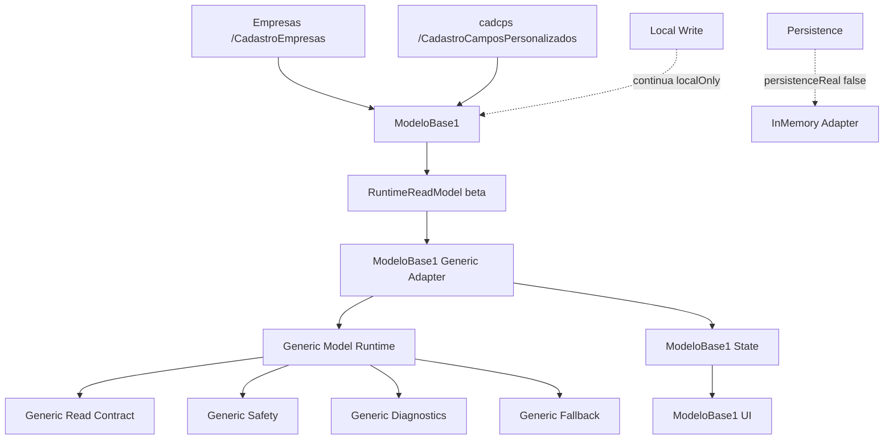
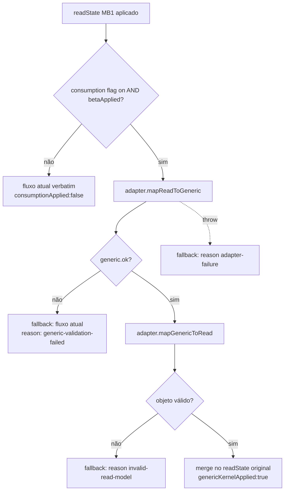

# Module Diagrams — Empresas/cadcps Consuming Generic Kernel



## Caminho de decisão (flag)



## Camadas (isolamento)

```mermaid
flowchart LR
  ACT[activation/*] --> ADP2[generic-model-adapter/*]
  ADP2 --> GK[runtime/generic-model/*]
  ACT -. React só no hook .-> HOOK[useModeloBase1GenericKernelConsumption]
  ACT -. NÃO importa .-> X1[backend/APIs/Prisma]
  ACT -. NÃO importa .-> X2[runtimeBridge/makBootstrap]
  ACT -. NÃO importa .-> X3[src/modules/empresas|cadcps]
```
