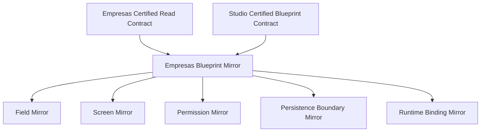
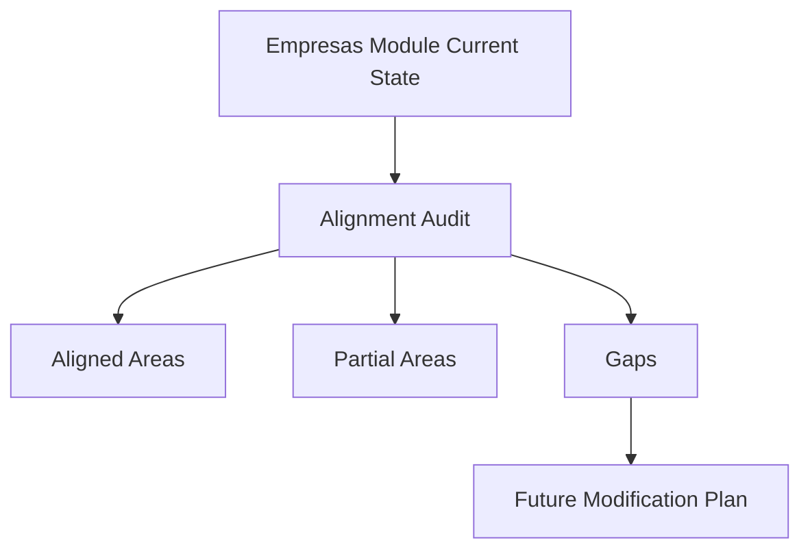
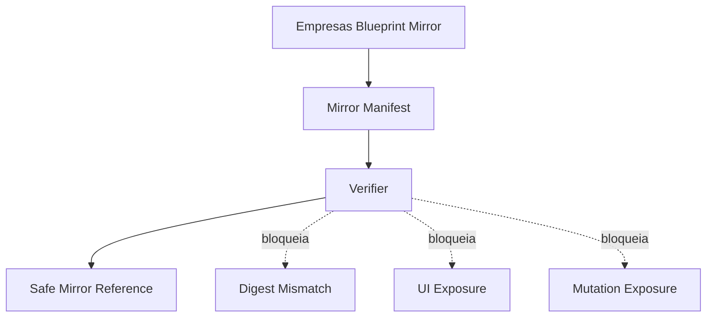
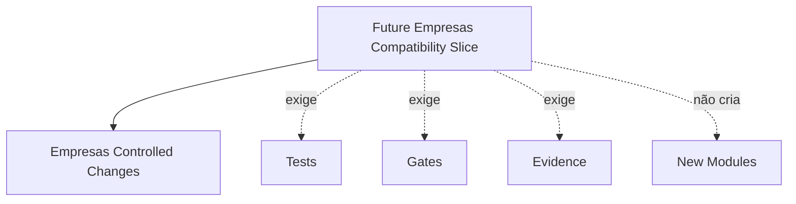

# MODULE DIAGRAMS

## Diagrama 1 — fontes → mirror

```mermaid
graph TD
  ERC[Empresas Certified Read Contract] --> EBM[Empresas Blueprint Mirror]
  SBC[Studio Certified Blueprint Contract] --> EBM
  EBM --> FM[Field Mirror]
  EBM --> SM[Screen Mirror]
  EBM --> PM[Permission Mirror]
  EBM --> PBM[Persistence Boundary Mirror]
  EBM --> RBM[Runtime Binding Mirror]
```

## Diagrama 2 — auditoria de alinhamento

```mermaid
graph TD
  CUR[Empresas Module Current State] --> AA[Alignment Audit]
  AA --> AL[Aligned Areas]
  AA --> PA[Partial Areas]
  AA --> GP[Gaps]
  GP --> FMP[Future Modification Plan]
```

## Diagrama 3 — manifest + verifier

```mermaid
graph TD
  EBM[Empresas Blueprint Mirror] --> MAN[Mirror Manifest]
  MAN --> V[Verifier]
  V --> SMR[Safe Mirror Reference]
  V -. bloqueia .-> DM[Digest Mismatch]
  V -. bloqueia .-> UI[UI Exposure]
  V -. bloqueia .-> MU[Mutation Exposure]
```

## Diagrama 4 — slice futuro controlado

```mermaid
graph TD
  FCS[Future Empresas Compatibility Slice] --> CC[Empresas Controlled Changes]
  FCS -. exige .-> T[Tests]
  FCS -. exige .-> G[Gates]
  FCS -. exige .-> E[Evidence]
  FCS -. não cria .-> NM[New Modules]
```
