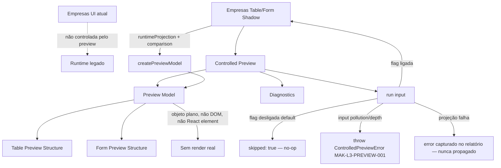
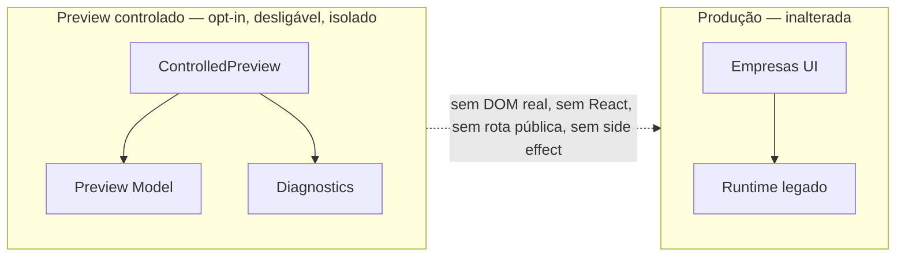

# Post-Foundation C — Module Diagrams

Empresas Controlled Preview Sandbox — position, flow, and isolation from the production Empresas screen.

---

## Controlled Preview — isolated preview model wiring



**Depends on (all optional/injectable):** `EmpresasTableFormShadow` (default construído internamente), Permission Engine (M09), Validation Engine (M15), Observability (M24). Nenhum obrigatório.
**Consumed by:** um futuro preview visual dev-only / segundo módulo piloto. Nunca consumido pelo render de produção, por rota pública, Studio ou Marketplace.

---

## Preview Model shape — plain, never renderable

```mermaid
flowchart TB
  PROJ[TableFormProjectionResult] --> CPM[createPreviewModel]
  CPM --> TABLE["table:\ncolumns[], visibleColumns[], headerLabels{}, cellMetadata{}, rowActions[] (metadata)"]
  CPM --> FORM["form:\nfields[] (label/required/validation/permission),\nvisibleFields[], sections[], formActions[]+formWorkflows[] (metadata)"]
  CPM --> DIAGS["diagnostics:\nwarnings, differences, deniedFields,\nmissingLabels, invalidMetadata, unsupportedFeatures"]
  TABLE --> MODEL["PreviewModel\n{kind:'preview-model', isPreviewModel:true}"]
  FORM --> MODEL
  DIAGS --> MODEL
  MODEL -. sem $$typeof, JSON.stringify seguro, sem nó DOM .-> PLAIN[Objeto plano isolado]
```

Actions e workflows aparecem **apenas como metadados** `{id, kind, ref}` — nunca há função de execução; nenhum Action/Workflow/Connector é invocado.

---

## Isolation guarantee



Com a flag desligada (padrão), `run()` retorna `{ skipped: true }` sem construir preview model — efeito zero sobre a tela Empresas. Nenhum preview é montado em produção; nenhuma rota pública é criada.
