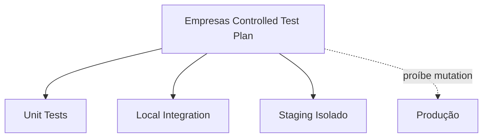
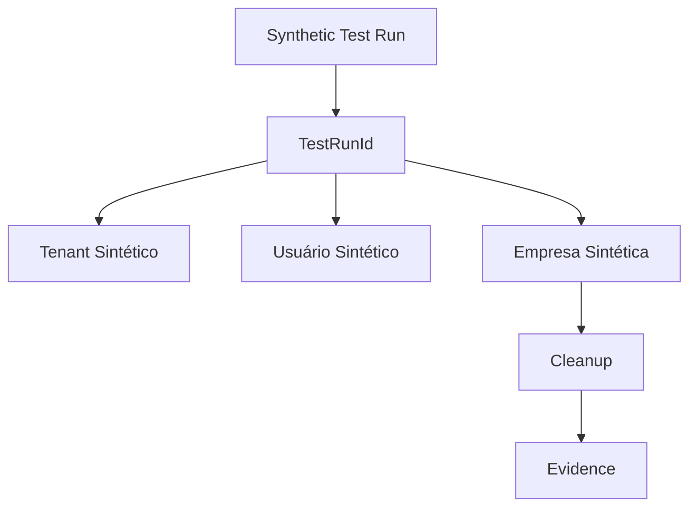
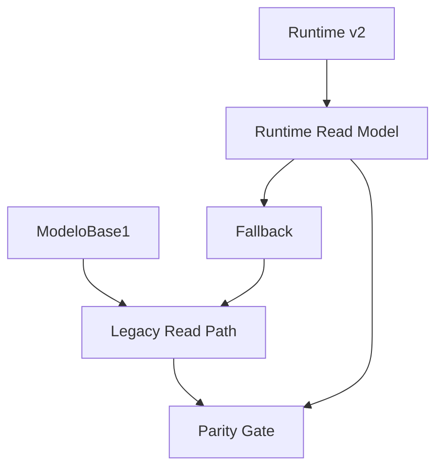
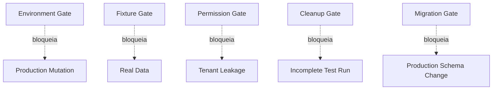

# Module Diagrams — Empresas Controlled Production Test Plan

## Diagrama 1 — Camadas de teste

## Diagrama 2 — Run sintético e cleanup

## Diagrama 3 — Paridade e fallback

## Diagrama 4 — Gates de segurança

## Leitura

- Testes progridem de unit → local integration → staging isolado; **produção nunca recebe mutation**.
- Todo run sintético é rastreado por `testRunId`, com tenant/usuário/empresa sintéticos e cleanup por ID.
- Paridade ModeloBase1 × runtime-v2 é verificada; fallback volta ao caminho legado byte-idêntico.
- Cinco gates de segurança bloqueiam produção, dados reais, tenant leakage, run incompleto e migration.
