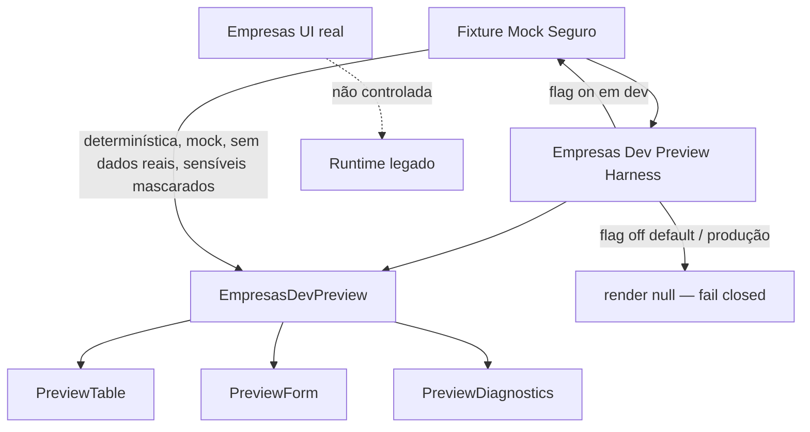
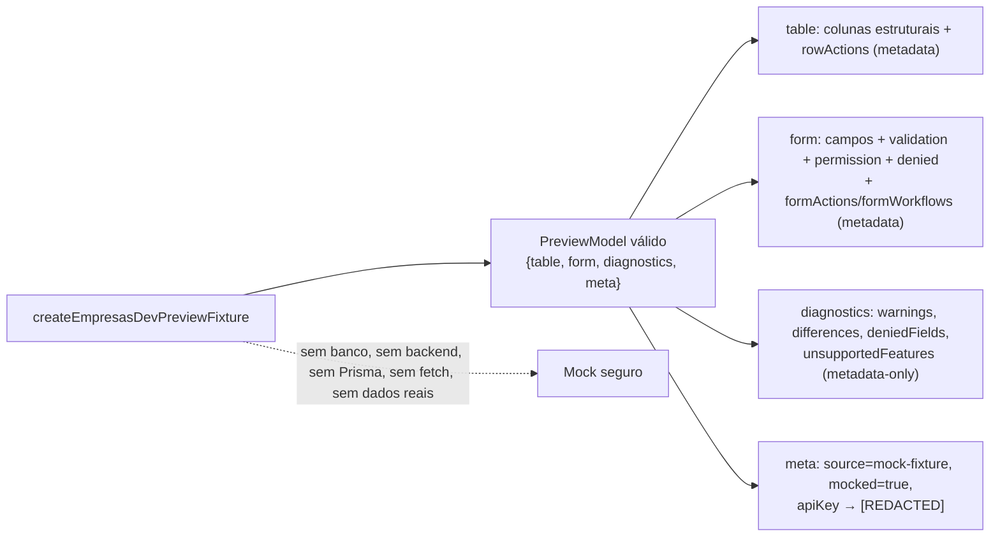

# Post-Foundation C — Module Diagrams

Empresas Dev-Only Preview Harness — position, flow, and isolation from the production Empresas screen.

---

## Dev-Only Preview Harness — safe fixture wiring



**Depends on:** `createEmpresasDevPreviewFixture` + `isEmpresasDevPreviewHarnessEnabled` (pure, framework-free) and `EmpresasDevPreview` (dev-only component). The harness React component is never exported from the runtime barrel.
**Consumed by:** a manual dev harness mount only. Never a public production route, never in the main menu, never auto-mounted.

---

## Fixture — safe, deterministic, no real data



---

## Isolation & opt-in gating

```mermaid
flowchart TB
  ENV[env] --> HFLAG{MAK_..._DEV_PREVIEW_HARNESS === true?}
  HFLAG -->|não| OFF[harness off — render null]
  HFLAG -->|sim| PRODQ{produção?}
  PRODQ -->|sim, sem override| OFF2[fail closed — render null]
  PRODQ -->|não / override explícito| ON[harness monta preview com fixture]
  ON --> INNER[EmpresasDevPreview recebe env efetivo\n(liga o preview interno; PROD ainda fail-closed)]
```

Duas camadas de proteção: a flag do harness (dev-only, fail-closed em produção) e o próprio `EmpresasDevPreview` (que também re-checa produção). Nenhuma rota/menu é adicionada; `src/App.jsx` permanece intocado.
