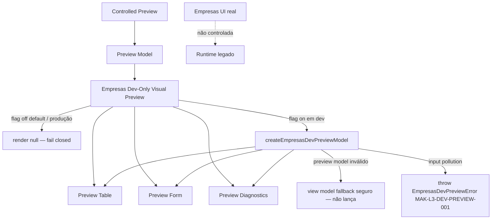
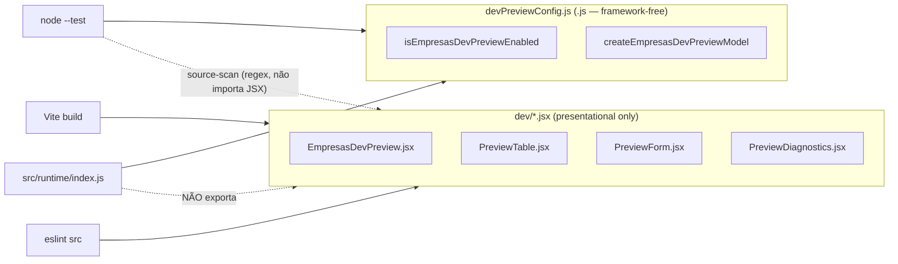
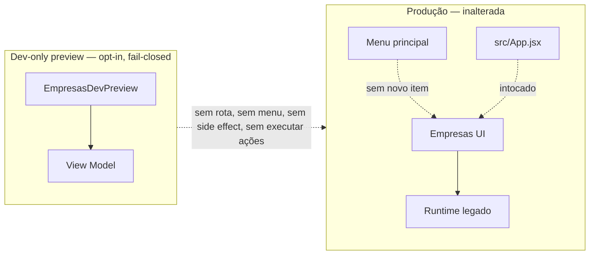

# Post-Foundation C — Module Diagrams

Empresas Dev-Only Visual Preview — position, flow, and isolation from the production Empresas screen.

---

## Dev-Only Visual Preview — isolated visualization wiring

**Depends on:** `createEmpresasDevPreviewModel`/`isEmpresasDevPreviewEnabled` (pure, framework-free core) + the ControlledPreview preview model. The React components are dev-only and never exported from the runtime barrel.
**Consumed by:** an isolated dev harness only. Never mounted in production navigation, never a public route, never in the main menu.

---

## Testability split — React under node --test

`node --test` exercita o core puro e inspeciona os `.jsx` como texto; Vite compila e ESLint valida os `.jsx`; o barrel do runtime exporta apenas os helpers puros — nenhum React entra no core framework-free.

---

## Isolation guarantee

Com a flag desligada (padrão) ou em produção sem override, `EmpresasDevPreview` renderiza `null` — efeito zero. Nenhum preview é montado em produção; nenhuma rota/menu é adicionado.
