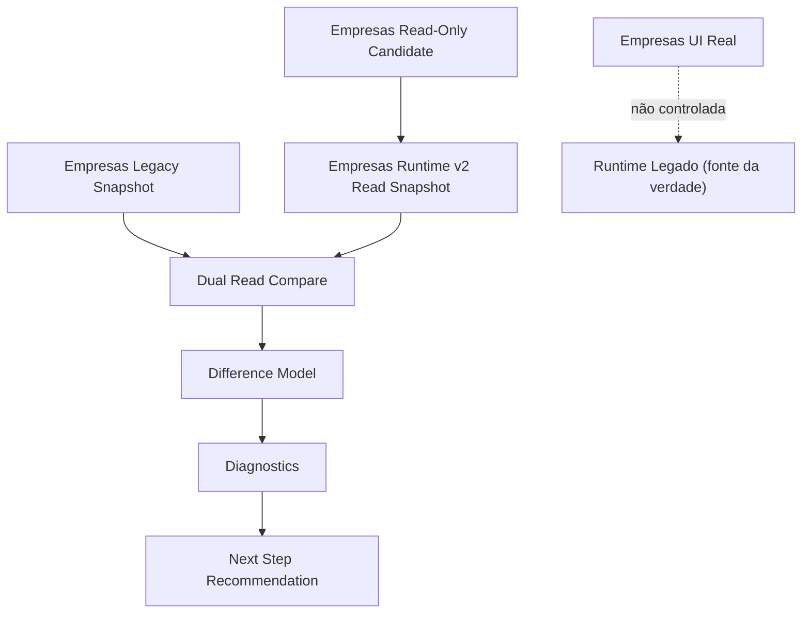
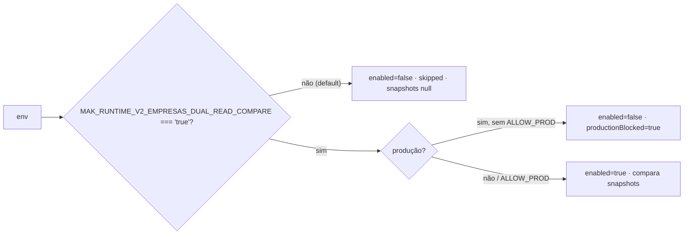
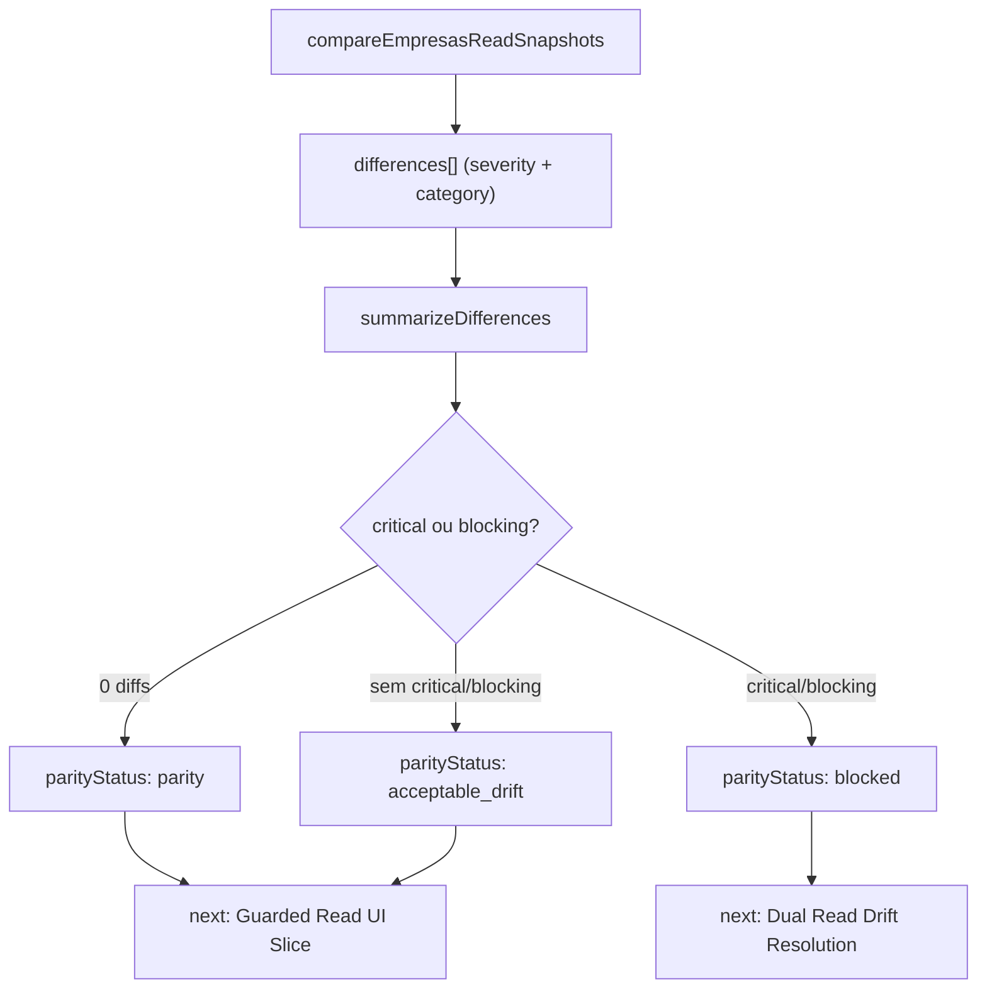
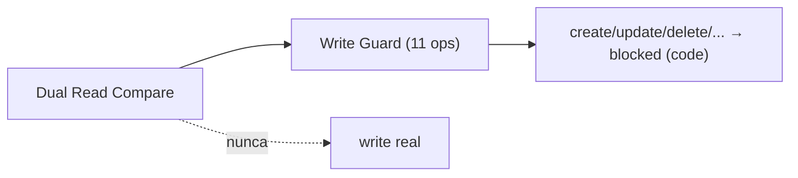

# Post-Foundation C — Module Diagrams

**Slice:** Post-Foundation C — Empresas Dual Read Shadow Compare

---

## 1. Composição do dual-read compare

## 2. Gate de habilitação (dev-only, fail-closed em produção)

## 3. Classificação de diferenças e parity status

## 4. Write guard permanece ativo

