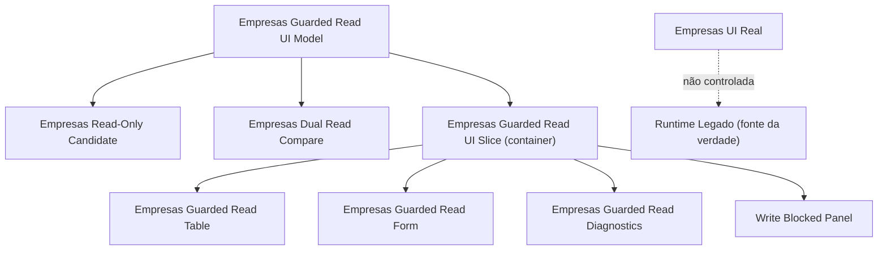
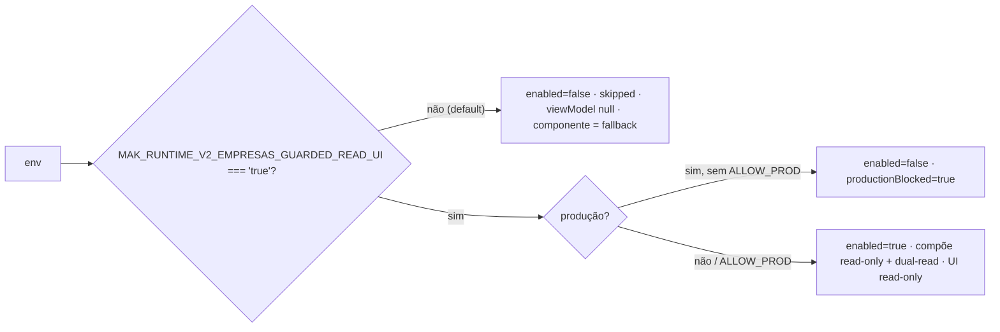
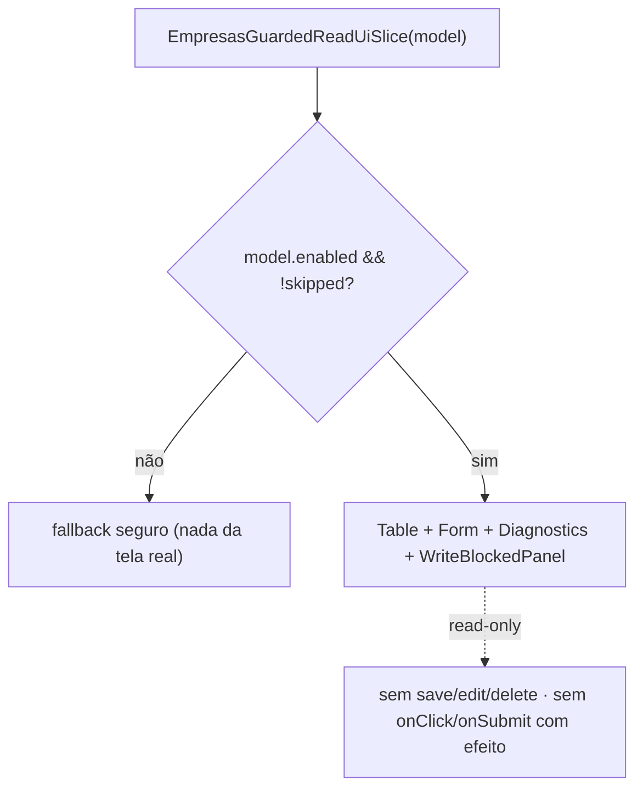
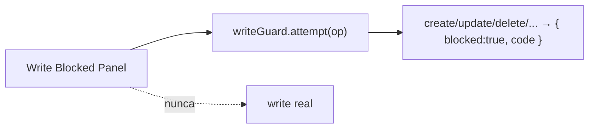

# Post-Foundation C — Module Diagrams

**Slice:** Post-Foundation C — Empresas Guarded Read UI Slice

---

## 1. Composição do guarded read UI

## 2. Gate de habilitação (dev-only, fail-closed em produção)

## 3. Render do container

## 4. Write bloqueado (guard ativo)

