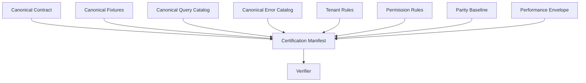
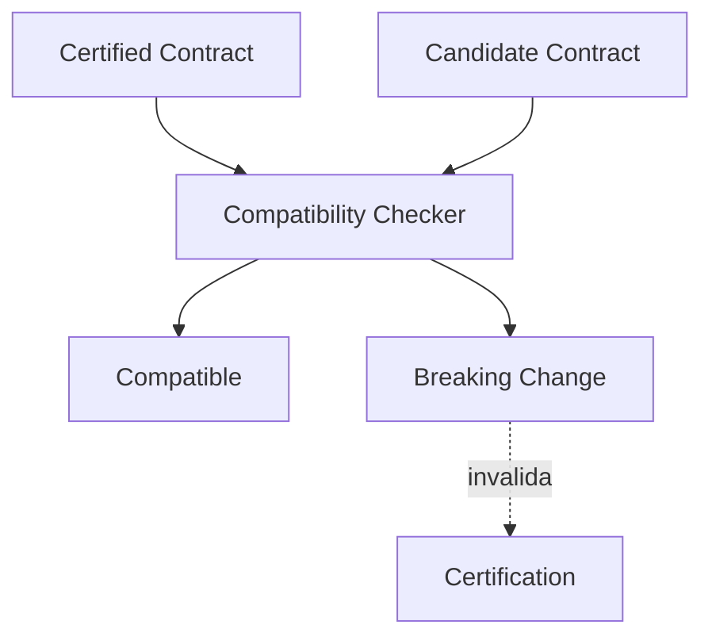
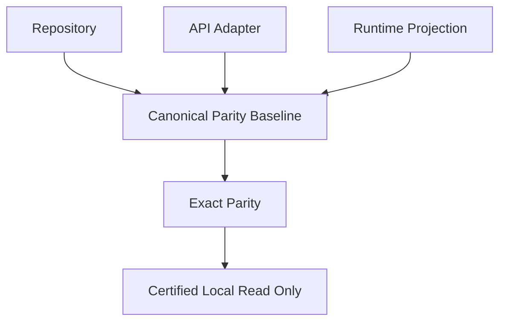
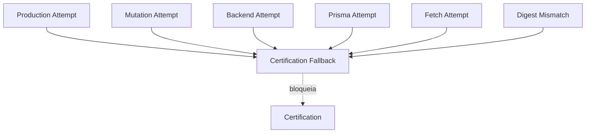

# Module Diagrams — Empresas Local Read Contract Certification

## Diagrama 1 — Manifesto

```mermaid
flowchart TD
  CC[Canonical Contract] --> M[Certification Manifest]
  CF[Canonical Fixtures] --> M
  QC[Canonical Query Catalog] --> M
  EC[Canonical Error Catalog] --> M
  TR[Tenant Rules] --> M
  PR[Permission Rules] --> M
  PB[Parity Baseline] --> M
  PE[Performance Envelope] --> M
  M --> V[Verifier]
```

## Diagrama 2 — Compatibilidade

```mermaid
flowchart TD
  CERT[Certified Contract] --> CK[Compatibility Checker]
  CAND[Candidate Contract] --> CK
  CK --> COMP[Compatible]
  CK --> BRK[Breaking Change]
  BRK -. invalida .-> CERTI[Certification]
```

## Diagrama 3 — Paridade

```mermaid
flowchart TD
  RR[Repository] --> PB[Canonical Parity Baseline]
  AA[API Adapter] --> PB
  RP[Runtime Projection] --> PB
  PB --> EP[Exact Parity]
  EP --> CLR[Certified Local Read Only]
```

## Diagrama 4 — Fallback

```mermaid
flowchart TD
  PA[Production Attempt] --> CF[Certification Fallback]
  MA[Mutation Attempt] --> CF
  BA[Backend Attempt] --> CF
  PRA[Prisma Attempt] --> CF
  FA[Fetch Attempt] --> CF
  DM[Digest Mismatch] --> CF
  CF -. bloqueia .-> CERT[Certification]
```
