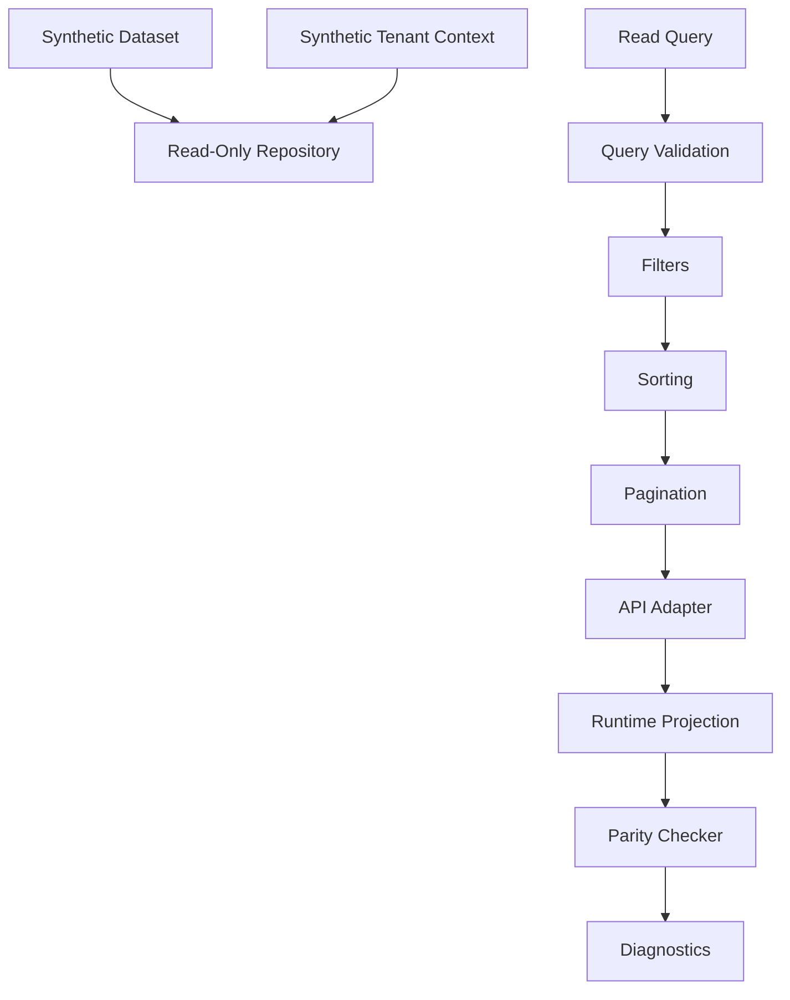
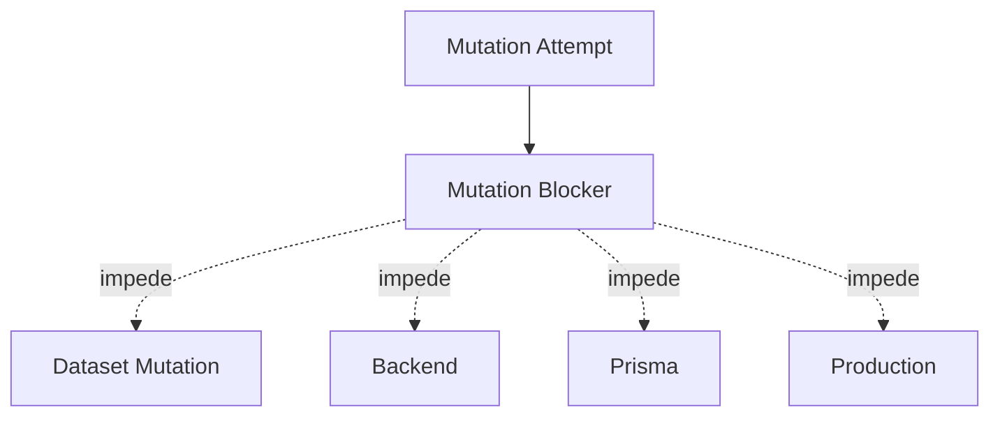
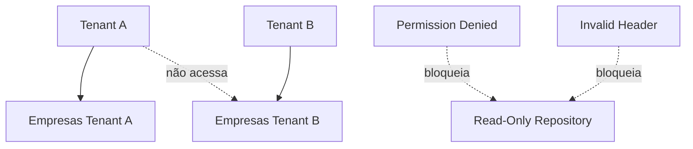
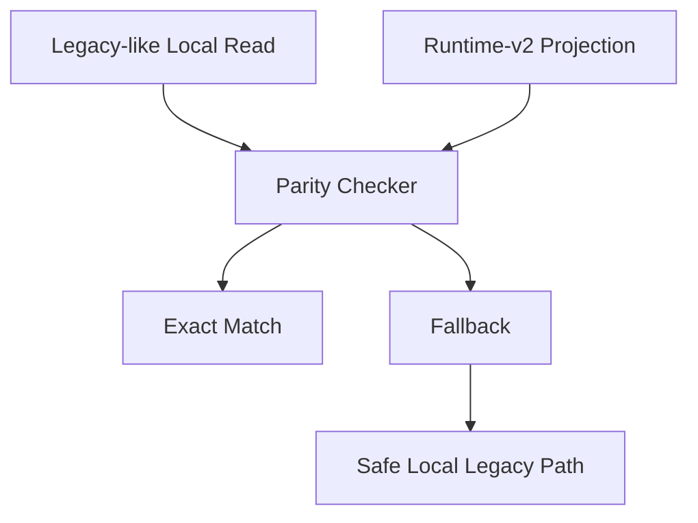

# Module Diagrams — Empresas Local Read-Only Contract Pilot

## Diagrama 1 — Fluxo de leitura

```mermaid
flowchart TD
  DS[Synthetic Dataset] --> RR[Read-Only Repository]
  TC[Synthetic Tenant Context] --> RR
  RQ[Read Query] --> QV[Query Validation]
  QV --> FL[Filters]
  FL --> SO[Sorting]
  SO --> PG[Pagination]
  PG --> AA[API Adapter]
  AA --> RP[Runtime Projection]
  RP --> PC[Parity Checker]
  PC --> DG[Diagnostics]
```

## Diagrama 2 — Mutation blocker

```mermaid
flowchart TD
  MA[Mutation Attempt] --> MB[Mutation Blocker]
  MB -. impede .-> DM[Dataset Mutation]
  MB -. impede .-> BE[Backend]
  MB -. impede .-> PR[Prisma]
  MB -. impede .-> PROD[Production]
```

## Diagrama 3 — Isolamento

```mermaid
flowchart TD
  TA[Tenant A] --> EA[Empresas Tenant A]
  TA -. não acessa .-> EB[Empresas Tenant B]
  TB[Tenant B] --> EB
  PD[Permission Denied] -. bloqueia .-> RR[Read-Only Repository]
  IH[Invalid Header] -. bloqueia .-> RR
```

## Diagrama 4 — Paridade e fallback

```mermaid
flowchart TD
  LL[Legacy-like Local Read] --> PC[Parity Checker]
  RV[Runtime-v2 Projection] --> PC
  PC --> EM[Exact Match]
  PC --> FB[Fallback]
  FB --> SL[Safe Local Legacy Path]
```
