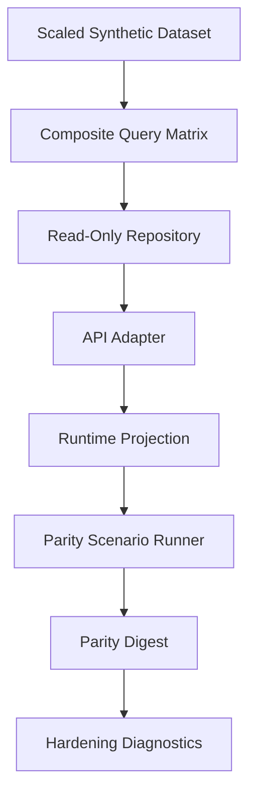
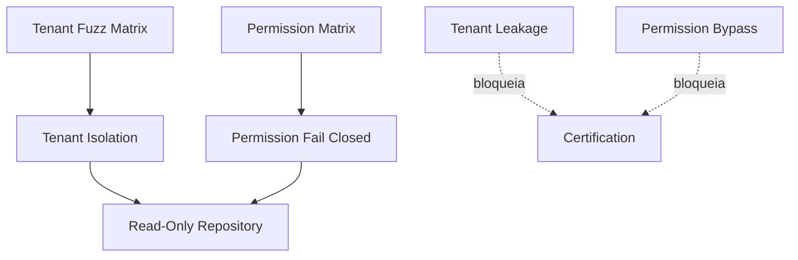
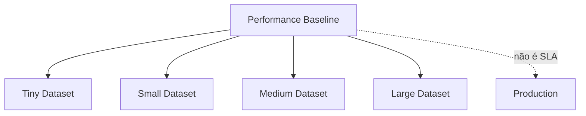
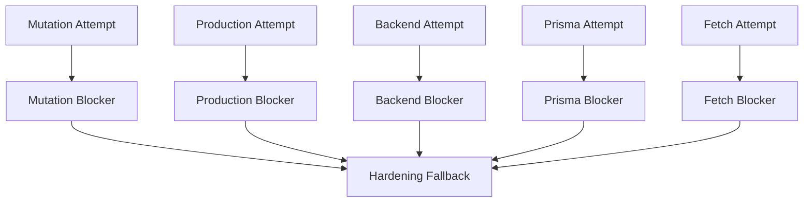

# Module Diagrams — Empresas Local Read Parity Hardening

## Diagrama 1 — Pipeline de hardening

## Diagrama 2 — Isolamento e permissões

## Diagrama 3 — Performance (não é SLA)

## Diagrama 4 — Blockers

