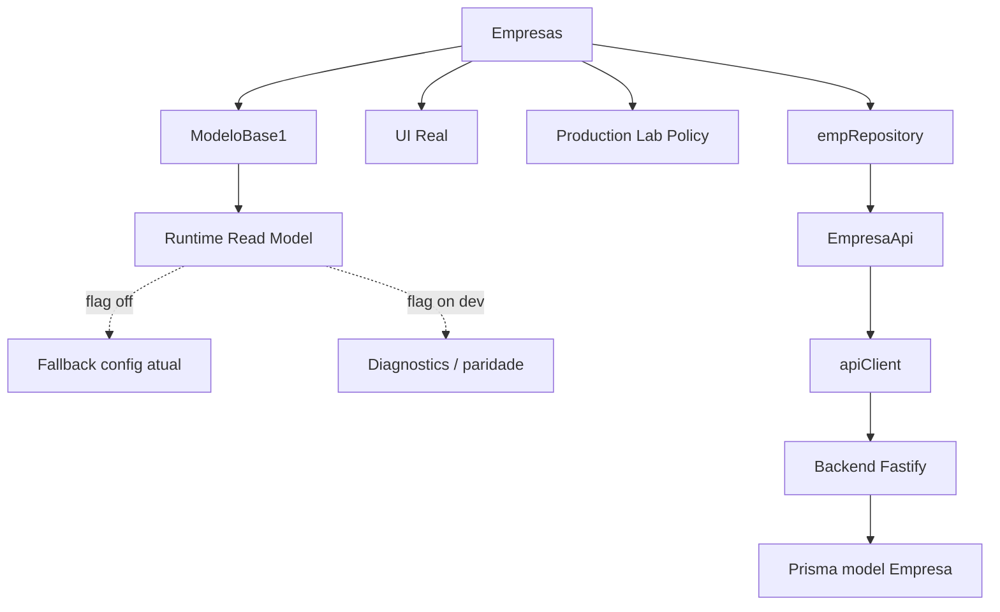
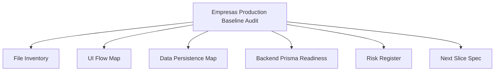
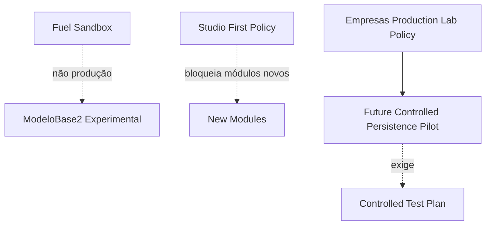

# Module Diagrams — Empresas Production Baseline Audit

## Diagrama 1 — Empresas hoje

## Diagrama 2 — Estrutura da auditoria

## Diagrama 3 — Política e caminho controlado

## Leitura

- Empresas já é **produção real**: ModeloBase1 → repository → EmpresaApi → apiClient → backend
  Fastify → Prisma `Empresa`. O `runtimeReadModel` runtime-v2 existe como beta read-only atrás de flag.
- A auditoria produz inventário, mapa de UI, mapa de dados/persistência, readiness de backend/Prisma,
  registro de riscos e a spec do próximo slice.
- Qualquer piloto real segue o caminho controlado (Test Plan → Read/Write/Persistence Pilot), sempre
  com gate + fallback + aprovação. Fuel/ModeloBase2 permanecem fora do caminho de produção.
