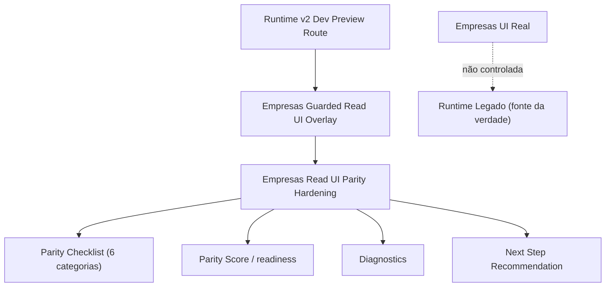
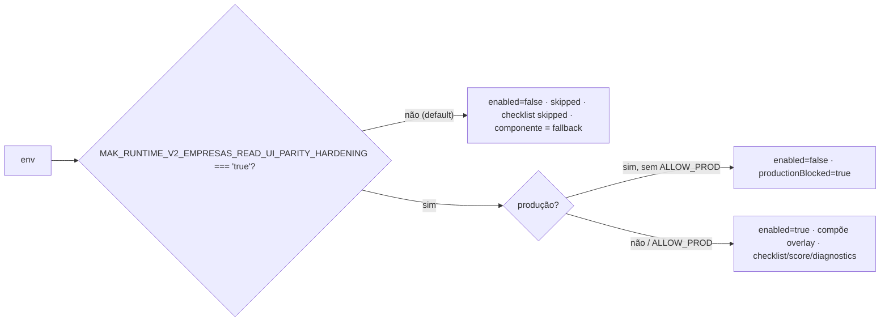
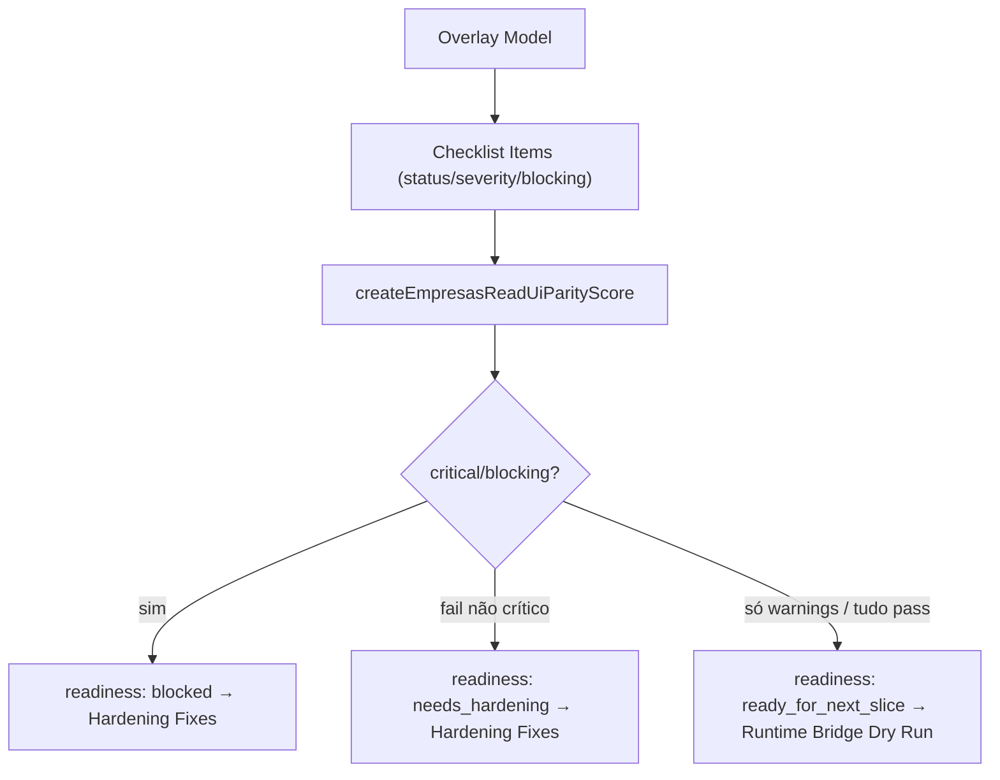
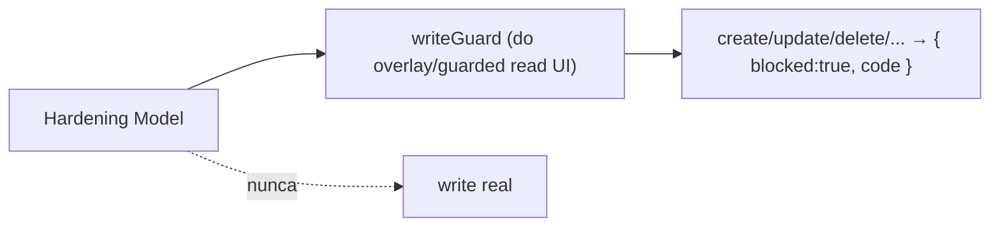

# Post-Foundation C — Module Diagrams

**Slice:** Post-Foundation C — Empresas Read UI Parity Hardening

---

## 1. Composição do hardening

## 2. Gate de habilitação (dev-only, fail-closed em produção)

## 3. Fluxo checklist → score → readiness

## 4. Write bloqueado (guard ativo herdado)

