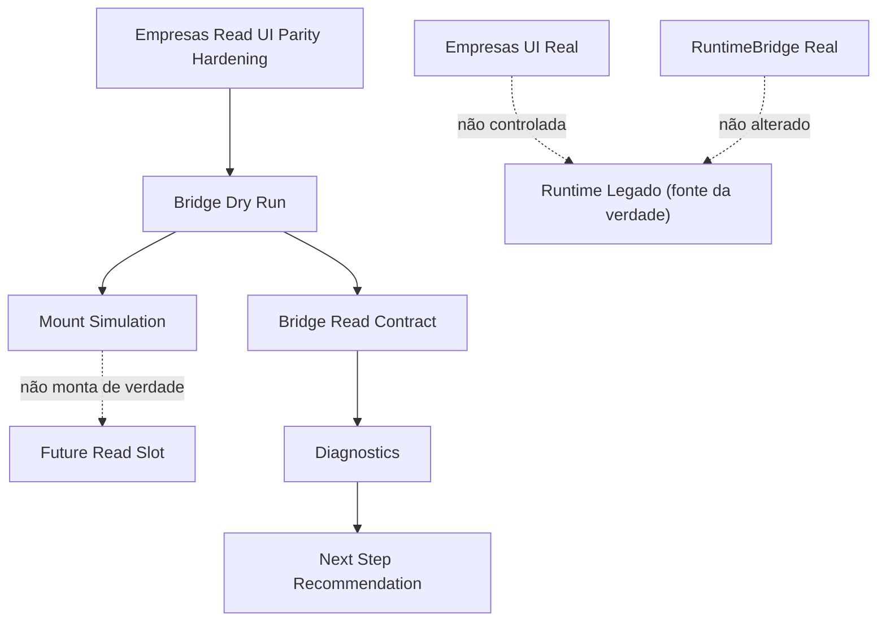
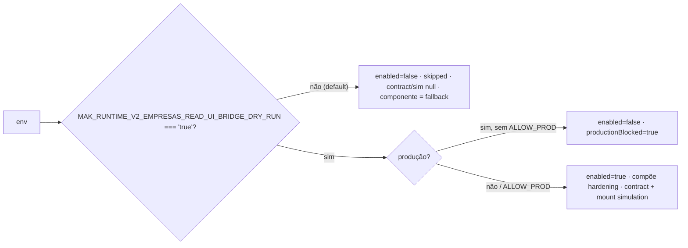
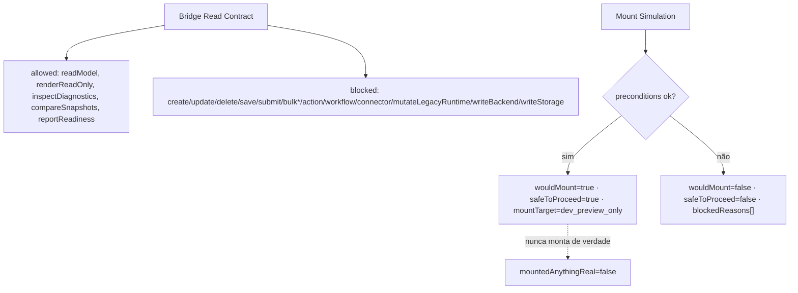
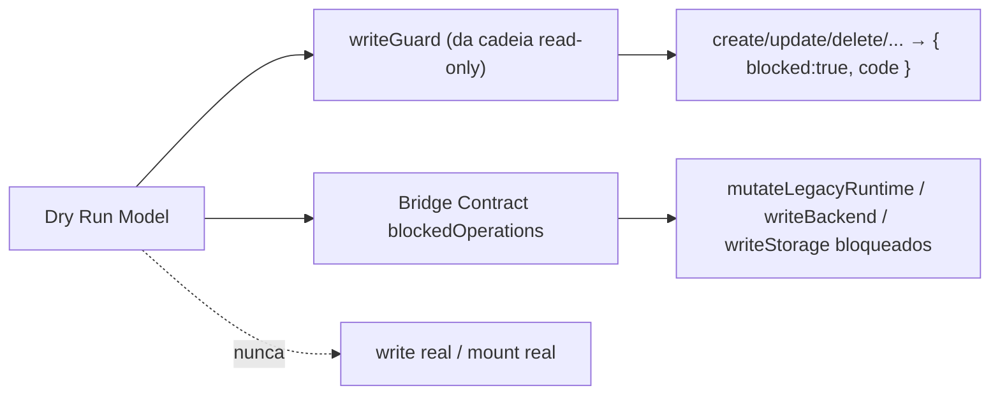

# Post-Foundation C — Module Diagrams

**Slice:** Post-Foundation C — Empresas Read UI Runtime Bridge Dry Run

---

## 1. Composição do dry run

## 2. Gate de habilitação (dev-only, fail-closed em produção)

## 3. Contrato read-only + simulação de montagem

## 4. Write bloqueado (guard ativo + contrato)

