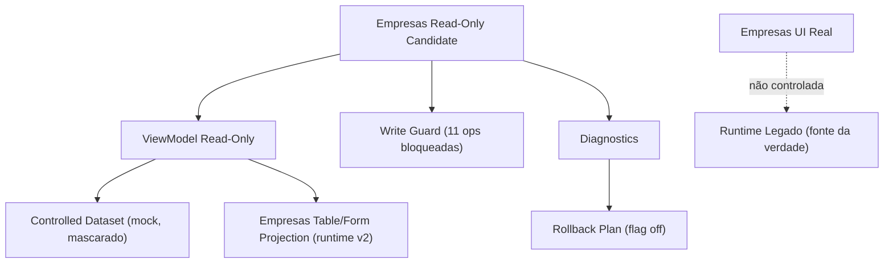
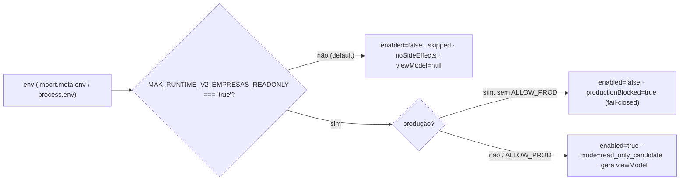
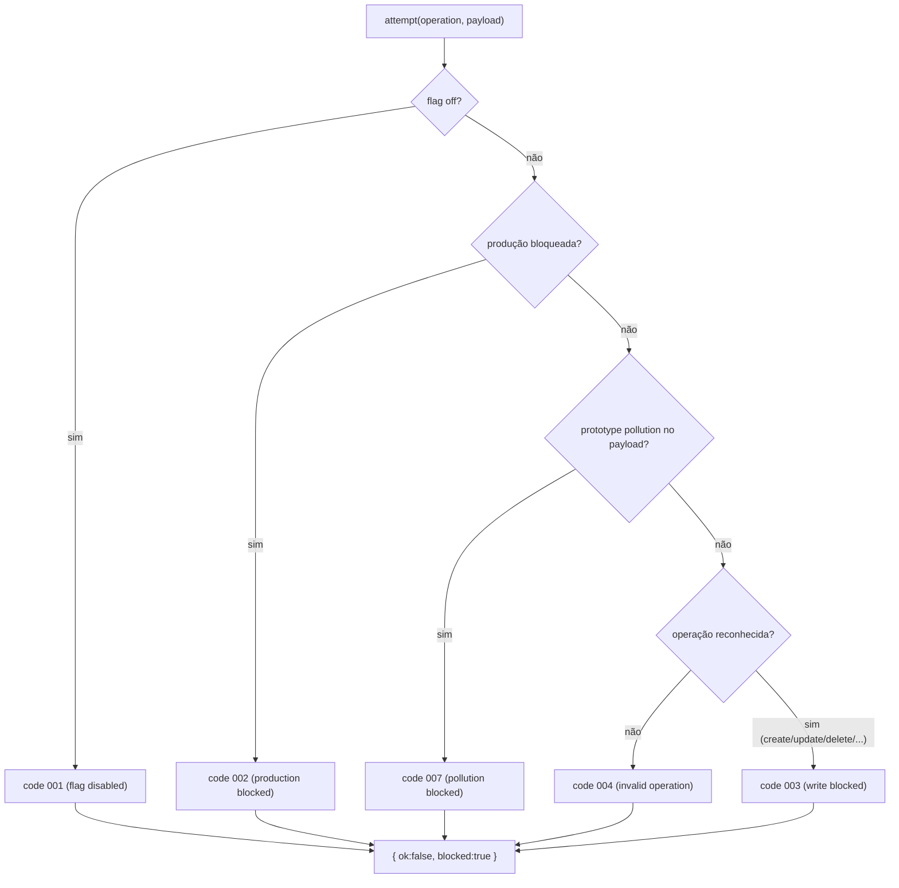
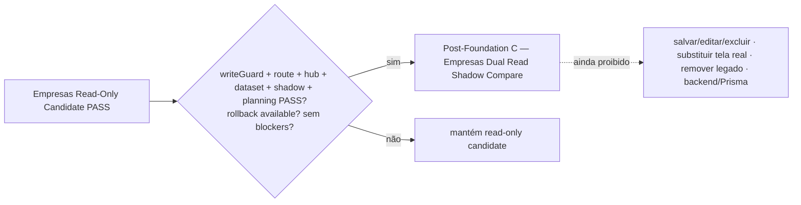

# Post-Foundation C — Module Diagrams

**Slice:** Post-Foundation C — Empresas Read-Only Runtime v2 Candidate

---

## 1. Composição do candidate read-only

## 2. Gate de habilitação (dev-only, fail-closed em produção)

## 3. Write guard — write real impossível

## 4. Próximo passo condicionado

