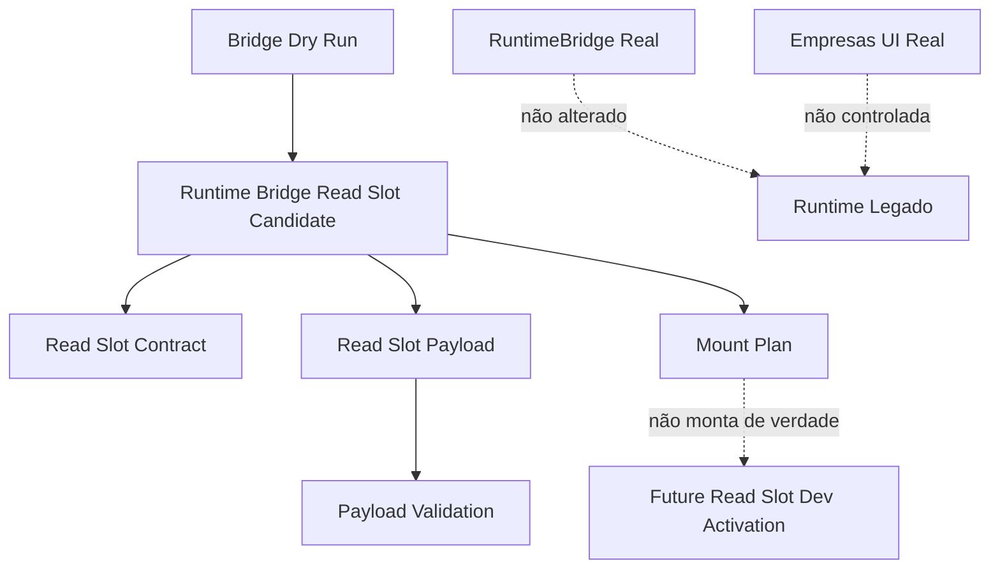
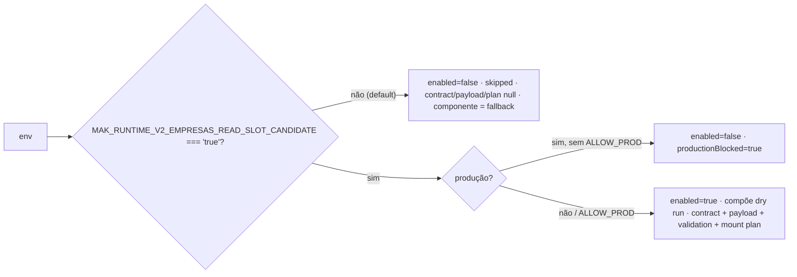
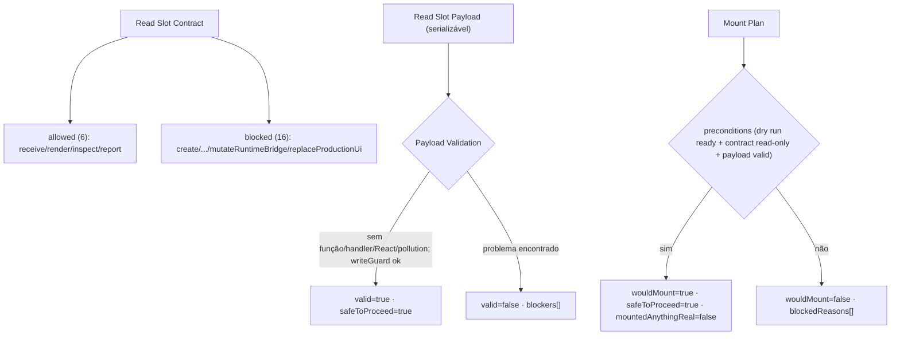
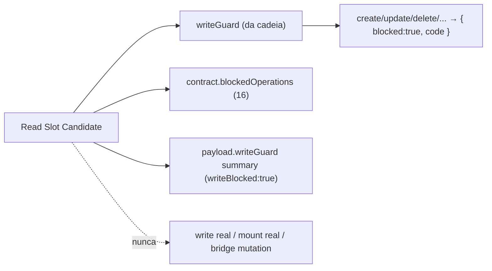

# Post-Foundation C — Module Diagrams

**Slice:** Post-Foundation C — Empresas Runtime Bridge Read Slot Candidate

---

## 1. Composição do read slot candidate

## 2. Gate de habilitação (dev-only, fail-closed em produção)

## 3. Contrato + payload + validação + mount plan

## 4. Write bloqueado (guard + contrato + payload)

