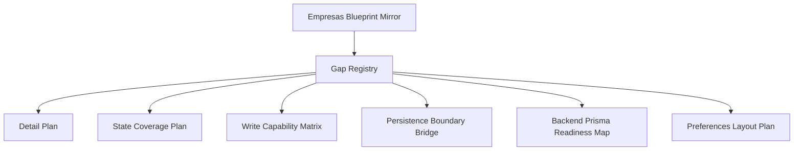
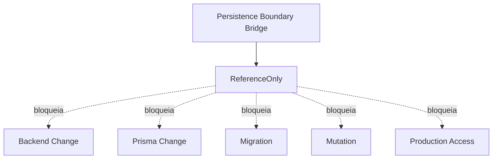
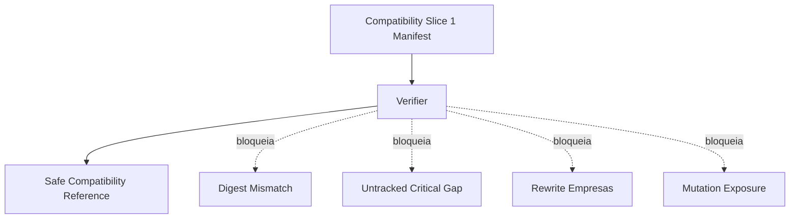
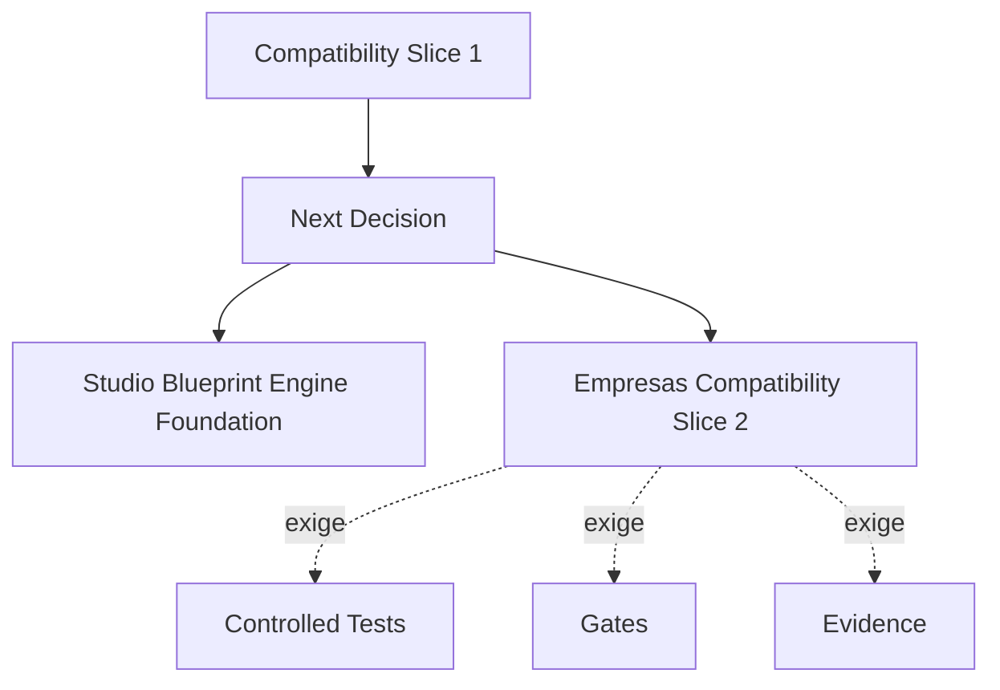

# MODULE DIAGRAMS

## Diagrama 1 — mirror → planos

```mermaid
graph TD
  EBM[Empresas Blueprint Mirror] --> GR[Gap Registry]
  GR --> DP[Detail Plan]
  GR --> SC[State Coverage Plan]
  GR --> WC[Write Capability Matrix]
  GR --> PB[Persistence Boundary Bridge]
  GR --> BP[Backend Prisma Readiness Map]
  GR --> PL[Preferences Layout Plan]
```

## Diagrama 2 — persistence reference-only

```mermaid
graph TD
  PB[Persistence Boundary Bridge] --> RO[ReferenceOnly]
  RO -. bloqueia .-> BC[Backend Change]
  RO -. bloqueia .-> PC[Prisma Change]
  RO -. bloqueia .-> MG[Migration]
  RO -. bloqueia .-> MU[Mutation]
  RO -. bloqueia .-> PA[Production Access]
```

## Diagrama 3 — manifest + verifier

```mermaid
graph TD
  MAN[Compatibility Slice 1 Manifest] --> V[Verifier]
  V --> SCR[Safe Compatibility Reference]
  V -. bloqueia .-> DM[Digest Mismatch]
  V -. bloqueia .-> UCG[Untracked Critical Gap]
  V -. bloqueia .-> RW[Rewrite Empresas]
  V -. bloqueia .-> MX[Mutation Exposure]
```

## Diagrama 4 — próxima decisão

```mermaid
graph TD
  CS1[Compatibility Slice 1] --> ND[Next Decision]
  ND --> ENG[Studio Blueprint Engine Foundation]
  ND --> CS2[Empresas Compatibility Slice 2]
  CS2 -. exige .-> T[Controlled Tests]
  CS2 -. exige .-> G[Gates]
  CS2 -. exige .-> E[Evidence]
```
