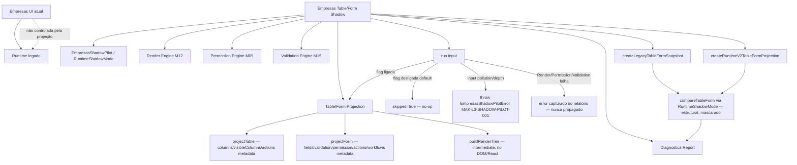
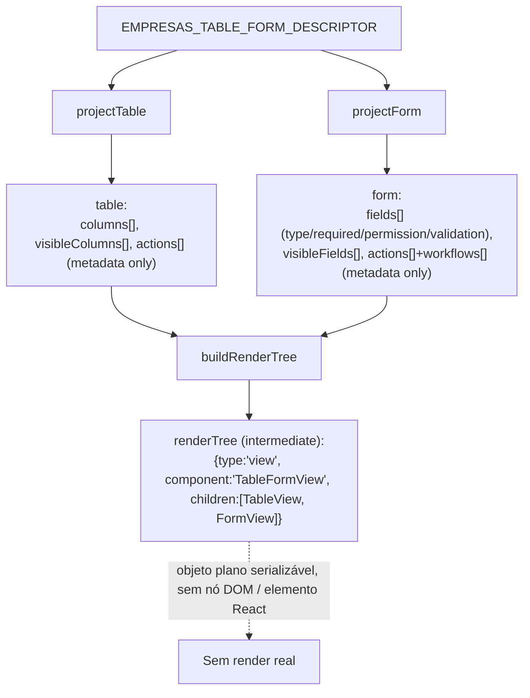
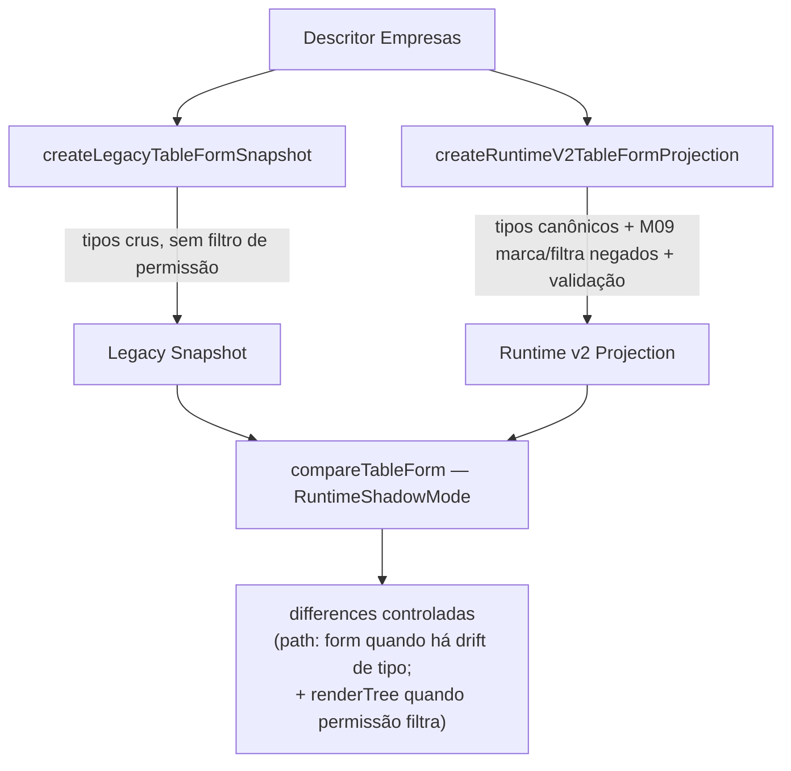
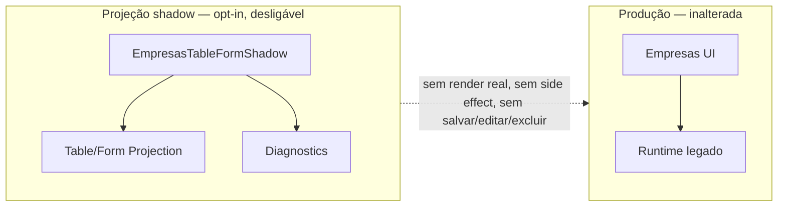

# Post-Foundation C — Module Diagrams

Empresas Table/Form Shadow Projection — position, flow, and isolation from the production Empresas screen.

---

## Table/Form Shadow — passive projection wiring

**Depends on (all optional/injectable):** `RuntimeShadowMode` (default construído internamente), Permission Engine (M09), Validation Engine (M15), Render Engine (M12), Observability (M24). Nenhum obrigatório.
**Consumed by:** um futuro preview visual controlado / segundo módulo piloto. Nunca consumido pelo render de produção, Studio ou Marketplace.

---

## Projection shape — intermediate, never renderable

Actions e workflows aparecem **apenas como metadados** `{id, kind, ref}` — nunca há função de execução; o Action/Workflow/Connector Engine nunca é invocado (mesmo contrato do Render Engine, que "never dispatches").

---

## Legacy vs Runtime v2 — divergence surfaced

---

## Isolation guarantee

Com a flag desligada (padrão), `run()` retorna `{ skipped: true }` sem construir projeção — efeito zero sobre a tela Empresas.
