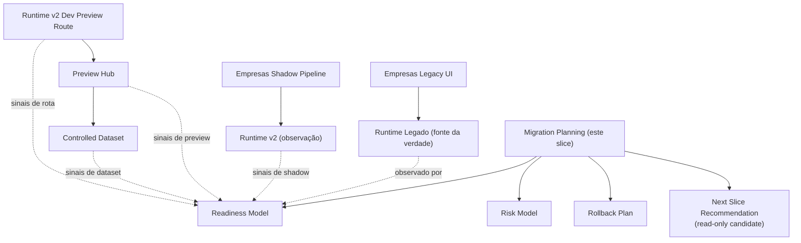
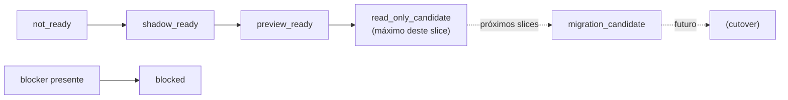
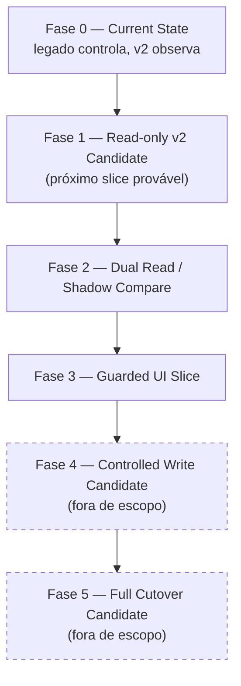
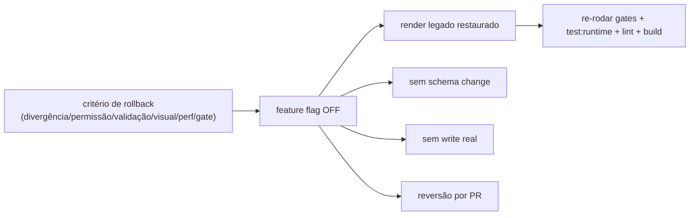

# Post-Foundation C — Module Diagrams

**Slice:** Post-Foundation C — First Real Module Migration Planning

---

## 1. Estado atual e camada de planejamento

## 2. Escada de readiness (capada em read_only_candidate)

## 3. Fases da migração de Empresas (nenhuma executada neste slice)

## 4. Rollback (flag off — reversão trivial por design)

