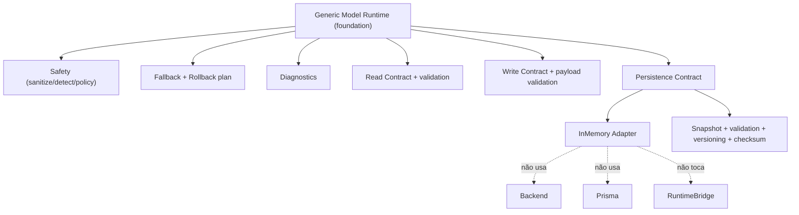
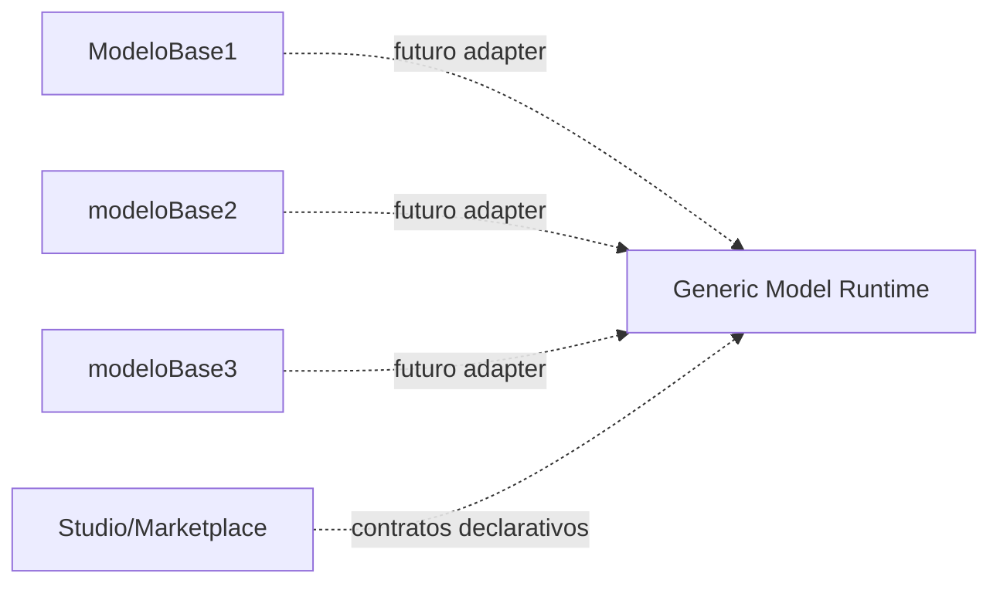
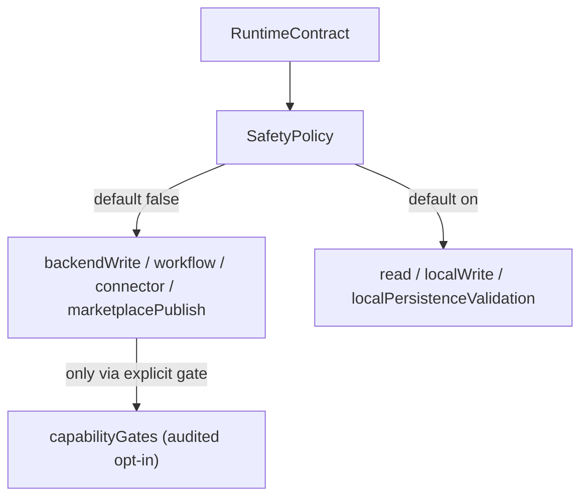

# MODULE DIAGRAMS — Generic Model Runtime Contracts Foundation

## Estrutura da fundação

```mermaid
flowchart TD
  GMR["Generic Model Runtime (foundation)"] --> SAFE["Safety (sanitize/detect/policy)"]
  GMR --> FB["Fallback + Rollback plan"]
  GMR --> DIAG["Diagnostics"]
  GMR --> RC["Read Contract + validation"]
  GMR --> WC["Write Contract + payload validation"]
  GMR --> PC["Persistence Contract"]
  PC --> ADP["InMemory Adapter"]
  PC --> SNAP["Snapshot + validation + versioning + checksum"]
  ADP -. não usa .-> BACKEND["Backend"]
  ADP -. não usa .-> PRISMA["Prisma"]
  ADP -. não toca .-> RB["RuntimeBridge"]
```

## Consumo futuro (adapters)

```mermaid
flowchart LR
  MB1["ModeloBase1"] -. futuro adapter .-> GMR["Generic Model Runtime"]
  MB2["modeloBase2"] -. futuro adapter .-> GMR
  MB3["modeloBase3"] -. futuro adapter .-> GMR
  STUDIO["Studio/Marketplace"] -. contratos declarativos .-> GMR
```

## Capacidades (fail-safe)

```mermaid
flowchart TD
  RCX["RuntimeContract"] --> POL["SafetyPolicy"]
  POL -->|default false| DANGER["backendWrite / workflow / connector / marketplacePublish"]
  POL -->|default on| SAFEC["read / localWrite / localPersistenceValidation"]
  DANGER -->|only via explicit gate| GATE["capabilityGates (audited opt-in)"]
```
