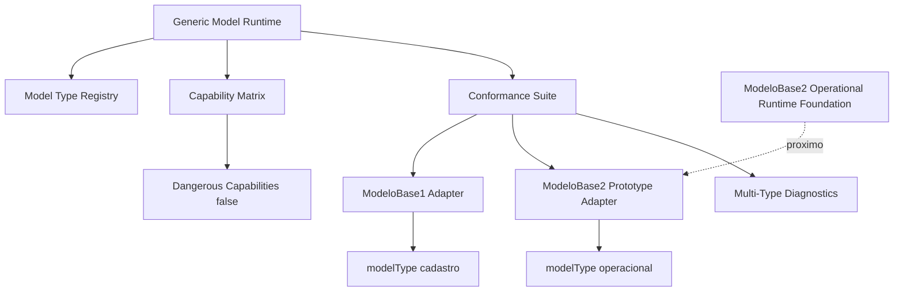
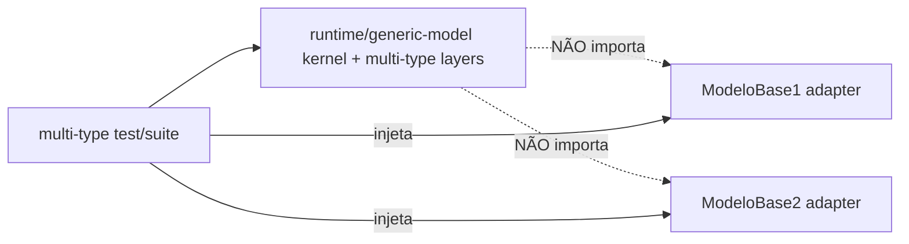
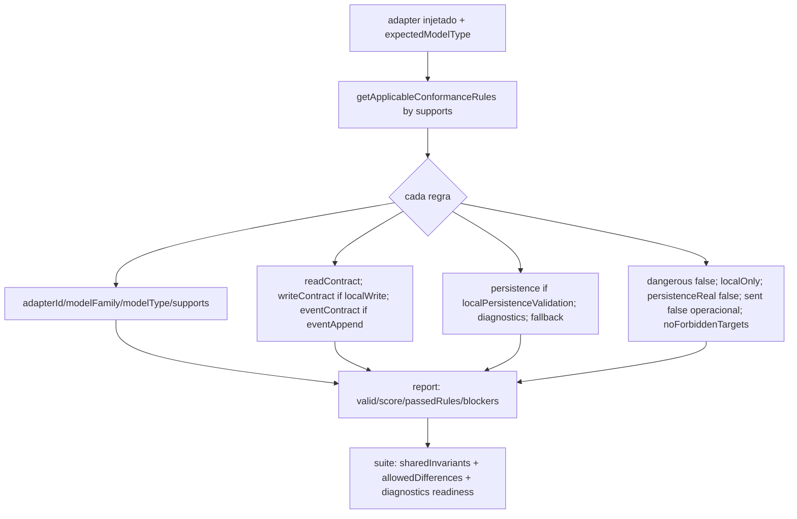

# Module Diagrams — Generic Model Multi-Type Hardening

```mermaid
flowchart TD
  GMR[Generic Model Runtime] --> REG[Model Type Registry]
  GMR --> CAP[Capability Matrix]
  GMR --> SUITE[Conformance Suite]
  SUITE --> MB1[ModeloBase1 Adapter]
  SUITE --> MB2[ModeloBase2 Prototype Adapter]
  MB1 --> TC[modelType cadastro]
  MB2 --> TO[modelType operacional]
  CAP --> DANGER[Dangerous Capabilities false]
  SUITE --> DIAG[Multi-Type Diagnostics]
  FUT[ModeloBase2 Operational Runtime Foundation] -. proximo .-> MB2
```

## Injeção (isolamento)

```mermaid
flowchart LR
  K[runtime/generic-model kernel + multi-type layers] -. NÃO importa .-> MB1a[ModeloBase1 adapter]
  K -. NÃO importa .-> MB2a[ModeloBase2 adapter]
  TEST[multi-type test/suite] -->|injeta| MB1a
  TEST -->|injeta| MB2a
  TEST --> K
```

## Fluxo de conformance

```mermaid
flowchart TD
  A[adapter injetado + expectedModelType] --> B[getApplicableConformanceRules by supports]
  B --> C{cada regra}
  C --> D[adapterId/modelFamily/modelType/supports]
  C --> E[readContract; writeContract if localWrite; eventContract if eventAppend]
  C --> F[persistence if localPersistenceValidation; diagnostics; fallback]
  C --> G[dangerous false; localOnly; persistenceReal false; sent false operacional; noForbiddenTargets]
  D --> H[report: valid/score/passedRules/blockers]
  E --> H
  F --> H
  G --> H
  H --> I[suite: sharedInvariants + allowedDifferences + diagnostics readiness]
```
