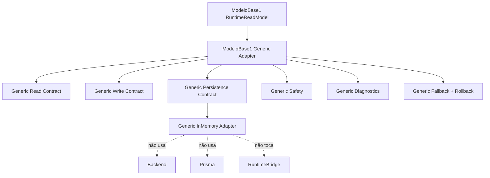
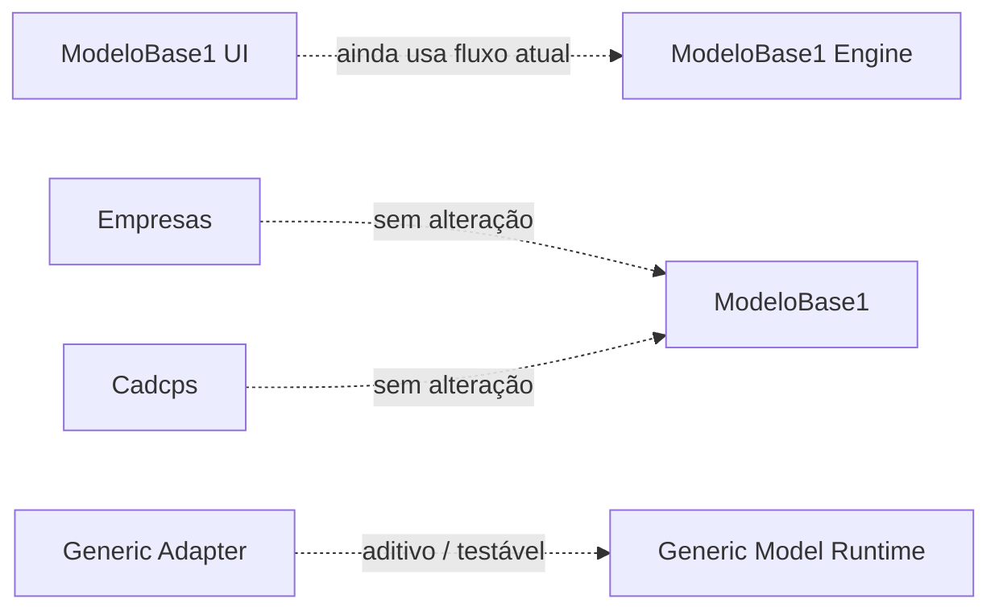
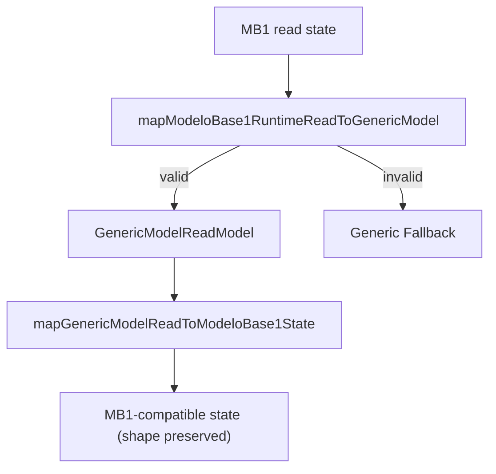

# MODULE DIAGRAMS — ModeloBase1 Adapter to Generic Kernel

## Adapter e bridges

```mermaid
flowchart TD
  RRM["ModeloBase1 RuntimeReadModel"] --> AD["ModeloBase1 Generic Adapter"]
  AD --> RC["Generic Read Contract"]
  AD --> WC["Generic Write Contract"]
  AD --> PC["Generic Persistence Contract"]
  AD --> SAFE["Generic Safety"]
  AD --> DIAG["Generic Diagnostics"]
  AD --> FB["Generic Fallback + Rollback"]
  PC --> ADP["Generic InMemory Adapter"]
  ADP -. não usa .-> BACKEND["Backend"]
  ADP -. não usa .-> PRISMA["Prisma"]
  ADP -. não toca .-> RB["RuntimeBridge"]
```

## Fluxo atual preservado

```mermaid
flowchart LR
  UI["ModeloBase1 UI"] -. ainda usa fluxo atual .-> ENGINE["ModeloBase1 Engine"]
  EMP["Empresas"] -. sem alteração .-> MB1["ModeloBase1"]
  CPS["Cadcps"] -. sem alteração .-> MB1
  AD["Generic Adapter"] -. aditivo / testável .-> KERNEL["Generic Model Runtime"]
```

## Read roundtrip

```mermaid
flowchart TD
  A["MB1 read state"] --> B["mapModeloBase1RuntimeReadToGenericModel"]
  B -->|valid| C["GenericModelReadModel"]
  B -->|invalid| FBK["Generic Fallback"]
  C --> D["mapGenericModelReadToModeloBase1State"]
  D --> E["MB1-compatible state (shape preserved)"]
```
