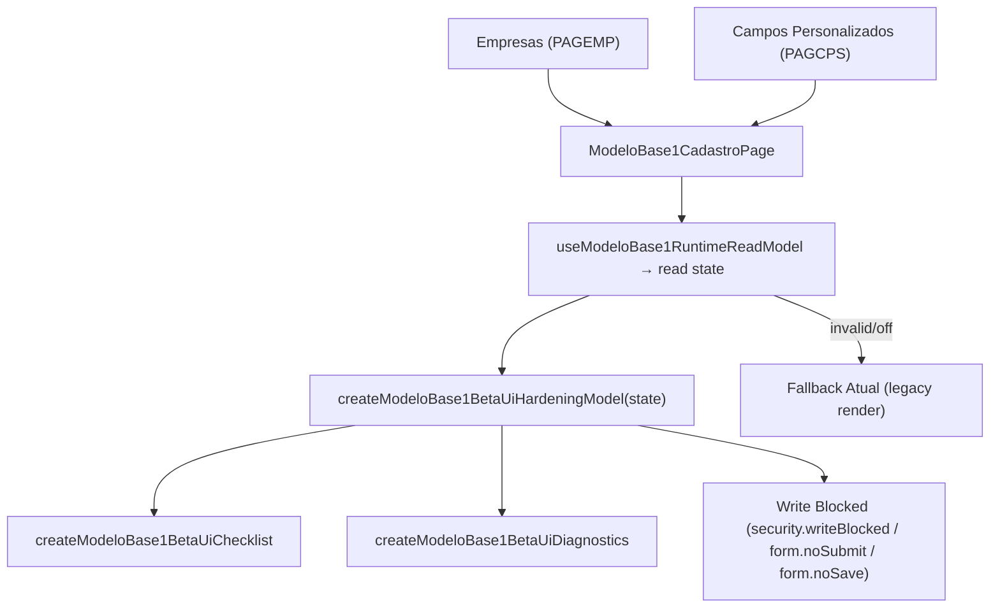
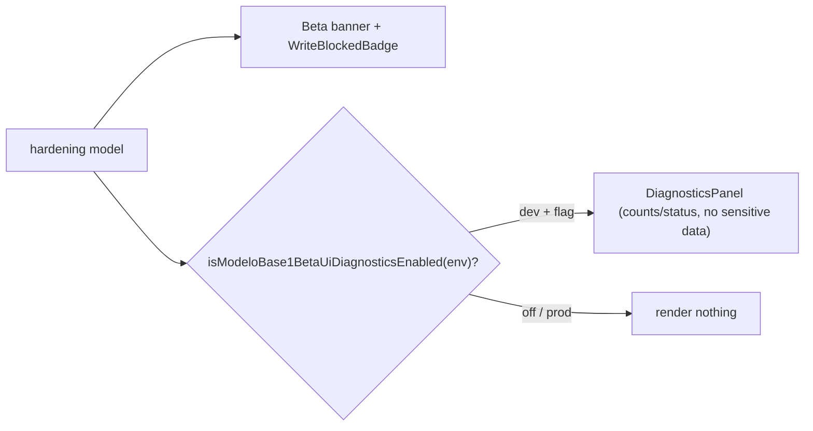
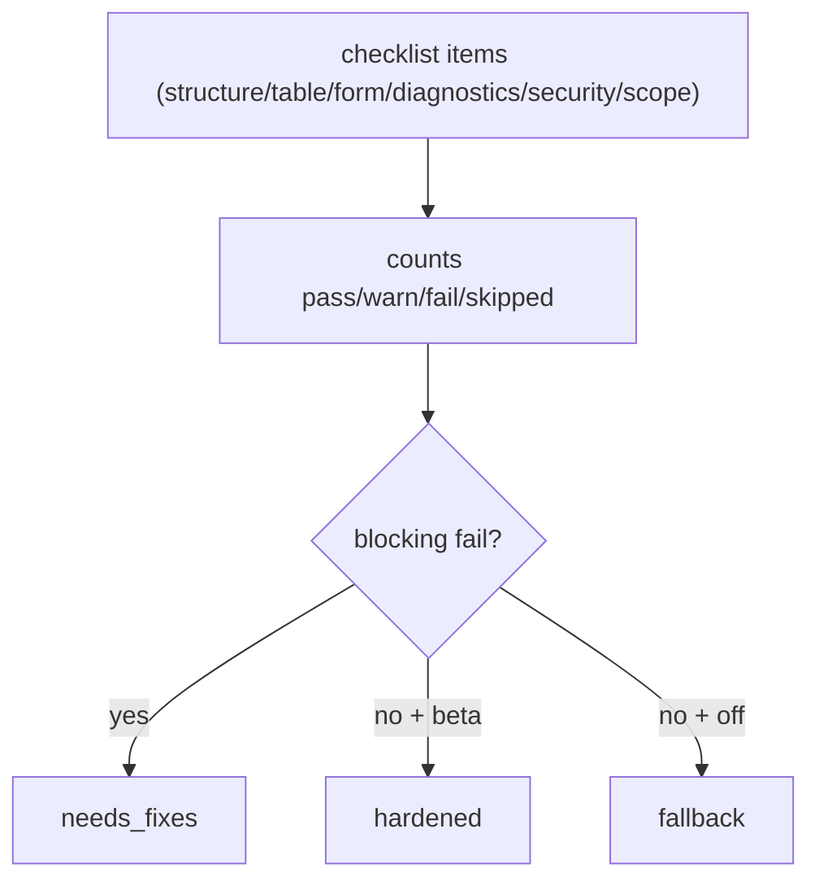
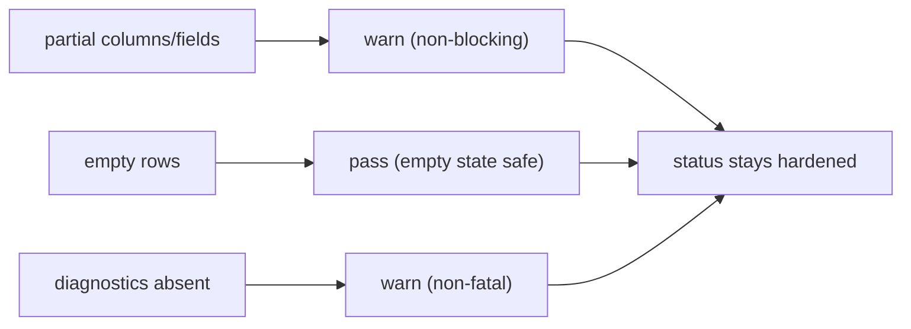

# MODULE DIAGRAMS — ModeloBase1 Beta UI Hardening

## Fluxo de hardening

```mermaid
flowchart TD
  EMP["Empresas (PAGEMP)"] --> MB1["ModeloBase1CadastroPage"]
  CPS["Campos Personalizados (PAGCPS)"] --> MB1
  MB1 --> RR["useModeloBase1RuntimeReadModel → read state"]
  RR --> HARD["createModeloBase1BetaUiHardeningModel(state)"]
  HARD --> CHK["createModeloBase1BetaUiChecklist"]
  HARD --> DIAG["createModeloBase1BetaUiDiagnostics"]
  HARD --> WB["Write Blocked (security.writeBlocked / form.noSubmit / form.noSave)"]
  RR -->|invalid/off| FB["Fallback Atual (legacy render)"]
```

## Consumo na UI (dev-only)

```mermaid
flowchart LR
  HARD["hardening model"] --> BANNER["Beta banner + WriteBlockedBadge"]
  HARD --> PANEL{"isModeloBase1BetaUiDiagnosticsEnabled(env)?"}
  PANEL -->|dev + flag| SHOW["DiagnosticsPanel (counts/status, no sensitive data)"]
  PANEL -->|off / prod| HIDE["render nothing"]
```

## Checklist → readiness

```mermaid
flowchart TD
  ITEMS["checklist items (structure/table/form/diagnostics/security/scope)"] --> COUNT["counts pass/warn/fail/skipped"]
  COUNT --> Q{"blocking fail?"}
  Q -->|yes| NF["needs_fixes"]
  Q -->|no + beta| HD["hardened"]
  Q -->|no + off| FBS["fallback"]
```

## Robustez em dados parciais

```mermaid
flowchart LR
  P["partial columns/fields"] --> W["warn (non-blocking)"]
  E["empty rows"] --> OK["pass (empty state safe)"]
  D["diagnostics absent"] --> W2["warn (non-fatal)"]
  W --> KEEP["status stays hardened"]
  OK --> KEEP
  W2 --> KEEP
```
