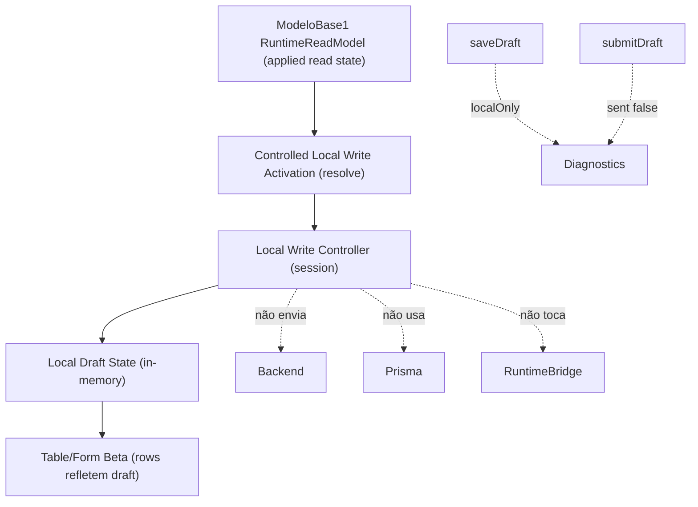
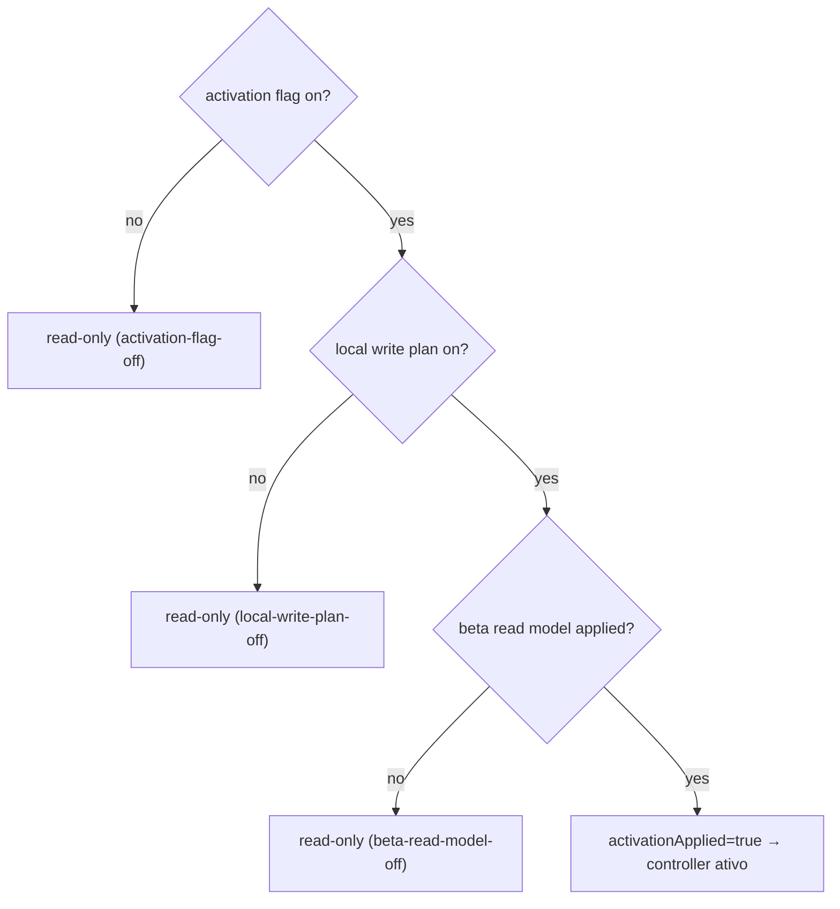
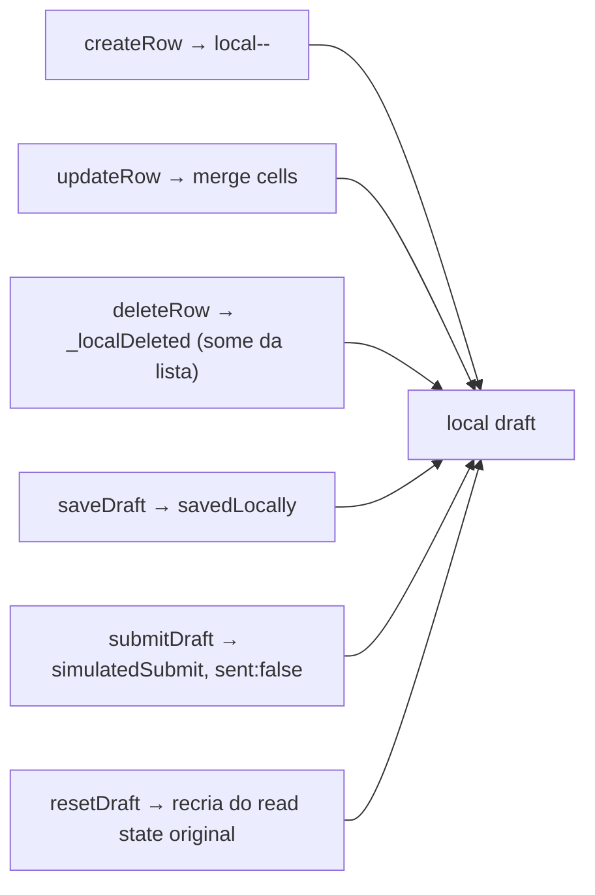
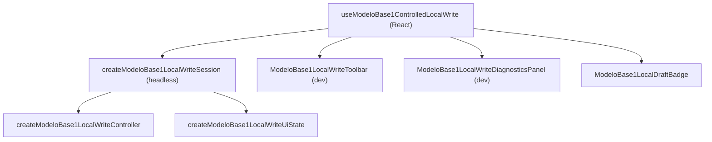

# MODULE DIAGRAMS — ModeloBase1 Controlled Local Write Activation

## Fluxo de ativação

```mermaid
flowchart TD
  RRM["ModeloBase1 RuntimeReadModel (applied read state)"] --> ACT["Controlled Local Write Activation (resolve)"]
  ACT --> CTRL["Local Write Controller (session)"]
  CTRL --> DRAFT["Local Draft State (in-memory)"]
  DRAFT --> UI["Table/Form Beta (rows refletem draft)"]
  SAVE["saveDraft"] -. localOnly .-> DIAG["Diagnostics"]
  SUBMIT["submitDraft"] -. sent false .-> DIAG
  CTRL -. não envia .-> BACKEND["Backend"]
  CTRL -. não usa .-> PRISMA["Prisma"]
  CTRL -. não toca .-> RB["RuntimeBridge"]
```

## Pré-condições da ativação

```mermaid
flowchart TD
  A{"activation flag on?"}
  A -->|no| OFF["read-only (activation-flag-off)"]
  A -->|yes| B{"local write plan on?"}
  B -->|no| OFF2["read-only (local-write-plan-off)"]
  B -->|yes| C{"beta read model applied?"}
  C -->|no| OFF3["read-only (beta-read-model-off)"]
  C -->|yes| ON["activationApplied=true → controller ativo"]
```

## Operações locais

```mermaid
flowchart LR
  CR["createRow → local-<mod>-<seq>"] --> D["local draft"]
  UP["updateRow → merge cells"] --> D
  DEL["deleteRow → _localDeleted (some da lista)"] --> D
  SV["saveDraft → savedLocally"] --> D
  SUB["submitDraft → simulatedSubmit, sent:false"] --> D
  RST["resetDraft → recria do read state original"] --> D
```

## Hook / session / componentes

```mermaid
flowchart TD
  HOOK["useModeloBase1ControlledLocalWrite (React)"] --> SESSION["createModeloBase1LocalWriteSession (headless)"]
  SESSION --> CTRL["createModeloBase1LocalWriteController"]
  SESSION --> UISTATE["createModeloBase1LocalWriteUiState"]
  HOOK --> TOOLBAR["ModeloBase1LocalWriteToolbar (dev)"]
  HOOK --> PANEL["ModeloBase1LocalWriteDiagnosticsPanel (dev)"]
  HOOK --> BADGE["ModeloBase1LocalDraftBadge"]
```
