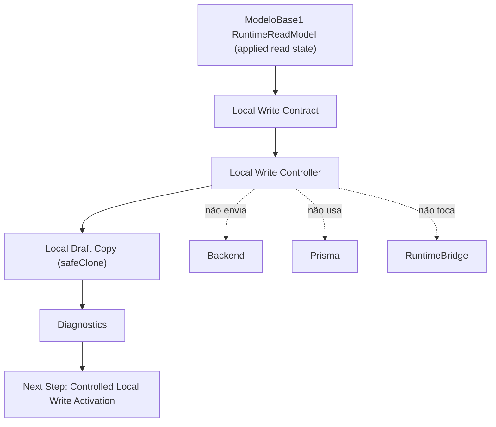
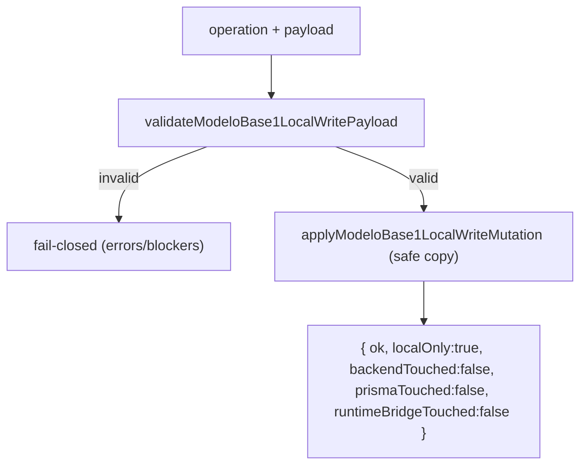
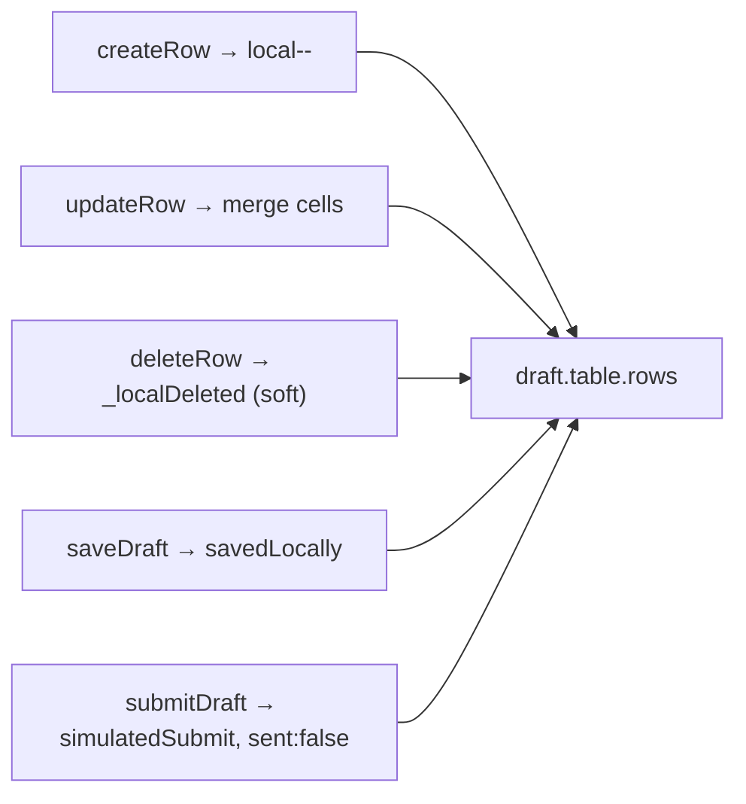
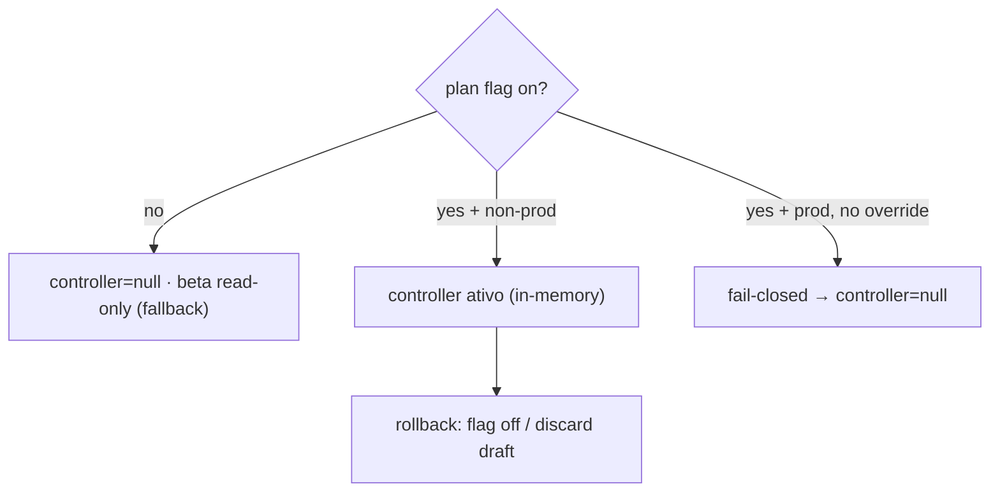

# MODULE DIAGRAMS — ModeloBase1 Controlled Local Write Plan

## Fluxo do plano local

```mermaid
flowchart TD
  RRM["ModeloBase1 RuntimeReadModel (applied read state)"] --> CONTRACT["Local Write Contract"]
  CONTRACT --> CTRL["Local Write Controller"]
  CTRL --> DRAFT["Local Draft Copy (safeClone)"]
  CTRL -. não envia .-> BACKEND["Backend"]
  CTRL -. não usa .-> PRISMA["Prisma"]
  CTRL -. não toca .-> RB["RuntimeBridge"]
  DRAFT --> DIAG["Diagnostics"]
  DIAG --> NEXT["Next Step: Controlled Local Write Activation"]
```

## Validação → aplicação

```mermaid
flowchart TD
  OP["operation + payload"] --> VAL["validateModeloBase1LocalWritePayload"]
  VAL -->|invalid| BLOCK["fail-closed (errors/blockers)"]
  VAL -->|valid| APPLY["applyModeloBase1LocalWriteMutation (safe copy)"]
  APPLY --> RES["{ ok, localOnly:true, backendTouched:false, prismaTouched:false, runtimeBridgeTouched:false }"]
```

## Mutações locais

```mermaid
flowchart LR
  CR["createRow → local-<mod>-<seq>"] --> D["draft.table.rows"]
  UP["updateRow → merge cells"] --> D
  DEL["deleteRow → _localDeleted (soft)"] --> D
  SV["saveDraft → savedLocally"] --> D
  SUB["submitDraft → simulatedSubmit, sent:false"] --> D
```

## Flags / rollback

```mermaid
flowchart TD
  F{"plan flag on?"}
  F -->|no| OFF["controller=null · beta read-only (fallback)"]
  F -->|yes + non-prod| ON["controller ativo (in-memory)"]
  F -->|yes + prod, no override| CLOSED["fail-closed → controller=null"]
  ON --> RB["rollback: flag off / discard draft"]
```
