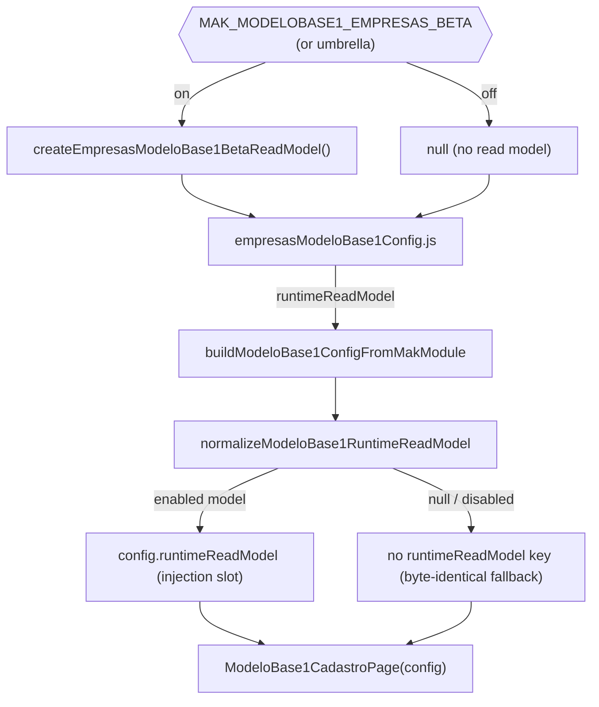
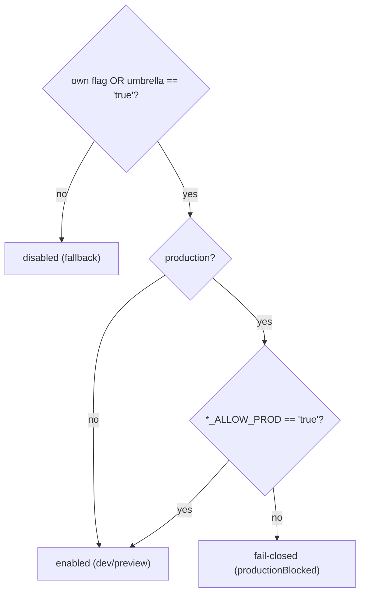
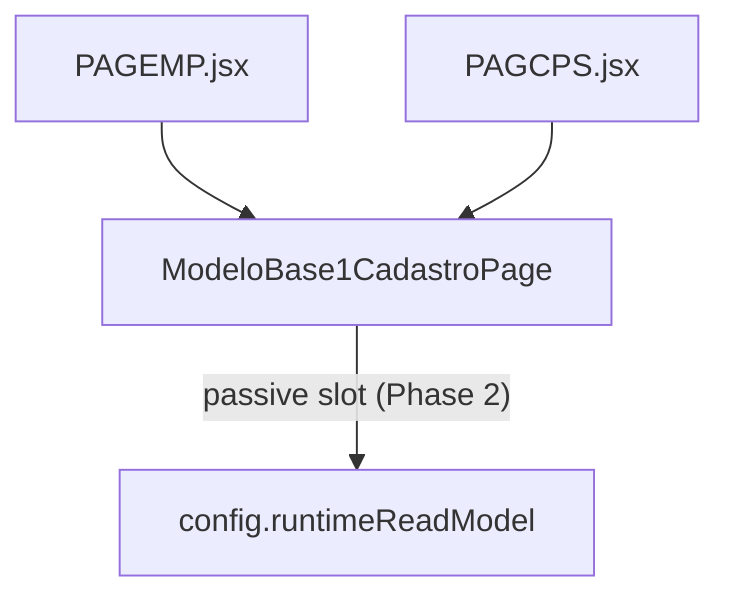

# MODULE DIAGRAMS — ModeloBase1 Empresas/Campos Direct Beta

## Fluxo de injeção (flag ON)



## Composição do read model beta de Empresas

```mermaid
flowchart LR
  W["createEmpresasModeloBase1BetaReadModel"]
  VM["createEmpresasReadOnlyViewModel<br/>(runtime v2 projection)"]
  DS["createEmpresasControlledDataset<br/>(mock, masked)"]
  WG["createEmpresasReadOnlyWriteGuard<br/>(11 ops blocked)"]
  GEN["createModeloBase1DirectBetaReadModel<br/>(generic descriptor + resolve)"]

  W --> GEN
  W --> WG
  GEN -->|resolveViewModel| VM
  VM --> DS
  GEN -->|resolve()| OUT["resolved read model<br/>(safeClone + live writeGuard)"]
```

## Composição do read model beta de Campos (cadcps)

```mermaid
flowchart LR
  C["createCadcpsModeloBase1BetaReadModel"]
  CVM["createCadcpsBetaViewModel<br/>(from controlled dataset)"]
  CDS["createCadcpsControlledDataset"]
  CWG["createDirectBetaWriteGuard<br/>(read-only)"]
  GEN["createModeloBase1DirectBetaReadModel"]

  C --> GEN
  C --> CWG
  GEN -->|resolveViewModel| CVM
  CVM --> CDS
  GEN -->|resolve()| OUT2["resolved read model"]
```

## Resolução de flag (fail-closed)



## Invariante — mesmo motor ModeloBase1


