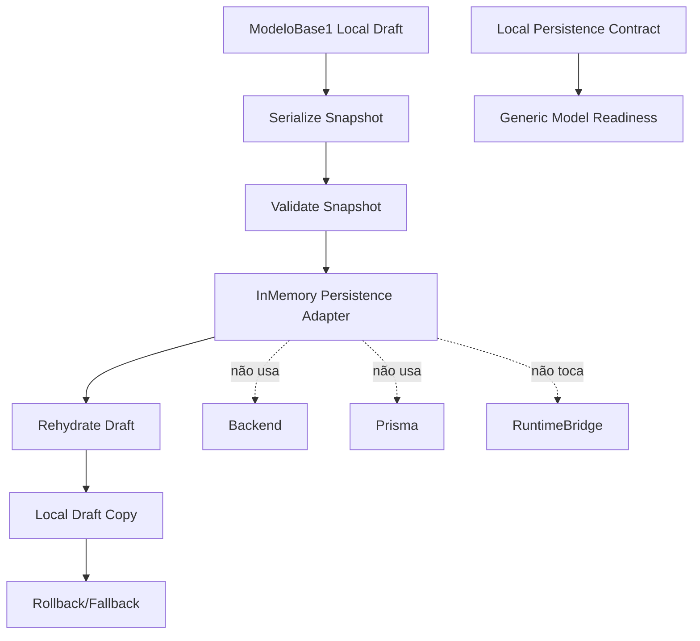
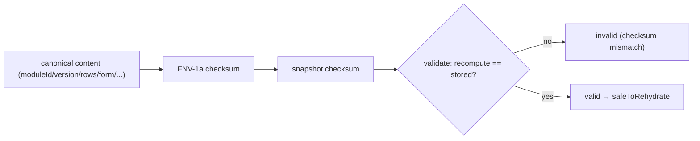
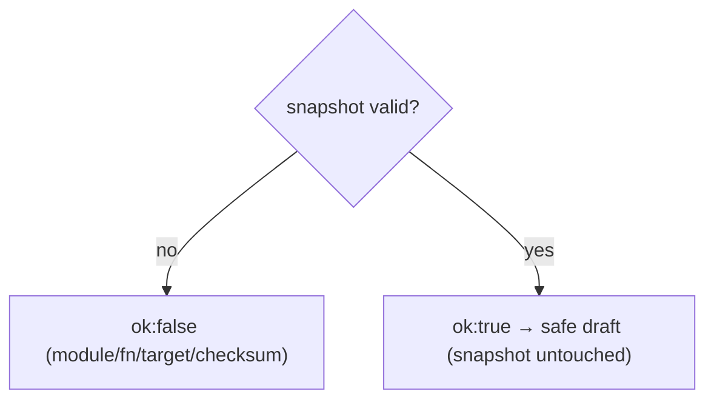
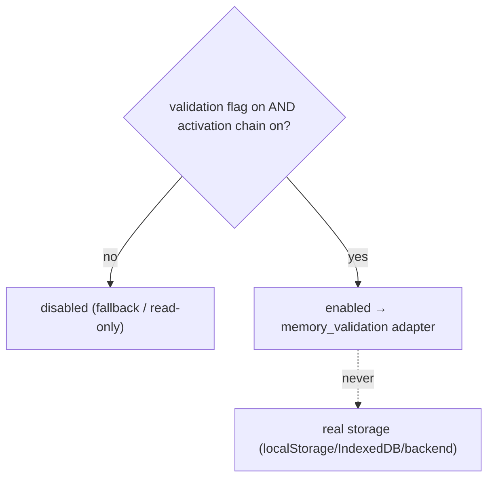

# MODULE DIAGRAMS — ModeloBase1 Local Persistence Validation

## Ciclo de validação de persistência

```mermaid
flowchart TD
  DRAFT["ModeloBase1 Local Draft"] --> SER["Serialize Snapshot"]
  SER --> VAL["Validate Snapshot"]
  VAL --> ADP["InMemory Persistence Adapter"]
  ADP --> REH["Rehydrate Draft"]
  REH --> COPY["Local Draft Copy"]
  COPY --> RB["Rollback/Fallback"]
  ADP -. não usa .-> BACKEND["Backend"]
  ADP -. não usa .-> PRISMA["Prisma"]
  ADP -. não toca .-> RBR["RuntimeBridge"]
  CONTRACT["Local Persistence Contract"] --> GEN["Generic Model Readiness"]
```

## Integridade (checksum)

```mermaid
flowchart LR
  CONTENT["canonical content (moduleId/version/rows/form/...)"] --> HASH["FNV-1a checksum"]
  HASH --> SNAP["snapshot.checksum"]
  SNAP --> VLD{"validate: recompute == stored?"}
  VLD -->|no| FAIL["invalid (checksum mismatch)"]
  VLD -->|yes| OK["valid → safeToRehydrate"]
```

## Fail-closed da reidratação

```mermaid
flowchart TD
  S{"snapshot valid?"}
  S -->|no| NO["ok:false (module/fn/target/checksum)"]
  S -->|yes| Y["ok:true → safe draft (snapshot untouched)"]
```

## Flags / storage

```mermaid
flowchart TD
  F{"validation flag on AND activation chain on?"}
  F -->|no| OFF["disabled (fallback / read-only)"]
  F -->|yes| ON["enabled → memory_validation adapter"]
  ON -. never .-> REAL["real storage (localStorage/IndexedDB/backend)"]
```
