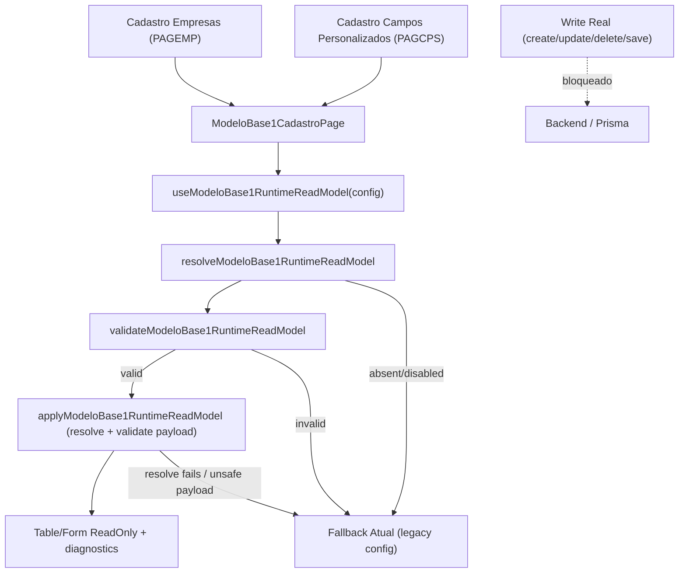
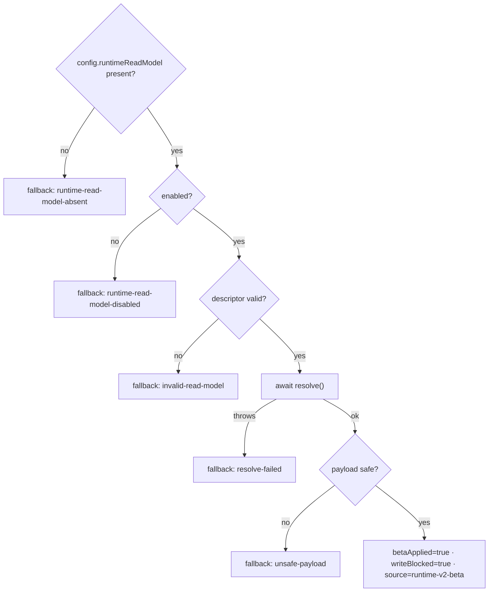
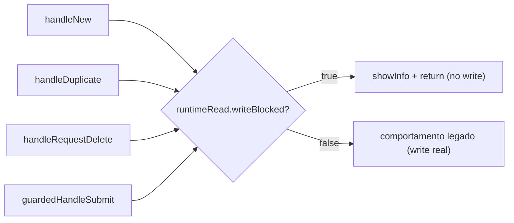
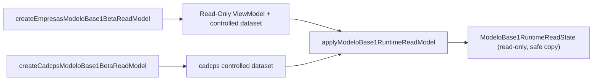

# MODULE DIAGRAMS — ModeloBase1 Runtime Wiring

## Consumo do runtimeReadModel no engine

```mermaid
flowchart TD
  EMP["Cadastro Empresas (PAGEMP)"] --> MB1["ModeloBase1CadastroPage"]
  CPS["Cadastro Campos Personalizados (PAGCPS)"] --> MB1
  MB1 --> HOOK["useModeloBase1RuntimeReadModel(config)"]
  HOOK --> RES["resolveModeloBase1RuntimeReadModel"]
  RES --> VAL["validateModeloBase1RuntimeReadModel"]
  VAL -->|valid| APPLY["applyModeloBase1RuntimeReadModel (resolve + validate payload)"]
  APPLY --> RO["Table/Form ReadOnly + diagnostics"]
  VAL -->|invalid| FB["Fallback Atual (legacy config)"]
  RES -->|absent/disabled| FB
  APPLY -->|resolve fails / unsafe payload| FB
  WRITE["Write Real (create/update/delete/save)"] -. bloqueado .-> BACKEND["Backend / Prisma"]
```

## Decisão detect → validate → resolve → apply

```mermaid
flowchart TD
  A{"config.runtimeReadModel present?"}
  A -->|no| FB1["fallback: runtime-read-model-absent"]
  A -->|yes| B{"enabled?"}
  B -->|no| FB2["fallback: runtime-read-model-disabled"]
  B -->|yes| C{"descriptor valid?"}
  C -->|no| FB3["fallback: invalid-read-model"]
  C -->|yes| D["await resolve()"]
  D -->|throws| FB4["fallback: resolve-failed"]
  D -->|ok| E{"payload safe?"}
  E -->|no| FB5["fallback: unsafe-payload"]
  E -->|yes| OK["betaApplied=true · writeBlocked=true · source=runtime-v2-beta"]
```

## Write-block no engine

```mermaid
flowchart LR
  H1["handleNew"] --> G{"runtimeRead.writeBlocked?"}
  H2["handleDuplicate"] --> G
  H3["handleRequestDelete"] --> G
  H4["guardedHandleSubmit"] --> G
  G -->|true| BLOCK["showInfo + return (no write)"]
  G -->|false| LEGACY["comportamento legado (write real)"]
```

## Fonte da leitura beta

```mermaid
flowchart LR
  EMPM["createEmpresasModeloBase1BetaReadModel"] --> ROVM["Read-Only ViewModel + controlled dataset"]
  CPSM["createCadcpsModeloBase1BetaReadModel"] --> CDS["cadcps controlled dataset"]
  ROVM --> APPLY["applyModeloBase1RuntimeReadModel"]
  CDS --> APPLY
  APPLY --> STATE["ModeloBase1RuntimeReadState (read-only, safe copy)"]
```
