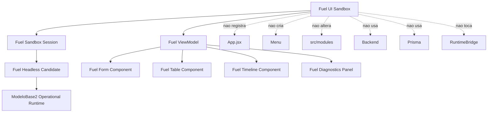
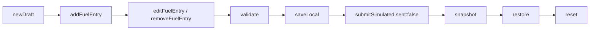
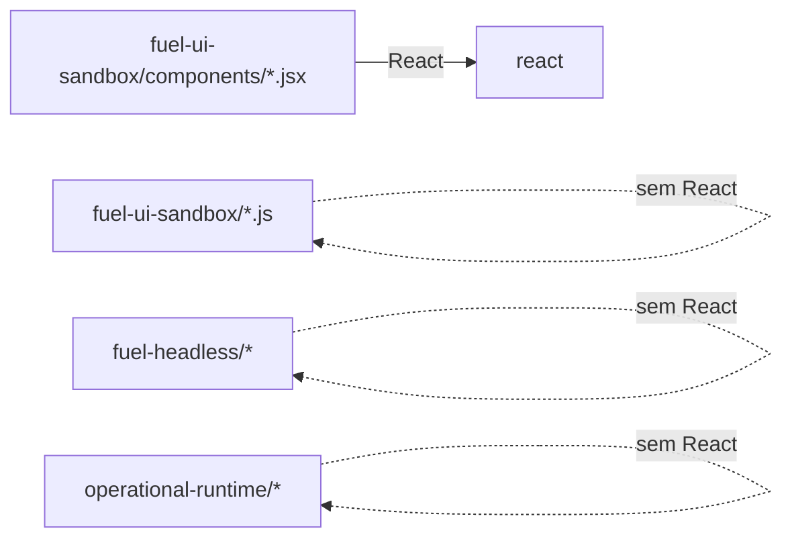

# Module Diagrams — ModeloBase2 Fuel Beta UI Sandbox

```mermaid
flowchart TD
  UI[Fuel UI Sandbox] --> VM[Fuel ViewModel]
  UI --> SS[Fuel Sandbox Session]
  SS --> FC[Fuel Headless Candidate]
  FC --> RT[ModeloBase2 Operational Runtime]
  VM --> FORM[Fuel Form Component]
  VM --> TBL[Fuel Table Component]
  VM --> TL[Fuel Timeline Component]
  VM --> DP[Fuel Diagnostics Panel]
  UI -. nao registra .-> APP[App.jsx]
  UI -. nao cria .-> MENU[Menu]
  UI -. nao altera .-> MOD[src/modules]
  UI -. nao usa .-> BK[Backend]
  UI -. nao usa .-> PR[Prisma]
  UI -. nao toca .-> RB[RuntimeBridge]
```

## Fluxo sandbox

```mermaid
flowchart LR
  A[newDraft] --> B[addFuelEntry]
  B --> C[editFuelEntry / removeFuelEntry]
  C --> D[validate]
  D --> E[saveLocal]
  E --> F[submitSimulated sent:false]
  F --> G[snapshot]
  G --> H[restore]
  H --> I[reset]
```

## Isolamento React

```mermaid
flowchart LR
  COMP[fuel-ui-sandbox/components/*.jsx] -->|React| REACT[react]
  PURE[fuel-ui-sandbox/*.js] -. sem React .-> PURE
  HL[fuel-headless/*] -. sem React .-> HL
  OR[operational-runtime/*] -. sem React .-> OR
```
