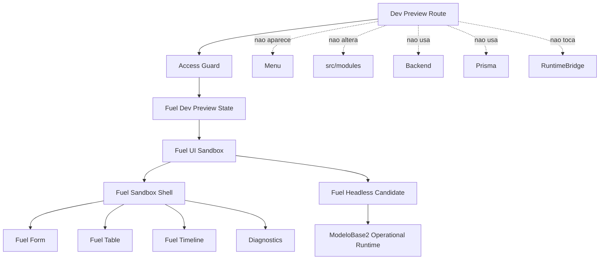
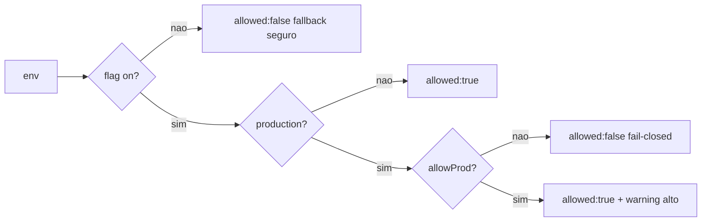

# Module Diagrams — ModeloBase2 Fuel Dev Preview Route

```mermaid
flowchart TD
  RT[Dev Preview Route] --> AG[Access Guard]
  AG --> ST[Fuel Dev Preview State]
  ST --> SB[Fuel UI Sandbox]
  SB --> SH[Fuel Sandbox Shell]
  SH --> FORM[Fuel Form]
  SH --> TBL[Fuel Table]
  SH --> TL[Fuel Timeline]
  SH --> DP[Diagnostics]
  SB --> FC[Fuel Headless Candidate]
  FC --> OR[ModeloBase2 Operational Runtime]
  RT -. nao aparece .-> MENU[Menu]
  RT -. nao altera .-> MOD[src/modules]
  RT -. nao usa .-> BK[Backend]
  RT -. nao usa .-> PR[Prisma]
  RT -. nao toca .-> RB[RuntimeBridge]
```

## Guard de acesso

```mermaid
flowchart LR
  A[env] --> B{flag on?}
  B -- nao --> DENY[allowed:false fallback seguro]
  B -- sim --> C{production?}
  C -- nao --> ALLOW[allowed:true]
  C -- sim --> D{allowProd?}
  D -- nao --> DENY2[allowed:false fail-closed]
  D -- sim --> WARN[allowed:true + warning alto]
```
